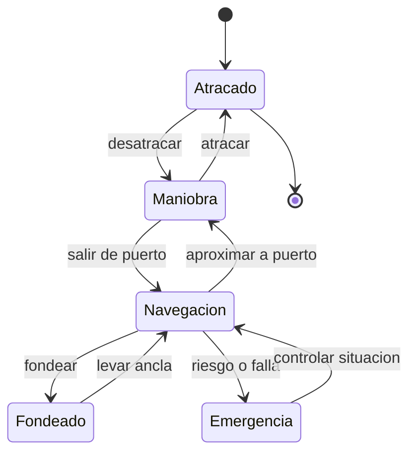

# 🎮 Diseno de simulacion del barco mercante

[🏠 Inicio](../../../README.md) · [🚢 Curso: Barcos mercantes](../README.md) · 🎮 Simulacion

## Objetivo de la simulacion

Que el usuario aprenda a gobernar un buque mercante respetando la inercia,
manejar la propulsion y el timon, aplicar reglas basicas de navegacion (COLREG)
y realizar maniobras de puerto de forma segura y progresiva.

## Nivel de realismo

- Nivel elegido: se ofrece del 1 al 3 (ver `docs/03-niveles-de-realismo.md`).
- Justificacion: el buque agrega flotacion, inercia de grandes masas y reglas
  maritimas, por lo que es un curso intermedio respecto de la moto.

## Variables principales

| Variable | Tipo | Rango | Afecta a | Comentarios |
| --- | --- | --- | --- | --- |
| Velocidad | numerica | 0-25 nudos | Avance y gobierno | El timon necesita flujo. |
| Rumbo | numerica | 0-359 grados | Direccion | Cambia con retardo. |
| Regimen de maquina | discreta | atras..avante toda | Empuje | Escalonado por telegrafo. |
| Angulo de timon | numerica | -35..35 grados | Radio de giro | Limitado por diseno. |
| Calado | numerica | segun carga | Riesgo de varada | Depende de carga y lastre. |
| Estabilidad (GM) | numerica | positiva | Escora y seguridad | Depende de la estiba. |
| Viento y corriente | vectorial | variable | Deriva | Ajuste del entorno. |
| Combustible | numerica | 0-100% | Autonomia | Consumo por regimen. |

## Ciclo basico

1. Leer entrada del usuario (timon, telegrafo, thruster, piloto automatico).
2. Actualizar estado de la maquina y la posicion del timon.
3. Calcular fuerzas: empuje, resistencia del agua, viento y corriente.
4. Aplicar la inercia de la masa del buque al cambio de velocidad y rumbo.
5. Actualizar posicion, rumbo, escora y calado.
6. Refrescar instrumentos (radar, GPS, ecosonda) y alarmas.

## Modos de juego futuros

- Tutorial guiado del puente y el telegrafo.
- Practica libre de maniobra en puerto.
- Travesia costera respetando COLREG.
- Desafios de atraque con viento y corriente.
- Situaciones de baja visibilidad con radar, sin contenido sensible.

## Elementos fuera de alcance

- Maniobras temerarias presentadas como recomendables.
- Reproduccion de navegacion negligente como objetivo del juego.
- Datos que permitan alterar sistemas reales de un buque.

## Pendientes

- [ ] Definir valores por defecto de cada variable por tipo de buque.
- [ ] Prototipar el modelo de inercia y gobierno.
- [ ] Ajustar el efecto de viento y corriente en la deriva.
- [ ] Agregar fuentes tecnicas publicas a [`manuales/fuentes.md`](../../../manuales/fuentes.md).

---

[⬅️ Anterior: Reglamentos](../reglamentos/reglamentos-barco-mercante.md) · [➡️ Siguiente: Recursos](../recursos/recursos-barco-mercante.md)
