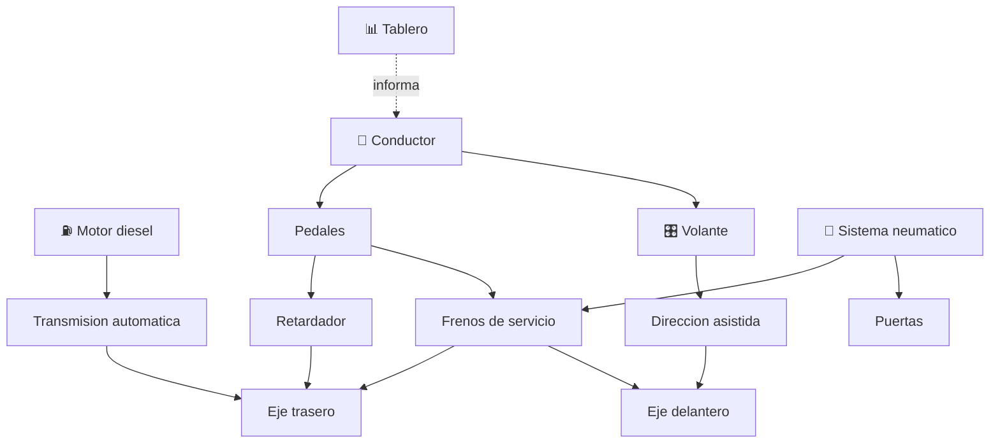

# 🚌 Curso: Buses

[🏠 Inicio](../../README.md) · [🚙 Catalogo de vehiculos](../README.md) · [🎓 Guia de curso](../../docs/08-guia-de-estilo-y-curso.md)

> **Curso completo del bus de transporte de pasajeros.** Documenta el vehiculo
> de principio a fin: historia, caracteristicas, mecanica en profundidad, mandos,
> principios de operacion con pasajeros, entornos, reglamentos chilenos y diseno
> de simulacion. Sigue la plantilla de oro del curso de motos.

---

## 🎯 Objetivos de aprendizaje

Al terminar este curso deberias poder:

- Explicar como un bus acelera, frena, gira y gestiona su gran masa.
- Identificar sus sistemas mecanicos, en especial el sistema neumatico.
- Reconocer todos los mandos e instrumentos, incluidos puertas y retardador.
- Comprender la operacion con pasajeros de pie, paradas y accesibilidad.
- Conocer los reglamentos chilenos aplicables (licencia clase A, aforo, jornada).
- Traducir todo lo anterior en variables de un simulador educativo.

---

## 🗺️ Mapa del vehiculo

---

## 📚 Modulos del curso

| # | Modulo | Contenido | Enlace |
| :-: | --- | --- | --- |
| 1 | 📜 Historia | Origen y evolucion del bus, linea de tiempo. | [Abrir](historia/historia-bus.md) |
| 2 | 📋 Caracteristicas | Que es, tipos de bus y para que sirve cada uno. | [Abrir](operacion/caracteristicas-bus.md) |
| 3 | 🔧 Sistemas mecanicos | Motor, transmision, frenos neumaticos, puertas, accesibilidad. | [Abrir](operacion/sistemas-mecanicos-bus.md) |
| 4 | 🎛️ Mandos e instrumentos | Puesto de mando, controles, puertas y tablero. | [Abrir](mandos/manual-mandos-bus.md) |
| 5 | 🧪 Principios y operacion | Masa, inercia, paradas y fases de operacion. | [Abrir](operacion/principios-bus.md) |
| 6 | 🌍 Entornos de trabajo | Urbano, interurbano, corredor BRT, terminal. | [Abrir](operacion/entornos-bus.md) |
| 7 | ⚖️ Reglamentos | Ley chilena: licencia clase A, aforo, jornada. | [Abrir](reglamentos/reglamentos-bus.md) |
| 8 | 🎮 Diseno de simulacion | Variables, ciclo y modos de juego. | [Abrir](simulacion/diseno-simulador-bus.md) |
| 9 | 🧰 Recursos | Glosario, enlaces y diagramas. | [Abrir](recursos/recursos-bus.md) |

---

## 🧩 Requisitos previos

Se recomienda haber revisado antes el [curso de motos](../motos/README.md) para
manejar los conceptos base de propulsion, frenado y transmision. El bus agrega
la gestion de gran masa, el sistema neumatico y la operacion con pasajeros.
Marco legal comun en
[⚖️ docs/07-marco-legal-chile.md](../../docs/07-marco-legal-chile.md).

---

[➡️ Empezar por el Modulo 1: Historia](historia/historia-bus.md)
