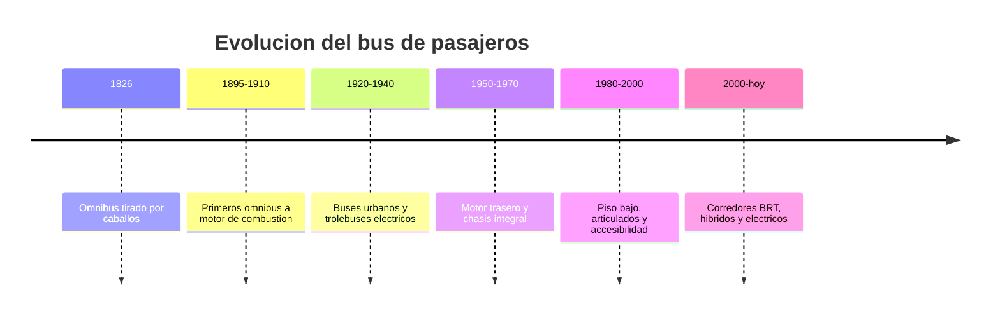

# 📜 Historia del bus

[🏠 Inicio](../../../README.md) · [🚌 Curso: Buses](../README.md) · 📜 Historia

## Origen

El transporte colectivo por carretera nace en el siglo XIX con el omnibus, un
carruaje tirado por caballos que ofrecia asientos a varios pasajeros por una
tarifa. La palabra "omnibus" (para todos) dio origen a "bus". Con el motor de
combustion, a fines del siglo XIX, el vehiculo gana autonomia y capacidad, y se
convierte en la columna del transporte urbano masivo.

## Linea de tiempo

| Periodo | Hito | Importancia |
| --- | --- | --- |
| 1826 | Omnibus tirado por caballos | Primer transporte colectivo urbano regular. |
| 1895-1910 | Omnibus a motor de combustion | Autonomia y mayor capacidad. |
| 1920-1940 | Buses urbanos y trolebuses | Redes de transporte publico en las ciudades. |
| 1950-1970 | Motor trasero y chasis integral | Mas espacio util y mejor reparto de peso. |
| 1980-2000 | Piso bajo y articulados | Accesibilidad y alta capacidad. |
| 2000-presente | BRT, hibridos y electricos | Eficiencia, menos emisiones y corredores segregados. |

## Evolucion tecnologica

- **Propulsion**: de la traccion animal al diesel, y hoy a hibridos y electricos.
- **Chasis**: del bastidor con motor delantero al motor trasero y piso bajo.
- **Frenos**: de frenos mecanicos a sistemas neumaticos con ABS y EBS.
- **Accesibilidad**: rampas, arrodillamiento y espacios para sillas de ruedas.
- **Capacidad**: aparicion de articulados y biarticulados de gran aforo.
- **Gestion**: pago electronico, GPS, camaras y prioridad semaforica.

## Tipos representativos

| Tipo | Uso tipico | Caracteristica destacada |
| --- | --- | --- |
| Urbano piso bajo | Ciudad, paradas frecuentes | Acceso a nivel de acera, accesible. |
| Articulado | Corredores de alta demanda | Gran aforo con seccion flexible. |
| Interurbano | Rutas entre ciudades | Butacas reclinables, bodega. |
| Trolebus | Ciudad con red aerea | Traccion electrica sin bateria propia. |
| Minibus | Baja y media demanda | Menor tamano, mas maniobrable. |
| Electrico de bateria | Ciudad y BRT | Cero emisiones locales, bajo ruido. |

## Impacto social y economico

El bus es el modo de transporte publico mas extendido del mundo por su bajo costo
de infraestructura frente al tren o el metro. Permite movilidad masiva y equitativa,
articula las ciudades y sostiene la actividad economica diaria. Su electrificacion
es hoy una palanca clave para reducir emisiones y ruido en las urbes.

## Fuentes

- Registrar aqui las fuentes publicas consultadas.
- Enlazar cada fuente tambien en [`manuales/fuentes.md`](../../../manuales/fuentes.md).

---

[🎓 Portada del curso](../README.md) · [➡️ Siguiente: Caracteristicas](../operacion/caracteristicas-bus.md)
