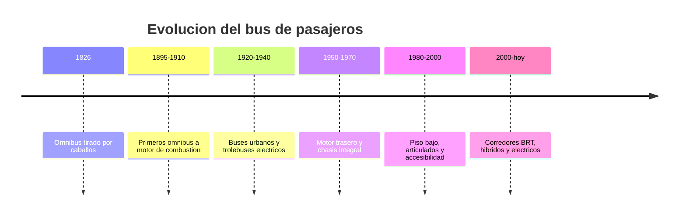

<!-- clase-meta
tipo_documento: clase
clase: 1
codigo: BUSES-01
curso: buses
titulo: "Historia del bus"
modalidad: "teórica dialogada"
duracion_minutos: 45
nivel: introductorio
prerrequisito: ninguno
competencia: "contexto_historico"
resultados_aprendizaje:
  - "Explicar origen, evolución tecnológica, variantes representativas e impacto con vocabulario propio de Buses."
  - "Aplicar esos conceptos a una decisión segura o a un escenario de simulación de Buses."
evidencia: "Línea de tiempo comentada con cuatro hitos o más."
criterio_aprobacion: "Los hitos están ordenados, son pertinentes y dos relaciones de causa y efecto quedan justificadas."
fuentes: manuales/fuentes.md
ultima_revision: 2026-09-10
-->

# 📜 Historia del bus

[🏠 Inicio](../../../README.md) · [🚌 Curso: Buses](../README.md) · 📜 Historia

```mermaid
timeline
    title Evolucion del bus de pasajeros
    1826 : Omnibus tirado por caballos
    1895-1910 : Primeros omnibus a motor de combustion
    1920-1940 : Buses urbanos y trolebuses electricos
    1950-1970 : Motor trasero y chasis integral
    1980-2000 : Piso bajo, articulados y accesibilidad
    2000-hoy : Corredores BRT, hibridos y electricos
```

## Origen

El transporte colectivo por carretera nace en el siglo XIX con el ómnibus, un
carruaje tirado por caballos que ofrecia asientos a varios pasajeros por una
tarifa. La palabra "ómnibus" (para todos) dio origen a "bus". Con el motor de
combustión, a fines del siglo XIX, el vehículo gana autonomía y capacidad, y se
convierte en la columna del transporte urbano masivo.

## Línea de tiempo

| Periodo | Hito | Importancia |
| --- | --- | --- |
| 1826 | Ómnibus tirado por caballos | Primer transporte colectivo urbano regular. |
| 1895-1910 | Ómnibus a motor de combustión | Autonomía y mayor capacidad. |
| 1920-1940 | Buses urbanos y trolebuses | Redes de transporte público en las ciudades. |
| 1950-1970 | Motor trasero y chasis integral | Más espacio útil y mejor reparto de peso. |
| 1980-2000 | Piso bajo y articulados | Accesibilidad y alta capacidad. |
| 2000-presente | BRT, híbridos y eléctricos | Eficiencia, menos emisiones y corredores segregados. |

## Evolución tecnológica

- **Propulsión**: de la tracción animal al diesel, y hoy a híbridos y eléctricos.
- **Chasis**: del bastidor con motor delantero al motor trasero y piso bajo.
- **Frenos**: de frenos mecánicos a sistemas neumáticos con ABS y EBS.
- **Accesibilidad**: rampas, arrodillamiento y espacios para sillas de ruedas.
- **Capacidad**: aparición de articulados y biarticulados de gran aforo.
- **Gestión**: pago electrónico, GPS, cámaras y prioridad semafórica.

## Tipos representativos

| Tipo | Uso típico | Característica destacada |
| --- | --- | --- |
| Urbano piso bajo | Ciudad, paradas frecuentes | Acceso a nivel de acera, accesible. |
| Articulado | Corredores de alta demanda | Gran aforo con sección flexible. |
| Interurbano | Rutas entre ciudades | Butacas reclinables, bodega. |
| Trolebus | Ciudad con red aérea | Tracción eléctrica sin batería propia. |
| Minibus | Baja y media demanda | Menor tamaño, más maniobrable. |
| Eléctrico de batería | Ciudad y BRT | Cero emisiones locales, bajo ruido. |

## Impacto social y económico

El bus es el modo de transporte público más extendido del mundo por su bajo costo
de infraestructura frente al tren o el metro. Permite movilidad masiva y equitativa,
articula las ciudades y sostiene la actividad económica diaria. Su electrificación
es hoy una palanca clave para reducir emisiones y ruido en las urbes.

## 🧭 Guía de estudio aplicada

### Pregunta guía

¿Cómo ayuda **Origen, Línea de tiempo, Evolución tecnológica y Tipos representativos** a **explicar cómo la evolución hizo posibles alternativas como bus urbano frente a autocar interurbano**?

### Explicación razonada

La evolución de Buses se comprende mejor como una sucesión de respuestas a problemas, no como una lista de fechas. Los cambios en motor, transmisión, freno de servicio y retardador y ejes alteraron qué podía hacer la máquina, quién podía usarla y qué riesgos debían controlarse. El contraste «bus urbano frente a autocar interurbano» permite observar qué decisiones de diseño permanecieron y cuáles cambiaron con la tecnología y el propósito.

Esta clase se conecta con el resto del curso mediante **gestión de inercia, distancia de detención y transferencia de peso con pasajeros**. El hilo de
seguridad consiste en reconocer a tiempo **sobrecalentar los frenos o provocar caídas de pasajeros con acciones bruscas** y poder justificar la decisión
**seleccionar marcha y retardador antes de que la velocidad obligue a abusar del freno**; en clases posteriores cambiará el ángulo de análisis, no esa relación causal.
La lectura funcional común sigue **motor → transmisión → freno de servicio y retardador → ejes**, de modo que cada concepto pueda
ubicarse dentro del funcionamiento completo y no quede como un dato aislado.

**Apoyo documental:** [Ley de Tránsito 18.290](https://www.bcn.cl/leychile/navegar?idNorma=29708) aporta marco legal chileno;
[Commercial Driver's License Manual](https://www.fmcsa.dot.gov/registration/commercial-drivers-license/cdl-manual) se usa para operación de buses y camiones. Estas fuentes
se contrastan con el alcance de la clase y no sustituyen un manual de equipo concreto.

### Caso resuelto: de la observación a la decisión

1. **Situar:** ordena los hitos que explican cómo se llegó a **bus urbano frente a autocar interurbano** y describe la necesidad que impulsó cada cambio.
2. **Relacionar:** explica qué se modificó en **motor**, **transmisión**, **freno de servicio y retardador** o **ejes**; una fecha sin mecanismo no basta.
3. **Interpretar:** vincula el cambio con una capacidad nueva y también con el riesgo **sobrecalentar los frenos o provocar caídas de pasajeros con acciones bruscas**.
4. **Transferir:** usa la evolución para justificar por qué hoy conviene **seleccionar marcha y retardador antes de que la velocidad obligue a abusar del freno**.

### Comprueba tu comprensión

1. ¿Qué necesidad histórica impulsó un cambio en **motor** o **transmisión**?
2. ¿Qué hito modificó la relación entre capacidad y **sobrecalentar los frenos o provocar caídas de pasajeros con acciones bruscas**?
3. ¿Por qué **bus urbano frente a autocar interurbano** no puede explicarse como una simple diferencia estética?

Orientación para revisar tus respuestas

- La primera respuesta debe relacionar el eslabón elegido con un efecto posterior, no solo nombrarlo.
- La segunda debe proponer una señal medible u observable y explicar qué tendencia sería preocupante.
- La tercera debe cambiar al menos una variable de capacidad, mando, entorno o margen de seguridad.

## 🎓 Cierre de clase

- **Actividad:** Construye una línea de tiempo de Buses y explica cómo dos cambios históricos transformaron su función o su puesto de mando.
- **Evidencia:** Línea de tiempo comentada con cuatro hitos o más.
- **Criterio de aprobación:** Los hitos están ordenados, son pertinentes y dos relaciones de causa y efecto quedan justificadas.
- **Transferencia:** explica qué cambiaría al pasar a otra variante de esta máquina.

### Fuentes de esta clase

- [CL-LEY-18290](https://www.bcn.cl/leychile/navegar?idNorma=29708): Ley de Tránsito 18.290, BCN Chile. Uso: marco legal chileno.
- [US-FMCSA-CDL](https://www.fmcsa.dot.gov/registration/commercial-drivers-license/cdl-manual): Commercial Driver's License Manual, FMCSA. Uso: operación de buses y camiones.
- [US-NHTSA](https://www.nhtsa.gov/vehicle-safety): Vehicle Safety, NHTSA. Uso: seguridad de vehículos terrestres.

> Las fuentes sostienen el marco conceptual y normativo; esta clase no reemplaza el manual
> del fabricante, la formación certificada ni la habilitación exigida para operar equipos reales.

---

[🎓 Portada del curso](../README.md) · [➡️ Siguiente: Características](../operacion/caracteristicas-bus.md)
