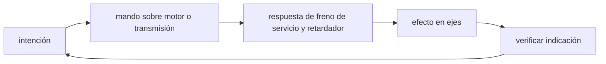

<!-- clase-meta
tipo_documento: clase
clase: 5
codigo: BUSES-05
curso: buses
titulo: "Mandos e instrumentos del bus"
modalidad: "taller de simulación"
duracion_minutos: 60
nivel: introductorio
prerrequisito: BUSES-04
competencia: "lectura_y_mando"
resultados_aprendizaje:
  - "Explicar controles, instrumentos, entradas y estados del sistema con vocabulario propio de Buses."
  - "Aplicar esos conceptos a una decisión segura o a un escenario de simulación de Buses."
evidencia: "Mapa de mandos y resolución de dos estados del tablero."
criterio_aprobacion: "Reconoce los controles críticos y responde a los estados sin introducir acciones inseguras."
fuentes: manuales/fuentes.md
ultima_revision: 2026-09-10
-->

# 🎛️ Mandos e instrumentos del bus

[🏠 Inicio](../../../README.md) · [🚌 Curso: Buses](../README.md) · 🎛️ Mandos

## Vista general

El puesto de mando de un bus es amplio y ergonomico, pensado para largas
jornadas. El conductor va sentado frente a un volante grande de dirección
asistida, con pedales al estilo automóvil (sin embrague en cajas automáticas),
un selector de marchas, el control de puertas al alcance de la mano y un tablero
que incluye la presión de aire del sistema neumático.

## Mapa de controles

| Zona | Control | Tipo | Función | Prioridad | Comentarios |
| --- | --- | --- | --- | --- | --- |
| Pie derecho | Acelerador | Pedal | Regular potencia del motor | Alta | Progresivo, con carga en mente. |
| Pie derecho | Freno de servicio | Pedal | Frenar por sistema neumático | Alta | Modular para no desestabilizar de pie. |
| Columna | Volante | Volante | Dirigir el bus | Alta | Dirección asistida, giros amplios. |
| Consola | Selector de transmisión | Palanca o botonera | Elegir D, N, R | Alta | Automática, sin embrague. |
| Consola | Retardador | Palanca o pedal | Freno auxiliar sin fricción | Alta | Escalonado, para descensos largos. |
| Panel puerta | Control de puertas | Botones | Abrir y cerrar puertas | Alta | Con enclavamiento de marcha. |
| Consola | Kneeling (arrodillamiento) | Botón | Bajar el lado de la puerta | Media | Facilita el ascenso accesible. |
| Consola | Rampa | Botón | Desplegar rampa de accesibilidad | Media | Para sillas de ruedas. |
| Tablero | Freno de estacionamiento | Válvula/botón | Aplicar freno de muelle | Alta | Obligatorio al detener y estacionar. |
| Columna | Luces e intermitentes | Palanca | Señalizar y alumbrar | Media | Incluye luces de parada. |
| Volante | Bocina | Botón | Advertir | Media | Uso de seguridad. |
| Tablero | Instrumentos | Panel | Mostrar estado | Alta | Ver sección de instrumentos. |

## Instrumentos principales

| Instrumento | Mide o muestra | Unidad | Importancia | Notas |
| --- | --- | --- | --- | --- |
| Velocímetro | Velocidad | km/h | Alta | Central para circulación segura. |
| Manómetro de aire | Presión del sistema neumático | bar/psi | Alta | No arrancar bajo el mínimo. |
| Tacómetro | Régimen del motor | rpm | Media | Ayuda en pendientes y freno motor. |
| Temperatura motor | Estado térmico | grados | Media | Vigila sobrecalentamiento. |
| Nivel de combustible | Combustible o carga | fracción/% | Alta | Diesel, gas o batería. |
| Testigos | Estado de sistemas | luz | Alta | Puertas, ABS, presión baja, retardador. |
| Indicador de puertas | Puertas abiertas/cerradas | luz | Alta | Ligado al enclavamiento de marcha. |

## Entradas de simulación

| Acción | Teclado | Controlador | Pantalla táctil | Comentarios |
| --- | --- | --- | --- | --- |
| Acelerar | Flecha arriba | Gatillo derecho | Zona derecha | Progresivo, con inercia de carga. |
| Frenar | Flecha abajo | Gatillo izquierdo | Botón freno | Modular para pasajeros de pie. |
| Retardador | Tecla R | Botón lateral | Botón retardador | Escalonado, sin desgaste. |
| Girar | Flechas izq/der | Stick izquierdo | Inclinar dispositivo | Anticipar el barrido trasero. |
| Cambiar D/N/R | Teclas D/N/R | Cruceta | Botones D/N/R | Automática, sin embrague. |
| Abrir puertas | Tecla O | Botón A | Botón puertas | Solo con el bus detenido. |
| Cerrar puertas | Tecla C | Botón B | Botón puertas | Verificar sensores antes. |
| Kneeling | Tecla K | Botón inferior | Botón kneeling | Baja el lado de la puerta. |

## Estados del sistema

| Estado | Descripción | Indicadores | Acciones disponibles |
| --- | --- | --- | --- |
| Apagado | Motor detenido, sin presión | Tablero off | Encender, esperar carga de aire. |
| Cargando aire | Motor en marcha, subiendo presión | Alarma de presión baja | Esperar rango normal antes de mover. |
| Preparado | Presión normal, detenido | Manómetro en verde | Soltar freno, abrir puertas, seleccionar D. |
| En servicio | Circulando con pasajeros | Velocímetro activo | Acelerar, frenar, girar, parar en paradas. |
| En parada | Detenido con puertas abiertas | Testigo de puertas | Ascenso/descenso; marcha enclavada. |
| Emergencia | Riesgo o falla | Testigos de alerta | Frenar, orillar, freno de estacionamiento. |

## Observaciones ergonomicas

- El velocímetro y el manómetro de aire deben verse siempre.
- El control de puertas debe estar claramente separado del resto para evitar
  aperturas accidentales en marcha.
- El enclavamiento de marcha con puertas abiertas es una salvaguarda clave: la
  interfaz debe impedir avanzar con puertas abiertas en niveles realistas.
- El retardador conviene representarlo escalonado, para enseñar a frenar
  descensos largos sin castigar los frenos de servicio.
- La suavidad del frenado debe premiarse: los pasajeros de pie penalizan las
  maniobras bruscas.

## 🧭 Guía de estudio aplicada

### Pregunta guía

¿Cómo ayuda **Vista general, Mapa de controles, Instrumentos principales y Entradas de simulación** a **interpretar mandos e indicaciones durante descenso prolongado con el vehículo cargado y una parada próxima**?

### Explicación razonada

Un mando no se aprende memorizando su nombre, sino recorriendo el ciclo intención → acción → indicación → verificación. En Buses, el operador actúa sobre motor o transmisión, observa la respuesta en freno de servicio y retardador y confirma el efecto en ejes. Una indicación inesperada exige detener la secuencia mental, identificar el modo activo y evitar una segunda orden que agrave el estado.

Esta clase se conecta con el resto del curso mediante **gestión de inercia, distancia de detención y transferencia de peso con pasajeros**. El hilo de
seguridad consiste en reconocer a tiempo **sobrecalentar los frenos o provocar caídas de pasajeros con acciones bruscas** y poder justificar la decisión
**seleccionar marcha y retardador antes de que la velocidad obligue a abusar del freno**; en clases posteriores cambiará el ángulo de análisis, no esa relación causal.
La lectura funcional común sigue **motor → transmisión → freno de servicio y retardador → ejes**, de modo que cada concepto pueda
ubicarse dentro del funcionamiento completo y no quede como un dato aislado.

**Apoyo documental:** [Ley de Tránsito 18.290](https://www.bcn.cl/leychile/navegar?idNorma=29708) aporta marco legal chileno;
[Commercial Driver's License Manual](https://www.fmcsa.dot.gov/registration/commercial-drivers-license/cdl-manual) se usa para operación de buses y camiones. Estas fuentes
se contrastan con el alcance de la clase y no sustituyen un manual de equipo concreto.

### Caso resuelto: de la observación a la decisión

1. **Intención:** formula qué cambio se necesita durante **descenso prolongado con el vehículo cargado y una parada próxima**.
2. **Mando:** identifica el control que actúa sobre **motor** o **transmisión** y el modo que debe estar activo.
3. **Lectura:** localiza la indicación que confirma la respuesta de **freno de servicio y retardador** y el efecto en **ejes**.
4. **Verificación:** si la lectura no coincide, no acumules órdenes; estabiliza e investiga el estado.

### Comprueba tu comprensión

1. ¿Qué mando inicia la respuesta y qué instrumento confirma que el modo correcto está activo?
2. ¿Qué indicación temprana advertiría **sobrecalentar los frenos o provocar caídas de pasajeros con acciones bruscas**?
3. ¿Qué secuencia usarías si la respuesta de **ejes** no coincide con la orden?

Orientación para revisar tus respuestas

- La primera respuesta debe relacionar el eslabón elegido con un efecto posterior, no solo nombrarlo.
- La segunda debe proponer una señal medible u observable y explicar qué tendencia sería preocupante.
- La tercera debe cambiar al menos una variable de capacidad, mando, entorno o margen de seguridad.

## 🎓 Cierre de clase

- **Actividad:** Recorre el puesto de mando simulado de Buses: localiza los controles de controles, instrumentos, entradas y estados del sistema y asocia cada indicación con una decisión.
- **Evidencia:** Mapa de mandos y resolución de dos estados del tablero.
- **Criterio de aprobación:** Reconoce los controles críticos y responde a los estados sin introducir acciones inseguras.
- **Transferencia:** explica qué cambiaría al pasar a otra variante de esta máquina.

### Fuentes de esta clase

- [CL-LEY-18290](https://www.bcn.cl/leychile/navegar?idNorma=29708): Ley de Tránsito 18.290, BCN Chile. Uso: marco legal chileno.
- [US-FMCSA-CDL](https://www.fmcsa.dot.gov/registration/commercial-drivers-license/cdl-manual): Commercial Driver's License Manual, FMCSA. Uso: operación de buses y camiones.
- [US-NHTSA](https://www.nhtsa.gov/vehicle-safety): Vehicle Safety, NHTSA. Uso: seguridad de vehículos terrestres.

> Las fuentes sostienen el marco conceptual y normativo; esta clase no reemplaza el manual
> del fabricante, la formación certificada ni la habilitación exigida para operar equipos reales.

---

[⬅️ Anterior: Sistemas mecánicos](../operacion/sistemas-mecanicos-bus.md) · [➡️ Siguiente: Principios y operación](../operacion/principios-bus.md)
