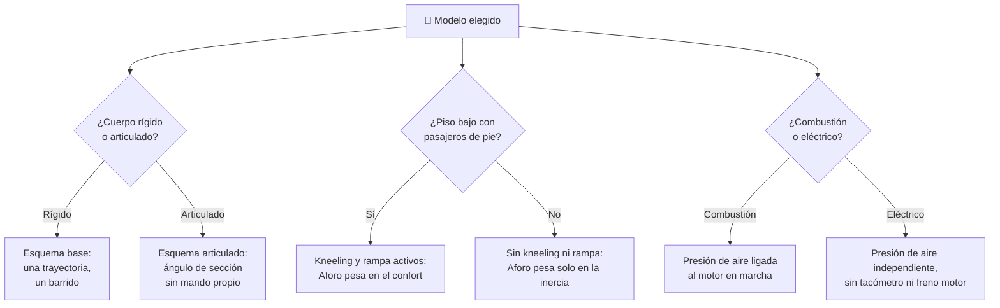

# 🧩 Modelos y variantes del bus

[🏠 Inicio](../../../README.md) · [🚌 Curso: Buses](../README.md) · 🧩 Modelos

El [Módulo 2](../operacion/caracteristicas-bus.md) ya dijo qué tipos de bus
existen y para qué sirve cada uno. Este módulo responde a lo siguiente: **no
todos se conducen igual**, y esa diferencia no es de matiz. Cambia qué mandos
tiene la máquina y, por tanto, qué debe modelar el simulador.

> 🎯 **La idea que sostiene el módulo.** "Un bus" no es una sola máquina desde el
> punto de vista del mando. Un articulado no lleva ningún control extra y aun así
> tiene una sección trasera que se mueve sola: no es que sea más difícil de
> girar, es que **el vehículo tiene un grado de libertad que ningún mando
> gobierna**. Un simulador que presente un solo esquema de control está
> representando un bus concreto aunque diga representarlos todos.

---

## 🧭 Por qué el modelo decide el simulador

El [Módulo 5](../mandos/manual-mandos-bus.md) describe un puesto de mando con
botón de **kneeling** (arrodillamiento), botón de **rampa** y un control de
puertas con enclavamiento de marcha. El
[Módulo 9](../simulacion/diseno-simulador-bus.md) expone una variable `Aforo`
con rango `0-100%` que afecta a "inercia y confort" porque cuenta pasajeros
sentados **y de pie**, y una variable `Presión de aire` de `0-12 bar` que sube
mientras el motor gira. Ambos describen un bus **urbano de piso bajo, de
combustión y transmisión automática**. Es el bus base del curso.

En un interurbano ese botón de kneeling no existe: el piso es alto, hay bodega
debajo y los pasajeros viajan sentados. Y `Aforo` deja de tener con qué castigar
una frenada brusca, porque nadie va de pie. Si el simulador se construye sobre el
esquema urbano y luego se le "añade" un interurbano, el resultado es un
interurbano con pasajeros de pie y arrodillamiento, que no es lo que se conduce.

---

## 🗂️ Qué cambia en el manejo

| Modelo | Qué cambia al conducirlo |
| --- | --- |
| Urbano piso bajo | La referencia del curso: paradas frecuentes, pasajeros de pie, acceso a nivel de acera. |
| Articulado | La sección trasera describe su propia trayectoria: el barrido deja de ser un arco previsible y el conductor gobierna la cola de forma indirecta. |
| Biarticulado | Dos secciones flexibles y el aforo máximo del catálogo: la inercia y el barrido llegan a su extremo, y la ruta suele ser un corredor segregado. |
| Interurbano | Velocidad sostenida en carretera y butacas con pasajeros sentados: el margen de frenado se juega en distancia, no en suavidad ante los de pie. |
| Minibus | Menor masa y radio de giro más corto: se acerca a la conducción de un vehículo ligero, con menos anticipación exigida. |
| Escolar | Paradas en calzada y pasajeros que cruzan alrededor del vehículo: la atención se desplaza del confort a la vigilancia del entorno inmediato. |
| Eléctrico | Par inmediato desde parado y bajo ruido: se pierde la referencia sonora del régimen y la salida de parada es más viva de lo esperado. |

---

## 🎛️ Qué cambia en el mando

| Modelo | Qué mando aparece o desaparece | Consecuencia |
| --- | --- | --- |
| Urbano piso bajo, Minibus | Ninguno: el mapa de controles del Módulo 5 aplica tal cual. | Cambian los rangos, no los controles. |
| Articulado / Biarticulado | **No aparece ninguno**: la articulación se mueve sin mando propio. | El vehículo tiene un estado que el conductor no ordena, solo anticipa con volante y acelerador. |
| Interurbano | **Desaparecen** el kneeling y la rampa. El control de puertas pierde protagonismo: se opera en terminal, no en cada parada. | El enclavamiento de marcha deja de ser la salvaguarda central de la jornada. |
| Escolar | **Aparece** la señalización reforzada de parada, que el mapa del Módulo 5 no recoge. | El mando de luces deja de ser secundario y pasa a ser un elemento de seguridad activa. |
| Eléctrico | **Desaparece** la referencia del régimen: el tacómetro no tiene rpm de combustión que mostrar y el freno motor no existe. | El retardador queda como único freno auxiliar declarado, y el aire deja de depender de que el motor gire. |

---

## 🎮 Qué cambia en el simulador

Contrastado con las variables del
[Módulo 9](../simulacion/diseno-simulador-bus.md):

| Modelo | Variables que cambian | Esquema de control |
| --- | --- | --- |
| Urbano piso bajo | Ninguna: es el caso base. | El del Módulo 5. |
| Articulado | Ninguna de las ocho declaradas basta: falta el ángulo de la articulación, que no tiene mando ni variable. `Adherencia` pasa a evaluarse por sección, no por vehículo. | El mismo mando sobre un cuerpo distinto. |
| Biarticulado | Lo mismo que el articulado, con dos ángulos en vez de uno. `Aforo` llega a su escala máxima. | El mismo mando sobre un cuerpo distinto. |
| Interurbano | `Aforo` deja de incluir pasajeros de pie: pasa a afectar solo a la inercia y **pierde su efecto sobre el confort**. `Velocidad` amplía su rango útil. `Estado de puertas` deja de gobernar la partida. | El mismo, sin kneeling ni rampa. |
| Minibus | `Aforo` reduce su escala y la inercia asociada baja; `Velocidad` mantiene rango. | El mismo. |
| Escolar | `Aforo` cuenta pasajeros sentados; `Estado de puertas` gana peso porque cada apertura ocurre en calzada. | El mismo. |
| Eléctrico | `Combustible/energía` pasa a ser carga de batería. `Presión de aire` **deja de depender** del motor en marcha. `Retardador` describe regeneración, no fricción. | El mismo, sin tacómetro. |

---

## 🗺️ Del modelo al esquema de control

---

## ⚠️ Qué modelos no comparten simulador

Dos familias no se resuelven con un ajuste de parámetros, porque su esquema de
control es otro:

- **El articulado y el biarticulado** frente al resto: el vehículo deja de ser un
  cuerpo rígido. Necesitan un estado nuevo —el ángulo de la articulación— que no
  tiene entrada de usuario y que ninguna de las variables del Módulo 9 recoge.
  Ese estado no es un parámetro más difícil: es una dimensión que el modelo base
  no tiene.
- **El interurbano** frente al urbano: al desaparecer los pasajeros de pie, el
  objetivo declarado en el Módulo 9 —frenar suave pensando en quien va de pie—
  se queda sin nada que medir. Cambia lo que el simulador evalúa, no solo cómo
  se comporta el bus.

El resto de modelos sí caben en un mismo simulador ajustando rangos y el
significado de algunas variables. El minibus es el caso más claro: los mismos
mandos con escalas menores. El eléctrico conserva el esquema de control completo;
lo que cambia es qué representan `Combustible/energía`, `Presión de aire` y
`Retardador`. Esto encaja con los
[niveles de realismo](../../../docs/03-niveles-de-realismo.md): en el nivel 1 casi
todos se comportan igual, y las diferencias emergen a medida que el nivel sube.

---

[⬅️ Anterior: Características](../operacion/caracteristicas-bus.md) · [➡️ Siguiente: Sistemas mecánicos](../operacion/sistemas-mecanicos-bus.md)
