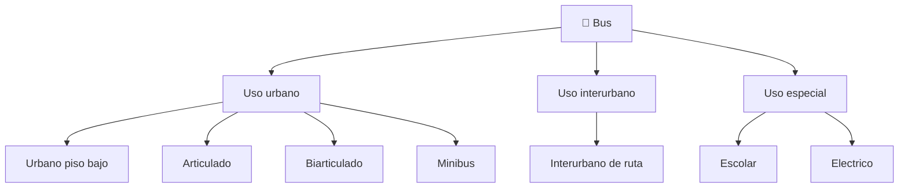

# 📋 Caracteristicas funcionales del bus

[🏠 Inicio](../../../README.md) · [🚌 Curso: Buses](../README.md) · 📋 Caracteristicas

Que es un bus, que tipos existen y para que sirve cada uno. Este modulo da el
contexto antes de abrir la mecanica (Modulo 3).

---

## 🧭 Definicion

Un bus es un vehiculo motorizado de gran tamano disenado para transportar muchos
pasajeros por carretera de forma colectiva. A diferencia de un automovil, el
conductor gestiona no solo la marcha sino tambien la seguridad y comodidad de
decenas de personas, muchas de ellas de pie, y el ascenso y descenso en paradas.

---

## 🧬 Caracteristicas clave

| Caracteristica | Descripcion |
| --- | --- |
| Gran masa | Entre 10 y 30 toneladas cargado; alta inercia al acelerar y frenar. |
| Capacidad | Desde 20 hasta mas de 250 pasajeros en biarticulados. |
| Pasajeros de pie | El frenado brusco los desestabiliza; exige suavidad. |
| Accesibilidad | Piso bajo, rampa y arrodillamiento para movilidad reducida. |
| Radio de giro amplio | El barrido trasero invade el carril contiguo al girar. |
| Puntos ciegos extensos | Gran carroceria y muchos espejos y camaras. |
| Sistema neumatico | Aire comprimido para frenos, puertas y suspension. |
| Frenado asistido | Frenos de aire, ABS/EBS, freno motor y retardador. |

---

## 🗂️ Tipos de bus

| Tipo | Uso tipico | Rasgo destacado |
| --- | --- | --- |
| Urbano piso bajo | Ciudad, paradas frecuentes | Acceso a nivel de acera, accesible. |
| Articulado | Corredores de alta demanda | Seccion flexible, gran aforo. |
| Biarticulado | BRT de muy alta demanda | Dos secciones flexibles, maxima capacidad. |
| Interurbano | Rutas entre ciudades | Butacas reclinables, bodega, mayor velocidad. |
| Minibus | Baja y media demanda | Menor tamano, mas maniobrable. |
| Escolar | Transporte de estudiantes | Senalizacion y seguridad reforzadas. |
| Electrico | Ciudad y BRT | Cero emisiones locales, bajo ruido. |

---

## 🎯 Para que se usa

- Transporte publico urbano masivo en ciudades.
- Corredores segregados de alta demanda (BRT).
- Conexion interurbana entre ciudades y regiones.
- Transporte escolar y de personal de empresas.
- Servicios turisticos y de acercamiento.

---

[⬅️ Anterior: Historia](../historia/historia-bus.md) · [➡️ Siguiente: Sistemas mecanicos](sistemas-mecanicos-bus.md)
