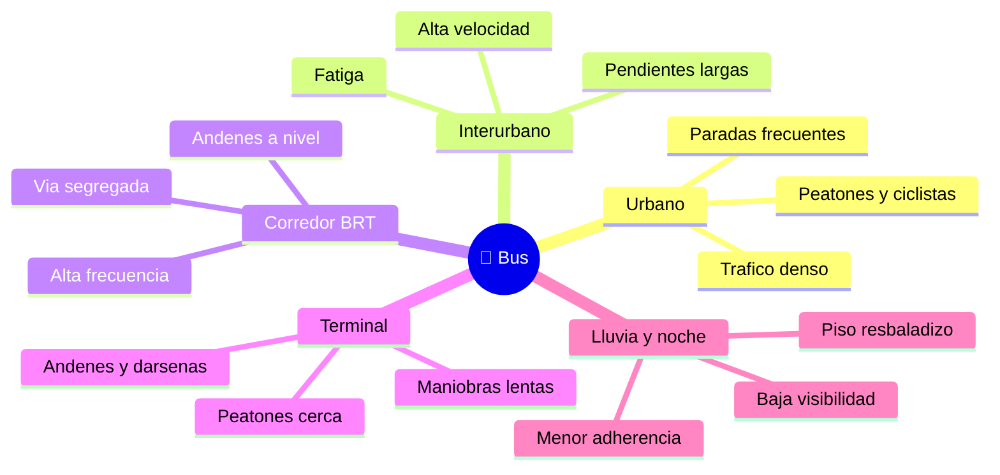

# 🌍 Entornos de trabajo del bus

[🏠 Inicio](../../../README.md) · [🚌 Curso: Buses](../README.md) · 🌍 Entornos

Dónde opera un bus y cómo cambia la conducción según el entorno. Cada entorno
implica reglas, riesgos y ajustes distintos, y en simulación se traduce en
escenarios diferentes.

---

## 🗺️ Entornos principales

| Entorno | Características | Riesgos típicos | Ajuste de conducción |
| --- | --- | --- | --- |
| Urbano | Tráfico, cruces, paradas frecuentes. | Peatones, ciclistas, puntos ciegos. | Baja velocidad, frenado suave, anticipación. |
| Interurbano | Velocidad sostenida, pendientes. | Fatiga, descensos largos, viento. | Retardador en bajadas, descansos, distancia. |
| Corredor BRT | Vía segregada, andenes a nivel. | Alta frecuencia, alineación al andén. | Precisión al andén, ritmo constante. |
| Terminal | Maniobras lentas, darsenas. | Peatones muy cerca, barrido trasero. | Velocidad mínima, vigilancia total, señas. |
| Lluvia / noche | Baja visibilidad y agarre. | Deslizamiento, no ver ni ser visto. | Luces, mayor distancia, frenado anticipado. |

---

## 🌦️ Factores del entorno

- **Clima**: lluvia y hielo reducen la adherencia de una gran masa; el viento
  lateral afecta a la alta carrocería en carretera.
- **Superficie**: asfalto, adoquín o pavimento mojado cambian el frenado.
- **Tráfico**: más vehículos, peatones y ciclistas, más puntos ciegos y decisiones.
- **Pendiente**: las bajadas largas exigen retardador y freno motor para no
  recalentar los frenos de servicio.
- **Luz**: de noche o con niebla, la visibilidad del bus y de sus paradas es crítica.

---

## 🎮 Traducción a simulación

Cada entorno es un escenario con su superficie, clima, tráfico, pendientes y tipo
de parada. Ver cómo se modela en el
[Módulo 9: Diseño de simulación](../simulacion/diseno-simulador-bus.md).

---

[⬅️ Anterior: Principios y operación](principios-bus.md) · [➡️ Siguiente: Reglamentos](../reglamentos/reglamentos-bus.md)
