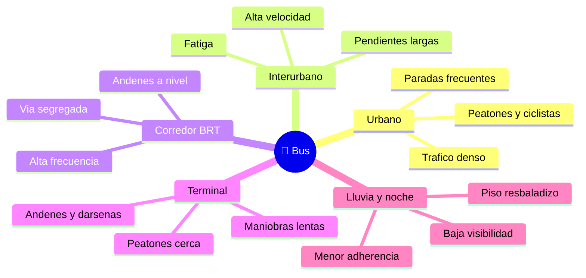

# 🌍 Entornos de trabajo del bus

[🏠 Inicio](../../../README.md) · [🚌 Curso: Buses](../README.md) · 🌍 Entornos

Donde opera un bus y como cambia la conduccion segun el entorno. Cada entorno
implica reglas, riesgos y ajustes distintos, y en simulacion se traduce en
escenarios diferentes.

---

## 🗺️ Entornos principales

| Entorno | Caracteristicas | Riesgos tipicos | Ajuste de conduccion |
| --- | --- | --- | --- |
| Urbano | Trafico, cruces, paradas frecuentes. | Peatones, ciclistas, puntos ciegos. | Baja velocidad, frenado suave, anticipacion. |
| Interurbano | Velocidad sostenida, pendientes. | Fatiga, descensos largos, viento. | Retardador en bajadas, descansos, distancia. |
| Corredor BRT | Via segregada, andenes a nivel. | Alta frecuencia, alineacion al anden. | Precision al anden, ritmo constante. |
| Terminal | Maniobras lentas, darsenas. | Peatones muy cerca, barrido trasero. | Velocidad minima, vigilancia total, senas. |
| Lluvia / noche | Baja visibilidad y agarre. | Deslizamiento, no ver ni ser visto. | Luces, mayor distancia, frenado anticipado. |

---

## 🌦️ Factores del entorno

- **Clima**: lluvia y hielo reducen la adherencia de una gran masa; el viento
  lateral afecta a la alta carroceria en carretera.
- **Superficie**: asfalto, adoquin o pavimento mojado cambian el frenado.
- **Trafico**: mas vehiculos, peatones y ciclistas, mas puntos ciegos y decisiones.
- **Pendiente**: las bajadas largas exigen retardador y freno motor para no
  recalentar los frenos de servicio.
- **Luz**: de noche o con niebla, la visibilidad del bus y de sus paradas es critica.

---

## 🎮 Traduccion a simulacion

Cada entorno es un escenario con su superficie, clima, trafico, pendientes y tipo
de parada. Ver como se modela en el
[Modulo 8: Diseno de simulacion](../simulacion/diseno-simulador-bus.md).

---

[⬅️ Anterior: Principios y operacion](principios-bus.md) · [➡️ Siguiente: Reglamentos](../reglamentos/reglamentos-bus.md)
