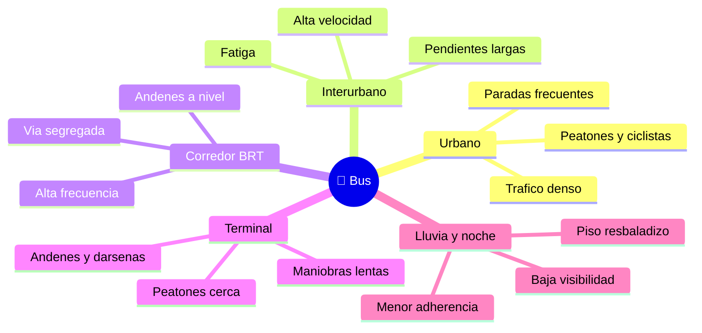

<!-- clase-meta
tipo_documento: clase
clase: 7
codigo: BUSES-07
curso: buses
titulo: "Entornos de trabajo del bus"
modalidad: "análisis de escenarios"
duracion_minutos: 60
nivel: introductorio
prerrequisito: BUSES-06
competencia: "adaptacion_al_entorno"
resultados_aprendizaje:
  - "Explicar entornos, factores ambientales, riesgos y respuesta de simulación con vocabulario propio de Buses."
  - "Aplicar esos conceptos a una decisión segura o a un escenario de simulación de Buses."
evidencia: "Matriz entorno–cambio–riesgo–respuesta."
criterio_aprobacion: "Cada respuesta se adapta al entorno y distingue riesgos que no son intercambiables entre escenarios."
fuentes: manuales/fuentes.md
ultima_revision: 2026-09-10
-->

# 🌍 Entornos de trabajo del bus

[🏠 Inicio](../../../README.md) · [🚌 Curso: Buses](../README.md) · 🌍 Entornos

Dónde opera un bus y cómo cambia la conducción según el entorno. Cada entorno
implica reglas, riesgos y ajustes distintos, y en simulación se traduce en
escenarios diferentes.

---

## 🗺️ Entornos principales

```mermaid
mindmap
  root((🚌 Bus))
    Urbano
      Trafico denso
      Paradas frecuentes
      Peatones y ciclistas
    Interurbano
      Alta velocidad
      Pendientes largas
      Fatiga
    Corredor BRT
      Via segregada
      Andenes a nivel
      Alta frecuencia
    Terminal
      Maniobras lentas
      Andenes y darsenas
      Peatones cerca
    Lluvia y noche
      Baja visibilidad
      Menor adherencia
      Piso resbaladizo
```

| Entorno | Características | Riesgos típicos | Ajuste de conducción |
| --- | --- | --- | --- |
| Urbano | Tráfico, cruces, paradas frecuentes. | Peatones, ciclistas, puntos ciegos. | Baja velocidad, frenado suave, anticipación. |
| Interurbano | Velocidad sostenida, pendientes. | Fatiga, descensos largos, viento. | Retardador en bajadas, descansos, distancia. |
| Corredor BRT | Vía segregada, andenes a nivel. | Alta frecuencia, alineación al andén. | Precisión al andén, ritmo constante. |
| Terminal | Maniobras lentas, darsenas. | Peatones muy cerca, barrido trasero. | Velocidad mínima, vigilancia total, señas. |
| Lluvia / noche | Baja visibilidad y agarre. | Deslizamiento, no ver ni ser visto. | Luces, mayor distancia, frenado anticipado. |

---

## 🌦️ Factores del entorno

- **Clima**: lluvia y hielo reducen la adherencia de una gran masa; el viento
  lateral afecta a la alta carrocería en carretera.
- **Superficie**: asfalto, adoquín o pavimento mojado cambian el frenado.
- **Tráfico**: más vehículos, peatones y ciclistas, más puntos ciegos y decisiones.
- **Pendiente**: las bajadas largas exigen retardador y freno motor para no
  recalentar los frenos de servicio.
- **Luz**: de noche o con niebla, la visibilidad del bus y de sus paradas es crítica.

---

## 🎮 Traducción a simulación

Cada entorno es un escenario con su superficie, clima, tráfico, pendientes y tipo
de parada. Ver cómo se modela en el
[Clase 9: Diseño de simulación](../simulacion/diseno-simulador-bus.md).

## 🧭 Guía de estudio aplicada

### Pregunta guía

¿Cómo ayuda **Entornos principales, Factores del entorno, Traducción a simulación y Guía de estudio aplicada** a **adaptar descenso prolongado con el vehículo cargado y una parada próxima a tres condiciones ambientales distintas**?

### Explicación razonada

El entorno no es decoración: modifica las fuerzas, la percepción y el tiempo disponible. En el caso «descenso prolongado con el vehículo cargado y una parada próxima», cambia el comportamiento de ejes y aumenta la probabilidad de sobrecalentar los frenos o provocar caídas de pasajeros con acciones bruscas. La respuesta correcta empieza por reconocer qué variable cambió y después adaptar límites, ruta o misión.

Esta clase se conecta con el resto del curso mediante **gestión de inercia, distancia de detención y transferencia de peso con pasajeros**. El hilo de
seguridad consiste en reconocer a tiempo **sobrecalentar los frenos o provocar caídas de pasajeros con acciones bruscas** y poder justificar la decisión
**seleccionar marcha y retardador antes de que la velocidad obligue a abusar del freno**; en clases posteriores cambiará el ángulo de análisis, no esa relación causal.
La lectura funcional común sigue **motor → transmisión → freno de servicio y retardador → ejes**, de modo que cada concepto pueda
ubicarse dentro del funcionamiento completo y no quede como un dato aislado.

**Apoyo documental:** [Ley de Tránsito 18.290](https://www.bcn.cl/leychile/navegar?idNorma=29708) aporta marco legal chileno;
[Commercial Driver's License Manual](https://www.fmcsa.dot.gov/registration/commercial-drivers-license/cdl-manual) se usa para operación de buses y camiones. Estas fuentes
se contrastan con el alcance de la clase y no sustituyen un manual de equipo concreto.

### Caso resuelto: de la observación a la decisión

1. **Escenario base:** conserva la misión «descenso prolongado con el vehículo cargado y una parada próxima» para poder comparar.
2. **Cambiar una condición:** modifica sucesivamente superficie o medio, visibilidad y perturbación externa.
3. **Recalcular margen:** explica cómo cada cambio afecta **ejes** y acerca o aleja **sobrecalentar los frenos o provocar caídas de pasajeros con acciones bruscas**.
4. **Adaptar:** cambia límite, ruta, configuración o incluso cancela; no mantengas la misma respuesta por hábito.

### Comprueba tu comprensión

1. ¿Cómo cambiaría **ejes** si empeora la perturbación externa?
2. ¿Qué condición ambiental acerca más el escenario a **sobrecalentar los frenos o provocar caídas de pasajeros con acciones bruscas**?
3. ¿Cuándo adaptarías la maniobra y cuándo la cancelarías?

Orientación para revisar tus respuestas

- La primera respuesta debe relacionar el eslabón elegido con un efecto posterior, no solo nombrarlo.
- La segunda debe proponer una señal medible u observable y explicar qué tendencia sería preocupante.
- La tercera debe cambiar al menos una variable de capacidad, mando, entorno o margen de seguridad.

## 🎓 Cierre de clase

- **Actividad:** Contrasta tres entornos de Buses a partir de entornos, factores ambientales, riesgos y respuesta de simulación y determina cómo cambian variables, percepción, riesgos y respuesta.
- **Evidencia:** Matriz entorno–cambio–riesgo–respuesta.
- **Criterio de aprobación:** Cada respuesta se adapta al entorno y distingue riesgos que no son intercambiables entre escenarios.
- **Transferencia:** explica qué cambiaría al pasar a otra variante de esta máquina.

### Fuentes de esta clase

- [CL-LEY-18290](https://www.bcn.cl/leychile/navegar?idNorma=29708): Ley de Tránsito 18.290, BCN Chile. Uso: marco legal chileno.
- [US-FMCSA-CDL](https://www.fmcsa.dot.gov/registration/commercial-drivers-license/cdl-manual): Commercial Driver's License Manual, FMCSA. Uso: operación de buses y camiones.
- [US-NHTSA](https://www.nhtsa.gov/vehicle-safety): Vehicle Safety, NHTSA. Uso: seguridad de vehículos terrestres.

> Las fuentes sostienen el marco conceptual y normativo; esta clase no reemplaza el manual
> del fabricante, la formación certificada ni la habilitación exigida para operar equipos reales.

---

[⬅️ Anterior: Principios y operación](principios-bus.md) · [➡️ Siguiente: Reglamentos](../reglamentos/reglamentos-bus.md)
