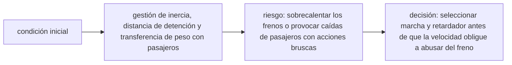

<!-- clase-meta
tipo_documento: clase
clase: 6
codigo: BUSES-06
curso: buses
titulo: "Principios y operación del bus"
modalidad: "resolución de problemas"
duracion_minutos: 90
nivel: introductorio
prerrequisito: BUSES-05
competencia: "razonamiento_operacional"
resultados_aprendizaje:
  - "Explicar principios físicos, fases de operación, decisiones y errores frecuentes con vocabulario propio de Buses."
  - "Aplicar esos conceptos a una decisión segura o a un escenario de simulación de Buses."
evidencia: "Resolución argumentada de un escenario operacional."
criterio_aprobacion: "Aplica los principios correctos, anticipa consecuencias y respeta los límites del curso."
fuentes: manuales/fuentes.md
ultima_revision: 2026-09-10
-->

# 🧪 Principios y operación del bus

[🏠 Inicio](../../../README.md) · [🚌 Curso: Buses](../README.md) · 🧪 Principios

Documento general y educativo. No sustituye un curso de conducción profesional
certificado ni el manual del fabricante. Describe cómo se opera un bus en
simulación y que principios físicos conviene representar.

## Principios de funcionamiento

- **Masa e inercia**: el bus es muy pesado; acelerar y detener requiere más
  distancia y tiempo. La anticipación es la primera herramienta de seguridad.
- **Frenado con pasajeros de pie**: una frenada brusca lanza a las personas hacia
  adelante. El frenado debe ser suave y progresivo, iniciado con antelación.
- **Radio de giro y barrido trasero**: el bus necesita mucho espacio para girar y
  su parte trasera describe un arco que invade el carril contiguo.
- **Puntos ciegos**: la gran carrocería genera amplias zonas sin visión directa;
  se cubren con espejos y cámaras, y aun así exigen precaución.
- **Aproximación a paradas**: acercarse al andén de forma paralela y suave para
  facilitar el ascenso y descenso seguro.

## Fases de operación

| Fase | Que ocurre | Puntos clave |
| --- | --- | --- |
| Inspección previa | Revisión básica | Neumáticos, luces, frenos, presión de aire, puertas. |
| Carga de aire | Motor en marcha | Esperar la presión mínima antes de mover el bus. |
| Puesta en marcha | Iniciar servicio | Soltar freno de estacionamiento, seleccionar D, salir suave. |
| Conducción | Circular con pasajeros | Mirar lejos, frenar con antelación, vigilar puntos ciegos. |
| Aproximación a parada | Llegar al andén | Reducir suave, alinear paralelo, detener y arrodillar si aplica. |
| Servicio en parada | Ascenso y descenso | Abrir puertas, marcha enclavada, cerrar sin atrapar. |
| Detención final | Terminar el servicio | Freno de estacionamiento, puertas, motor apagado. |

## Aproximación a parada: idea general

1. Anticipar la parada y **reducir la velocidad con tiempo**.
2. Señalizar e ir alineando el bus **paralelo al andén**.
3. Frenar de forma **progresiva** para no desestabilizar a los de pie.
4. Detener completamente y aplicar el freno; **arrodillar** si hay accesibilidad.
5. Abrir puertas solo con el bus detenido; cerrar verificando los sensores.
6. Reincorporarse al tráfico mirando espejos y puntos ciegos.

## Errores comunes que la simulación puede enseñar a evitar

- Frenar tarde y brusco, desestabilizando a los pasajeros de pie.
- Girar sin dejar espacio para el barrido trasero.
- Abrir o mantener puertas abiertas con el bus en movimiento.
- Ignorar la presión de aire y mover el bus antes de tiempo.
- Olvidar los puntos ciegos al cambiar de carril o al salir de la parada.
- Abusar del freno de servicio en descensos en vez de usar el retardador.

## Relación con los niveles de realismo

- **Nivel 1 (educativo)**: acelerar, frenar suave, parar en paradas y respetar señales.
- **Nivel 2 (simplificado)**: agregar inercia de la masa, barrido trasero y aforo.
- **Nivel 3 (técnico)**: sumar presión de aire, retardador, enclavamiento de
  puertas y gestión de la fatiga en jornada.

Ver [`docs/03-niveles-de-realismo.md`](../../../docs/03-niveles-de-realismo.md) para el detalle de cada nivel.

## 🧭 Guía de estudio aplicada

### Pregunta guía

¿Cómo ayuda **Principios de funcionamiento, Fases de operación, Aproximación a parada: idea general y Errores comunes que la simulación puede enseñar a evitar** a **resolver descenso prolongado con el vehículo cargado y una parada próxima sin agotar el margen operacional**?

### Explicación razonada

El principio rector puede resumirse así: gestión de inercia, distancia de detención y transferencia de peso con pasajeros. Esto explica por qué una misma orden produce resultados distintos cuando cambian velocidad, carga, configuración o entorno. Operar bien consiste en leer la tendencia antes de agotar el margen y tomar esta decisión: seleccionar marcha y retardador antes de que la velocidad obligue a abusar del freno.

Esta clase se conecta con el resto del curso mediante **gestión de inercia, distancia de detención y transferencia de peso con pasajeros**. El hilo de
seguridad consiste en reconocer a tiempo **sobrecalentar los frenos o provocar caídas de pasajeros con acciones bruscas** y poder justificar la decisión
**seleccionar marcha y retardador antes de que la velocidad obligue a abusar del freno**; en clases posteriores cambiará el ángulo de análisis, no esa relación causal.
La lectura funcional común sigue **motor → transmisión → freno de servicio y retardador → ejes**, de modo que cada concepto pueda
ubicarse dentro del funcionamiento completo y no quede como un dato aislado.

**Apoyo documental:** [Ley de Tránsito 18.290](https://www.bcn.cl/leychile/navegar?idNorma=29708) aporta marco legal chileno;
[Commercial Driver's License Manual](https://www.fmcsa.dot.gov/registration/commercial-drivers-license/cdl-manual) se usa para operación de buses y camiones. Estas fuentes
se contrastan con el alcance de la clase y no sustituyen un manual de equipo concreto.

### Caso resuelto: de la observación a la decisión

1. **Datos:** reconoce condiciones, configuración y margen disponibles en **descenso prolongado con el vehículo cargado y una parada próxima**.
2. **Modelo:** aplica **gestión de inercia, distancia de detención y transferencia de peso con pasajeros** para predecir una tendencia antes de actuar.
3. **Riesgo:** explica mediante qué cadena de causas podría ocurrir **sobrecalentar los frenos o provocar caídas de pasajeros con acciones bruscas**.
4. **Decisión:** ejecuta mentalmente **seleccionar marcha y retardador antes de que la velocidad obligue a abusar del freno** y define qué observación confirmaría que funcionó.

### Comprueba tu comprensión

1. ¿Qué variable del principio «gestión de inercia, distancia de detención y transferencia de peso con pasajeros» cambia primero en el caso?
2. ¿Cómo se propaga ese cambio hasta **ejes**?
3. ¿Qué evidencia confirmaría que **seleccionar marcha y retardador antes de que la velocidad obligue a abusar del freno** conservó margen operacional?

Orientación para revisar tus respuestas

- La primera respuesta debe relacionar el eslabón elegido con un efecto posterior, no solo nombrarlo.
- La segunda debe proponer una señal medible u observable y explicar qué tendencia sería preocupante.
- La tercera debe cambiar al menos una variable de capacidad, mando, entorno o margen de seguridad.

## 🎓 Cierre de clase

- **Actividad:** Resuelve un escenario de Buses explicando, paso a paso, cómo intervienen principios físicos, fases de operación, decisiones y errores frecuentes.
- **Evidencia:** Resolución argumentada de un escenario operacional.
- **Criterio de aprobación:** Aplica los principios correctos, anticipa consecuencias y respeta los límites del curso.
- **Transferencia:** explica qué cambiaría al pasar a otra variante de esta máquina.

### Fuentes de esta clase

- [CL-LEY-18290](https://www.bcn.cl/leychile/navegar?idNorma=29708): Ley de Tránsito 18.290, BCN Chile. Uso: marco legal chileno.
- [US-FMCSA-CDL](https://www.fmcsa.dot.gov/registration/commercial-drivers-license/cdl-manual): Commercial Driver's License Manual, FMCSA. Uso: operación de buses y camiones.
- [US-NHTSA](https://www.nhtsa.gov/vehicle-safety): Vehicle Safety, NHTSA. Uso: seguridad de vehículos terrestres.

> Las fuentes sostienen el marco conceptual y normativo; esta clase no reemplaza el manual
> del fabricante, la formación certificada ni la habilitación exigida para operar equipos reales.

---

[⬅️ Anterior: Mandos](../mandos/manual-mandos-bus.md) · [➡️ Siguiente: Entornos de trabajo](entornos-bus.md)
