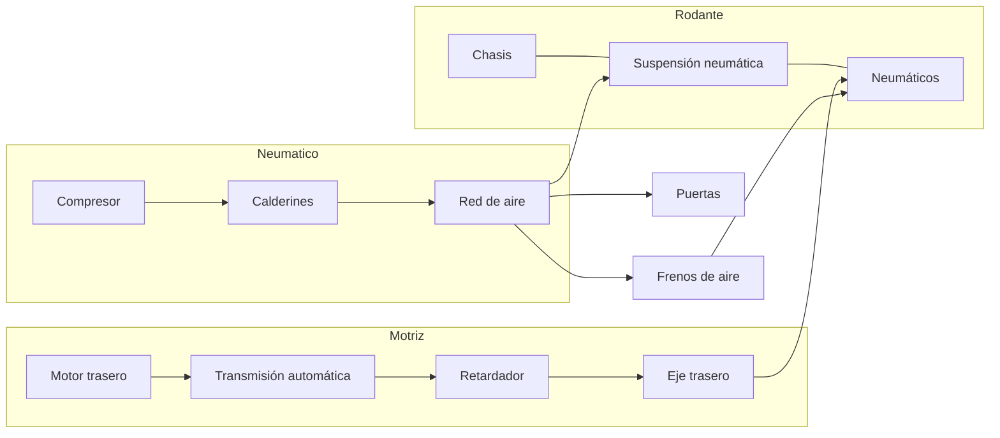
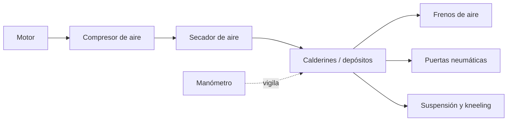

# 🔧 Sistemas mecánicos del bus

[🏠 Inicio](../../../README.md) · [🚌 Curso: Buses](../README.md) · 🔧 Sistemas mecánicos

Este módulo abre el bus por dentro. Explica cada sistema, como funciona y como
se conecta con los demás, con foco en el sistema neumático, los frenos y las
puertas. Es la base técnica para entender los mandos (Módulo 5) y la operación
con pasajeros (Módulo 6).

---

## 1. ⚙️ Motor

El motor transforma energía en movimiento de giro. En un bus suele ir en
posición **trasera**, lo que libera el piso para pasajeros y mejora el reparto
de peso sobre el eje motriz.

| Tipo de motor | Como funciona | Uso típico |
| --- | --- | --- |
| Diesel | Combustión por compresión, alto par. | El más extendido, urbano e interurbano. |
| Gas (GNC/GLP) | Combustión de gas, menos emisiones. | Flotas urbanas con red de recarga. |
| Eléctrico | Motor alimentado por batería, par inmediato. | Ciudad y BRT, cero emisiones locales. |
| Híbrido | Combina diesel y eléctrico. | Recupera energía al frenar, ahorra en ciudad. |

| Parámetro | Efecto en el bus |
| --- | --- |
| Cilindrada y cilindros | Par disponible para mover gran masa. |
| Par (torque) | Fuerza de arranque con el bus cargado y en pendiente. |
| Potencia (kW/CV) | Capacidad de mantener velocidad con carga. |
| Posición trasera | Más espacio útil y tracción sobre el eje trasero. |

Sistemas de apoyo del motor:

- **Alimentación**: inyección electrónica (common raíl en diesel moderno).
- **Refrigeración**: por líquido con radiador de gran capacidad.
- **Lubricación**: aceite que reduce desgaste y disipa calor.
- **Postratamiento**: filtros y SCR (AdBlue) para reducir emisiones.

---

## 2. 🔗 Transmisión

Lleva la fuerza del motor al eje trasero y adapta fuerza y velocidad. En buses
urbanos domina la **transmisión automática con convertidor de par**, que suaviza
la marcha y evita el embrague manual con pasajeros de pie.

- **Convertidor de par**: acopla el motor a la caja mediante fluido, sin pedal
  de embrague; permite arrancar suave con carga.
- **Caja automática**: selecciona la relación sin intervención del conductor.
- **Retardador**: freno auxiliar (hidráulico o electromagnético) que frena sin
  desgastar las zapatas; clave en pendientes largas.
- **Transmisión final**: árbol, diferencial y eje trasero entregan el giro.

| Elemento | Función | Ventaja operativa |
| --- | --- | --- |
| Convertidor de par | Acople fluido motor-caja | Arranque suave, sin embrague. |
| Caja automática | Cambia relaciones sola | Menos fatiga, marcha estable. |
| Retardador | Frenado sin fricción | Protege frenos en bajadas largas. |

---

## 3. 🎯 Dirección

Un bus usa **dirección asistida** (hidráulica o electrohidraulica) porque el
esfuerzo para girar las ruedas de un vehículo tan pesado sería inviable a mano.

- **Asistencia**: una bomba multiplica la fuerza del conductor sobre el volante.
- **Radio de giro**: amplio; el bus necesita mucho espacio para maniobrar.
- **Barrido trasero**: al girar, la parte trasera describe un arco que invade el
  carril contiguo; el conductor debe anticiparlo.

---

## 4. 🛑 Frenos

Convierten la energía de movimiento en calor. Por la gran masa, los buses usan
**frenos neumáticos de aire** en vez de hidráulicos.

| Sistema | Función | Nota |
| --- | --- | --- |
| Freno de servicio | Frenado principal por aire. | Se acciona con el pedal. |
| ABS | Evita bloqueo de ruedas. | Mantiene control en frenada fuerte. |
| EBS | Frenado electrónico repartido. | Distribuye la fuerza por eje. |
| Freno motor | Retención del motor al soltar acelerador. | Ahorra frenos en descensos. |
| Retardador | Freno auxiliar sin fricción. | Ideal en pendientes largas. |
| Freno de estacionamiento | Bloqueo por muelle (spring brake). | Se aplica al detener y sin aire. |

Nota de seguridad: si el aire cae por debajo del mínimo, el **freno de muelle**
se aplica solo y detiene el bus; esto es un diseño a prueba de fallos.

---

## 5. 🌊 Suspensión

Mantiene los neumáticos en contacto con el suelo y da confort a los pasajeros.
Los buses modernos usan **suspensión neumática** (fuelles de aire).

- **Fuelles de aire**: reemplazan a los muelles metalicos y absorben el camino.
- **Nivelación**: mantiene la altura constante aunque cambie la carga.
- **Arrodillamiento (kneeling)**: baja la carrocería del lado de la puerta para
  facilitar el ascenso; usa el mismo aire de la suspensión.

---

## 6. 💨 Sistema neumático

Es el corazón auxiliar del bus: el aire comprimido acciona frenos, puertas y
suspensión. Entenderlo es clave para operar el vehículo.

| Componente | Función |
| --- | --- |
| Compresor | Genera aire comprimido movido por el motor. |
| Secador | Elimina humedad para evitar corrosión y hielo. |
| Calderines | Depósitos que almacenan el aire a presión. |
| Válvulas | Reparten el aire a cada sistema. |
| Manómetro | Muestra la presión; avisa si es insuficiente. |

- **Presión típica de trabajo**: del orden de 8 a 12 bar en los calderines.
- **Presión mínima**: por debajo de un umbral suena una alarma y no se debe
  arrancar; los frenos de muelle pueden aplicarse.
- **Regla operativa**: antes de mover el bus se espera a que la presión suba al
  rango normal.

---

## 7. 🚪 Puertas

Las puertas de pasajeros son **neumáticas**: el mismo aire comprimido las abre y
cierra desde el puesto de mando.

- **Accionamiento**: el conductor abre y cierra con un control dedicado.
- **Sensores**: detectan obstáculos o personas y reabren para evitar atrapamientos.
- **Enclavamiento**: con puertas abiertas el bus no debe poder avanzar (o limita
  la marcha), por seguridad de los pasajeros.

| Elemento | Función |
| --- | --- |
| Cilindro neumático | Mueve la hoja de la puerta con aire. |
| Sensor de borde | Reabre si detecta un obstáculo. |
| Enclavamiento de marcha | Impide avanzar con puertas abiertas. |
| Botón de solicitud | El pasajero pide parada; avisa al conductor. |

---

## 8. ♿ Capacidad y accesibilidad

El bus debe atender a todos los pasajeros, incluidos los de movilidad reducida.

| Elemento | Función |
| --- | --- |
| Piso bajo | Acceso a nivel de acera, sin escalones. |
| Rampa | Despliega para sillas de ruedas y coches. |
| Arrodillamiento | Baja el lado de la puerta para reducir el escalón. |
| Espacio reservado | Zona para silla de ruedas con anclaje. |
| Aforo | Suma de plazas sentadas y de pie autorizadas. |
| Asideros | Barras y correas para pasajeros de pie. |

El **aforo** es el número máximo de pasajeros permitido; superarlo compromete la
seguridad y la dinámica de frenado.

---

## 9. ⚡ Sistema eléctrico

Alimenta luces, tablero, puertas electrónicas, validadores de pago y sistemas de
apoyo.

- **Batería** y alternador (o convertidores en eléctricos) dan la energía.
- **24 voltios** es la tensión habitual en buses, superior a los 12 V de un auto.
- Alimenta iluminación interior, letreros de ruta, cámaras y comunicación.

---

## 🔁 Cómo se conecta todo

1. El **motor trasero** genera fuerza.
2. La **transmisión automática** la adapta sin embrague manual.
3. El **eje trasero** entrega el movimiento a las ruedas.
4. El **compresor** llena los **calderines** de aire comprimido.
5. Ese aire acciona **frenos**, **puertas** y **suspensión neumática**.
6. El **retardador** y el **freno motor** ayudan a frenar la gran masa.
7. La **dirección asistida** permite girar; el conductor vigila el barrido trasero.

Con esto entendido, el [Módulo 5: Mandos](../mandos/manual-mandos-bus.md) muestra
como el conductor opera cada uno de estos sistemas.

---

[⬅️ Anterior: Modelos y variantes](../modelos/modelos-bus.md) · [➡️ Siguiente: Mandos e instrumentos](../mandos/manual-mandos-bus.md)
