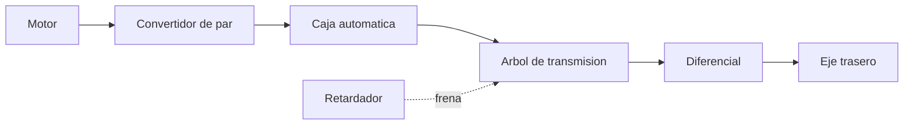
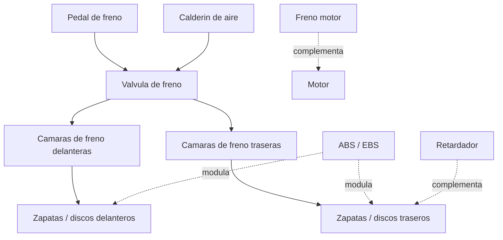

# 🔧 Sistemas mecanicos del bus

[🏠 Inicio](../../../README.md) · [🚌 Curso: Buses](../README.md) · 🔧 Sistemas mecanicos

Este modulo abre el bus por dentro. Explica cada sistema, como funciona y como
se conecta con los demas, con foco en el sistema neumatico, los frenos y las
puertas. Es la base tecnica para entender los mandos (Modulo 4) y la operacion
con pasajeros (Modulo 5).

---

## 1. ⚙️ Motor

El motor transforma energia en movimiento de giro. En un bus suele ir en
posicion **trasera**, lo que libera el piso para pasajeros y mejora el reparto
de peso sobre el eje motriz.

| Tipo de motor | Como funciona | Uso tipico |
| --- | --- | --- |
| Diesel | Combustion por compresion, alto par. | El mas extendido, urbano e interurbano. |
| Gas (GNC/GLP) | Combustion de gas, menos emisiones. | Flotas urbanas con red de recarga. |
| Electrico | Motor alimentado por bateria, par inmediato. | Ciudad y BRT, cero emisiones locales. |
| Hibrido | Combina diesel y electrico. | Recupera energia al frenar, ahorra en ciudad. |

| Parametro | Efecto en el bus |
| --- | --- |
| Cilindrada y cilindros | Par disponible para mover gran masa. |
| Par (torque) | Fuerza de arranque con el bus cargado y en pendiente. |
| Potencia (kW/CV) | Capacidad de mantener velocidad con carga. |
| Posicion trasera | Mas espacio util y traccion sobre el eje trasero. |

Sistemas de apoyo del motor:

- **Alimentacion**: inyeccion electronica (common rail en diesel moderno).
- **Refrigeracion**: por liquido con radiador de gran capacidad.
- **Lubricacion**: aceite que reduce desgaste y disipa calor.
- **Postratamiento**: filtros y SCR (AdBlue) para reducir emisiones.

---

## 2. 🔗 Transmision

Lleva la fuerza del motor al eje trasero y adapta fuerza y velocidad. En buses
urbanos domina la **transmision automatica con convertidor de par**, que suaviza
la marcha y evita el embrague manual con pasajeros de pie.

- **Convertidor de par**: acopla el motor a la caja mediante fluido, sin pedal
  de embrague; permite arrancar suave con carga.
- **Caja automatica**: selecciona la relacion sin intervencion del conductor.
- **Retardador**: freno auxiliar (hidraulico o electromagnetico) que frena sin
  desgastar las zapatas; clave en pendientes largas.
- **Transmision final**: arbol, diferencial y eje trasero entregan el giro.

| Elemento | Funcion | Ventaja operativa |
| --- | --- | --- |
| Convertidor de par | Acople fluido motor-caja | Arranque suave, sin embrague. |
| Caja automatica | Cambia relaciones sola | Menos fatiga, marcha estable. |
| Retardador | Frenado sin friccion | Protege frenos en bajadas largas. |

---

## 3. 🎯 Direccion

Un bus usa **direccion asistida** (hidraulica o electrohidraulica) porque el
esfuerzo para girar las ruedas de un vehiculo tan pesado seria inviable a mano.

- **Asistencia**: una bomba multiplica la fuerza del conductor sobre el volante.
- **Radio de giro**: amplio; el bus necesita mucho espacio para maniobrar.
- **Barrido trasero**: al girar, la parte trasera describe un arco que invade el
  carril contiguo; el conductor debe anticiparlo.

---

## 4. 🛑 Frenos

Convierten la energia de movimiento en calor. Por la gran masa, los buses usan
**frenos neumaticos de aire** en vez de hidraulicos.

| Sistema | Funcion | Nota |
| --- | --- | --- |
| Freno de servicio | Frenado principal por aire. | Se acciona con el pedal. |
| ABS | Evita bloqueo de ruedas. | Mantiene control en frenada fuerte. |
| EBS | Frenado electronico repartido. | Distribuye la fuerza por eje. |
| Freno motor | Retencion del motor al soltar acelerador. | Ahorra frenos en descensos. |
| Retardador | Freno auxiliar sin friccion. | Ideal en pendientes largas. |
| Freno de estacionamiento | Bloqueo por muelle (spring brake). | Se aplica al detener y sin aire. |

Nota de seguridad: si el aire cae por debajo del minimo, el **freno de muelle**
se aplica solo y detiene el bus; esto es un diseno a prueba de fallos.

---

## 5. 🌊 Suspension

Mantiene los neumaticos en contacto con el suelo y da confort a los pasajeros.
Los buses modernos usan **suspension neumatica** (fuelles de aire).

- **Fuelles de aire**: reemplazan a los muelles metalicos y absorben el camino.
- **Nivelacion**: mantiene la altura constante aunque cambie la carga.
- **Arrodillamiento (kneeling)**: baja la carroceria del lado de la puerta para
  facilitar el ascenso; usa el mismo aire de la suspension.

---

## 6. 💨 Sistema neumatico

Es el corazon auxiliar del bus: el aire comprimido acciona frenos, puertas y
suspension. Entenderlo es clave para operar el vehiculo.

| Componente | Funcion |
| --- | --- |
| Compresor | Genera aire comprimido movido por el motor. |
| Secador | Elimina humedad para evitar corrosion y hielo. |
| Calderines | Depositos que almacenan el aire a presion. |
| Valvulas | Reparten el aire a cada sistema. |
| Manometro | Muestra la presion; avisa si es insuficiente. |

- **Presion tipica de trabajo**: del orden de 8 a 12 bar en los calderines.
- **Presion minima**: por debajo de un umbral suena una alarma y no se debe
  arrancar; los frenos de muelle pueden aplicarse.
- **Regla operativa**: antes de mover el bus se espera a que la presion suba al
  rango normal.

---

## 7. 🚪 Puertas

Las puertas de pasajeros son **neumaticas**: el mismo aire comprimido las abre y
cierra desde el puesto de mando.

- **Accionamiento**: el conductor abre y cierra con un control dedicado.
- **Sensores**: detectan obstaculos o personas y reabren para evitar atrapamientos.
- **Enclavamiento**: con puertas abiertas el bus no debe poder avanzar (o limita
  la marcha), por seguridad de los pasajeros.

| Elemento | Funcion |
| --- | --- |
| Cilindro neumatico | Mueve la hoja de la puerta con aire. |
| Sensor de borde | Reabre si detecta un obstaculo. |
| Enclavamiento de marcha | Impide avanzar con puertas abiertas. |
| Boton de solicitud | El pasajero pide parada; avisa al conductor. |

---

## 8. ♿ Capacidad y accesibilidad

El bus debe atender a todos los pasajeros, incluidos los de movilidad reducida.

| Elemento | Funcion |
| --- | --- |
| Piso bajo | Acceso a nivel de acera, sin escalones. |
| Rampa | Despliega para sillas de ruedas y coches. |
| Arrodillamiento | Baja el lado de la puerta para reducir el escalon. |
| Espacio reservado | Zona para silla de ruedas con anclaje. |
| Aforo | Suma de plazas sentadas y de pie autorizadas. |
| Asideros | Barras y correas para pasajeros de pie. |

El **aforo** es el numero maximo de pasajeros permitido; superarlo compromete la
seguridad y la dinamica de frenado.

---

## 9. ⚡ Sistema electrico

Alimenta luces, tablero, puertas electronicas, validadores de pago y sistemas de
apoyo.

- **Bateria** y alternador (o convertidores en electricos) dan la energia.
- **24 voltios** es la tension habitual en buses, superior a los 12 V de un auto.
- Alimenta iluminacion interior, letreros de ruta, camaras y comunicacion.

---

## 🔁 Como se conecta todo

1. El **motor trasero** genera fuerza.
2. La **transmision automatica** la adapta sin embrague manual.
3. El **eje trasero** entrega el movimiento a las ruedas.
4. El **compresor** llena los **calderines** de aire comprimido.
5. Ese aire acciona **frenos**, **puertas** y **suspension neumatica**.
6. El **retardador** y el **freno motor** ayudan a frenar la gran masa.
7. La **direccion asistida** permite girar; el conductor vigila el barrido trasero.

Con esto entendido, el [Modulo 4: Mandos](../mandos/manual-mandos-bus.md) muestra
como el conductor opera cada uno de estos sistemas.

---

[⬅️ Anterior: Caracteristicas](caracteristicas-bus.md) · [➡️ Siguiente: Mandos e instrumentos](../mandos/manual-mandos-bus.md)
