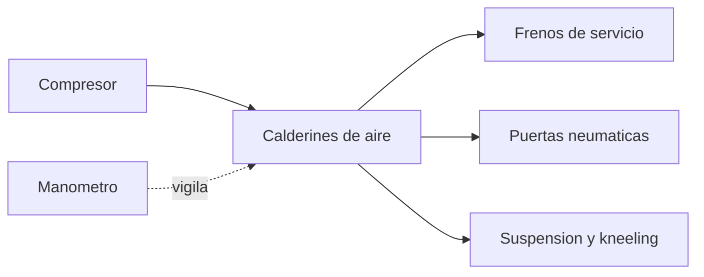

# 🧰 Recursos del bus

[🏠 Inicio](../../../README.md) · [🚌 Curso: Buses](../README.md) · 🧰 Recursos

Glosario especifico, enlaces y diagramas de apoyo del curso de buses. Amplia el
[glosario general](../../../docs/05-glosario-general.md).

---

## 📖 Glosario especifico

| Termino | Definicion |
| --- | --- |
| Aforo | Numero maximo de pasajeros permitido, sentados y de pie. |
| Sistema neumatico | Red de aire comprimido que acciona frenos, puertas y suspension. |
| Calderin | Deposito que almacena el aire comprimido a presion. |
| Retardador | Freno auxiliar sin friccion para descensos largos. |
| Freno de muelle | Freno de estacionamiento que se aplica al faltar aire. |
| Arrodillamiento (kneeling) | Descenso del lado de la puerta para facilitar el ascenso. |
| Piso bajo | Piso sin escalones a nivel de la acera, accesible. |
| Barrido trasero | Arco que describe la parte trasera del bus al girar. |
| Articulado | Bus de dos secciones unidas por una junta flexible. |
| Enclavamiento de marcha | Bloqueo que impide avanzar con las puertas abiertas. |

---

## 🗺️ Diagrama del sistema neumatico

---

## 🔗 Enlaces y fuentes

- Marco legal: [⚖️ docs/07-marco-legal-chile.md](../../../docs/07-marco-legal-chile.md)
- Registro de fuentes: [📚 manuales/fuentes.md](../../../manuales/fuentes.md)
- Manuales oficiales del conductor (CONASET) y reglamento del transporte publico
  (MTT): ver el registro de fuentes.

Registrar cada recurso nuevo con su origen y licencia, siguiendo
[`recursos/README.md`](../../../recursos/README.md).

---

[🎓 Portada del curso](../README.md) · [⬅️ Anterior: Diseno de simulacion](../simulacion/diseno-simulador-bus.md)
