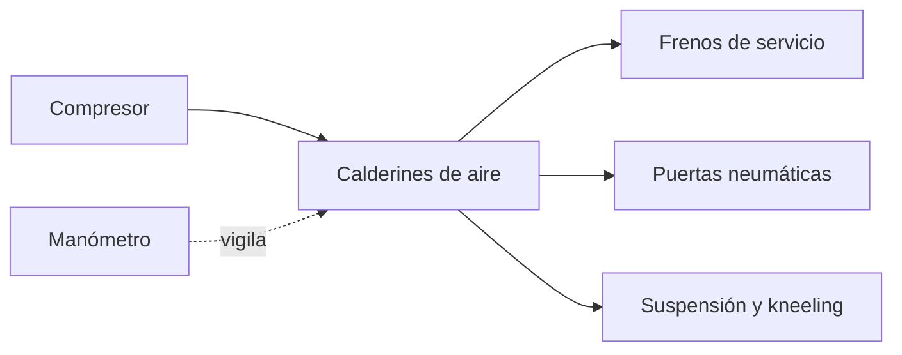

<!-- clase-meta
tipo_documento: clase
clase: 10
codigo: BUSES-10
curso: buses
titulo: "Recursos del bus"
modalidad: "taller documental"
duracion_minutos: 45
nivel: introductorio
prerrequisito: BUSES-09
competencia: "alfabetizacion_tecnica"
resultados_aprendizaje:
  - "Explicar glosario, esquemas y trazabilidad de fuentes con vocabulario propio de Buses."
  - "Aplicar esos conceptos a una decisión segura o a un escenario de simulación de Buses."
evidencia: "Glosario aplicado y ficha breve de trazabilidad."
criterio_aprobacion: "Los términos permiten interpretar el curso y las fuentes se distinguen por autoridad, alcance y vigencia."
fuentes: manuales/fuentes.md
ultima_revision: 2026-09-10
-->

# 🧰 Recursos del bus

[🏠 Inicio](../../../README.md) · [🚌 Curso: Buses](../README.md) · 🧰 Recursos

Glosario específico, enlaces y diagramas de apoyo del curso de buses. Amplia el
[glosario general](../../../docs/05-glosario-general.md).

---

## 📖 Glosario específico

| Término | Definición |
| --- | --- |
| Aforo | Número máximo de pasajeros permitido, sentados y de pie. |
| Sistema neumático | Red de aire comprimido que acciona frenos, puertas y suspensión. |
| Calderin | Depósito que almacena el aire comprimido a presión. |
| Retardador | Freno auxiliar sin fricción para descensos largos. |
| Freno de muelle | Freno de estacionamiento que se aplica al faltar aire. |
| Arrodillamiento (kneeling) | Descenso del lado de la puerta para facilitar el ascenso. |
| Piso bajo | Piso sin escalones a nivel de la acera, accesible. |
| Barrido trasero | Arco que describe la parte trasera del bus al girar. |
| Articulado | Bus de dos secciones unidas por una junta flexible. |
| Enclavamiento de marcha | Bloqueo que impide avanzar con las puertas abiertas. |

---

## 🗺️ Diagrama del sistema neumático

```mermaid
flowchart LR
    Compresor[Compresor] --> Calderines[Calderines de aire]
    Calderines --> Frenos[Frenos de servicio]
    Calderines --> Puertas[Puertas neumáticas]
    Calderines --> Suspension[Suspensión y kneeling]
    Manometro[Manómetro] -. vigila .-> Calderines
```

---

## 🔗 Enlaces y fuentes

- Marco legal: [⚖️ docs/07-marco-legal-chile.md](../../../docs/07-marco-legal-chile.md)
- Registro de fuentes: [📚 manuales/fuentes.md](../../../manuales/fuentes.md)
- Manuales oficiales del conductor (CONASET) y reglamento del transporte público
  (MTT): ver el registro de fuentes.

Registrar cada recurso nuevo con su origen y licencia, siguiendo
[`recursos/README.md`](../../../recursos/README.md).

## 🧭 Guía de estudio aplicada

### Pregunta guía

¿Cómo ayuda **Glosario específico, Diagrama del sistema neumático, Enlaces y fuentes y Guía de estudio aplicada** a **explicar con fuentes los términos motor, transmisión, freno de servicio y retardador y ejes**?

### Explicación razonada

El vocabulario técnico organiza relaciones: motor, transmisión, freno de servicio y retardador y ejes nombran partes distintas de una misma cadena funcional. Una fuente se usa para sostener una afirmación concreta —principio, límite, procedimiento o contexto— y debe distinguirse del manual particular de un fabricante o de una regla narrativa.

Esta clase se conecta con el resto del curso mediante **gestión de inercia, distancia de detención y transferencia de peso con pasajeros**. El hilo de
seguridad consiste en reconocer a tiempo **sobrecalentar los frenos o provocar caídas de pasajeros con acciones bruscas** y poder justificar la decisión
**seleccionar marcha y retardador antes de que la velocidad obligue a abusar del freno**; en clases posteriores cambiará el ángulo de análisis, no esa relación causal.
La lectura funcional común sigue **motor → transmisión → freno de servicio y retardador → ejes**, de modo que cada concepto pueda
ubicarse dentro del funcionamiento completo y no quede como un dato aislado.

**Apoyo documental:** [Ley de Tránsito 18.290](https://www.bcn.cl/leychile/navegar?idNorma=29708) aporta marco legal chileno;
[Commercial Driver's License Manual](https://www.fmcsa.dot.gov/registration/commercial-drivers-license/cdl-manual) se usa para operación de buses y camiones. Estas fuentes
se contrastan con el alcance de la clase y no sustituyen un manual de equipo concreto.

### Caso resuelto: de la observación a la decisión

1. **Definir en contexto:** explica **motor**, **transmisión**, **freno de servicio y retardador** y **ejes** por su función y relación.
2. **Respaldar:** enlaza cada afirmación importante con una fuente identificable y declara su alcance.
3. **Contrastar:** separa principios generales, requisitos locales, manual de fabricante y —si aplica— canon ficticio.
4. **Reformular:** convierte una definición copiada en una explicación propia con un ejemplo de **Buses**.

### Comprueba tu comprensión

1. Explica la diferencia funcional entre **transmisión** y **freno de servicio y retardador** sin copiar una definición.
2. ¿Qué fuente respalda el principio «gestión de inercia, distancia de detención y transferencia de peso con pasajeros» y cuál es su alcance?
3. ¿Qué dato exigiría un manual de fabricante en vez de una fuente general?

Orientación para revisar tus respuestas

- La primera respuesta debe relacionar el eslabón elegido con un efecto posterior, no solo nombrarlo.
- La segunda debe proponer una señal medible u observable y explicar qué tendencia sería preocupante.
- La tercera debe cambiar al menos una variable de capacidad, mando, entorno o margen de seguridad.

## 🎓 Cierre de clase

- **Actividad:** Selecciona términos de glosario, esquemas y trazabilidad de fuentes, explícalos en contexto de Buses y verifica la procedencia de las fuentes utilizadas.
- **Evidencia:** Glosario aplicado y ficha breve de trazabilidad.
- **Criterio de aprobación:** Los términos permiten interpretar el curso y las fuentes se distinguen por autoridad, alcance y vigencia.
- **Transferencia:** explica qué cambiaría al pasar a otra variante de esta máquina.

### Fuentes de esta clase

- [CL-LEY-18290](https://www.bcn.cl/leychile/navegar?idNorma=29708): Ley de Tránsito 18.290, BCN Chile. Uso: marco legal chileno.
- [US-FMCSA-CDL](https://www.fmcsa.dot.gov/registration/commercial-drivers-license/cdl-manual): Commercial Driver's License Manual, FMCSA. Uso: operación de buses y camiones.
- [US-NHTSA](https://www.nhtsa.gov/vehicle-safety): Vehicle Safety, NHTSA. Uso: seguridad de vehículos terrestres.

> Las fuentes sostienen el marco conceptual y normativo; esta clase no reemplaza el manual
> del fabricante, la formación certificada ni la habilitación exigida para operar equipos reales.

---

[🎓 Portada del curso](../README.md) · [⬅️ Anterior: Diseño de simulación](../simulacion/diseno-simulador-bus.md) · [➡️ Siguiente: Ejercicios](../ejercicios/ejercicios-bus.md)
