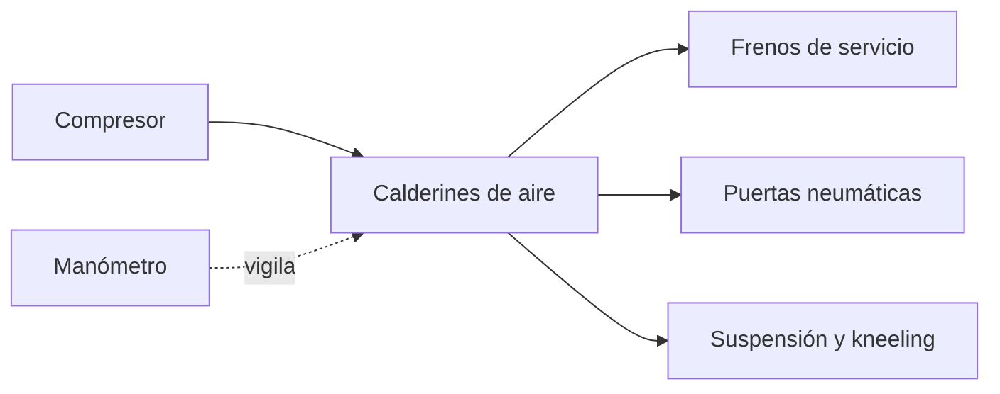

# 🧰 Recursos del bus

[🏠 Inicio](../../../README.md) · [🚌 Curso: Buses](../README.md) · 🧰 Recursos

Glosario específico, enlaces y diagramas de apoyo del curso de buses. Amplia el
[glosario general](../../../docs/05-glosario-general.md).

---

## 📖 Glosario específico

| Término | Definición |
| --- | --- |
| Aforo | Número máximo de pasajeros permitido, sentados y de pie. |
| Sistema neumático | Red de aire comprimido que acciona frenos, puertas y suspensión. |
| Calderin | Depósito que almacena el aire comprimido a presión. |
| Retardador | Freno auxiliar sin fricción para descensos largos. |
| Freno de muelle | Freno de estacionamiento que se aplica al faltar aire. |
| Arrodillamiento (kneeling) | Descenso del lado de la puerta para facilitar el ascenso. |
| Piso bajo | Piso sin escalones a nivel de la acera, accesible. |
| Barrido trasero | Arco que describe la parte trasera del bus al girar. |
| Articulado | Bus de dos secciones unidas por una junta flexible. |
| Enclavamiento de marcha | Bloqueo que impide avanzar con las puertas abiertas. |

---

## 🗺️ Diagrama del sistema neumático

```mermaid
flowchart LR
    Compresor[Compresor] --> Calderines[Calderines de aire]
    Calderines --> Frenos[Frenos de servicio]
    Calderines --> Puertas[Puertas neumáticas]
    Calderines --> Suspension[Suspensión y kneeling]
    Manometro[Manómetro] -. vigila .-> Calderines
```

---

## 🔗 Enlaces y fuentes

- Marco legal: [⚖️ docs/07-marco-legal-chile.md](../../../docs/07-marco-legal-chile.md)
- Registro de fuentes: [📚 manuales/fuentes.md](../../../manuales/fuentes.md)
- Manuales oficiales del conductor (CONASET) y reglamento del transporte público
  (MTT): ver el registro de fuentes.

Registrar cada recurso nuevo con su origen y licencia, siguiendo
[`recursos/README.md`](../../../recursos/README.md).

## 🎓 Cierre de clase

- **Actividad:** Selecciona términos de glosario, esquemas y trazabilidad de fuentes, explícalos en contexto de Buses y verifica la procedencia de las fuentes utilizadas.
- **Evidencia:** Glosario aplicado y ficha breve de trazabilidad.
- **Criterio de aprobación:** Los términos permiten interpretar el curso y las fuentes se distinguen por autoridad, alcance y vigencia.
- **Transferencia:** explica qué cambiaría al pasar a otra variante de esta máquina.

### Fuentes de esta clase

- [CL-LEY-18290](https://www.bcn.cl/leychile/navegar?idNorma=29708): Ley de Tránsito 18.290, BCN Chile. Uso: marco legal chileno.
- [US-FMCSA-CDL](https://www.fmcsa.dot.gov/registration/commercial-drivers-license/cdl-manual): Commercial Driver's License Manual, FMCSA. Uso: operación de buses y camiones.
- [US-NHTSA](https://www.nhtsa.gov/vehicle-safety): Vehicle Safety, NHTSA. Uso: seguridad de vehículos terrestres.

> Las fuentes sostienen el marco conceptual y normativo; esta clase no reemplaza el manual
> del fabricante, la formación certificada ni la habilitación exigida para operar equipos reales.

---

[🎓 Portada del curso](../README.md) · [⬅️ Anterior: Diseño de simulación](../simulacion/diseno-simulador-bus.md) · [➡️ Siguiente: Ejercicios](../ejercicios/ejercicios-bus.md)
