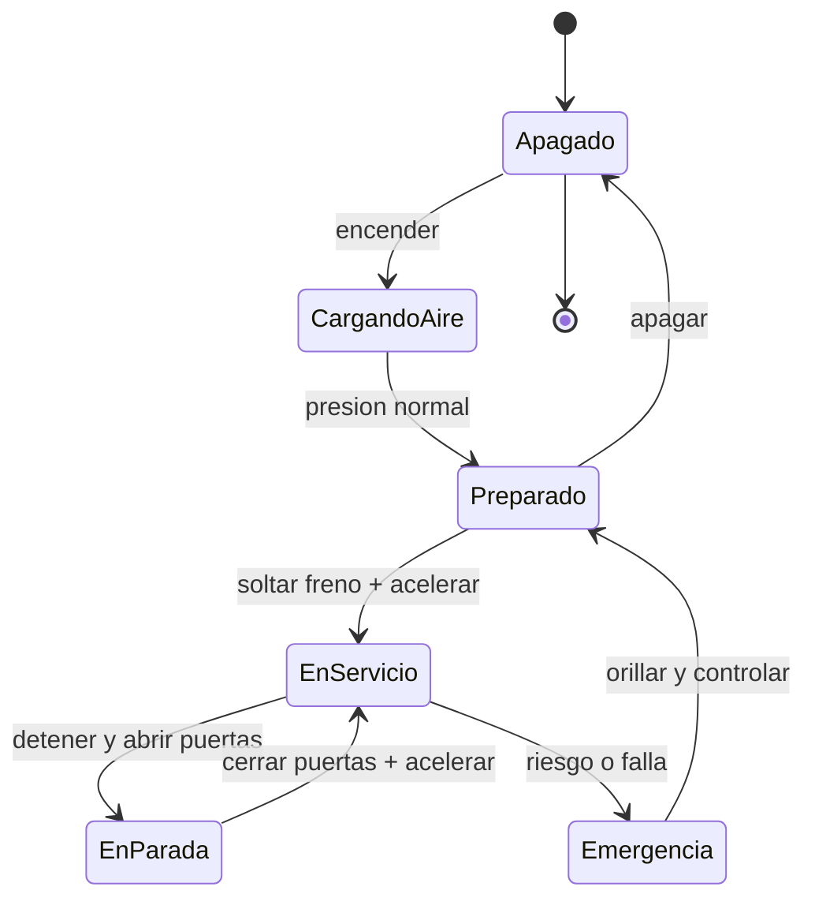

# 🎮 Diseño de simulación del bus

[🏠 Inicio](../../../README.md) · [🚌 Curso: Buses](../README.md) · 🎮 Simulación

## Objetivo de la simulación

Que el usuario aprenda a conducir un bus de forma segura y suave: gestionar la
gran masa, frenar con antelación pensando en los pasajeros de pie, aproximarse a
las paradas, operar las puertas con enclavamiento y respetar las normas del
transporte público.

## Nivel de realismo

- Nivel elegido: se ofrece del 1 al 3 (ver `docs/03-niveles-de-realismo.md`).
- Justificación: el bus suma sobre la moto la gestión de masa, el sistema
  neumático y la operación con pasajeros, por lo que se ubica en dificultad
  intermedia dentro del catálogo.

## Variables principales

| Variable | Tipo | Rango | Afecta a | Comentarios |
| --- | --- | --- | --- | --- |
| Velocidad | numérica | 0-100 km/h | Movimiento y frenado | Central para todo. |
| Aforo | numérica | 0-100% | Inercia y confort | Pasajeros sentados y de pie. |
| Presión de aire | numérica | 0-12 bar | Frenos, puertas, suspensión | No arrancar bajo el mínimo. |
| Estado de puertas | discreta | abiertas/cerradas | Enclavamiento de marcha | Bloquea avance si abiertas. |
| Marcha | discreta | R,N,D | Sentido de la marcha | Automática, sin embrague. |
| Retardador | discreta | 0..3 niveles | Frenado sin fricción | Para descensos largos. |
| Adherencia | numérica | 0-1 | Freno y giro | Baja con lluvia. |
| Combustible/energía | numérica | 0-100% | Autonomía | Diesel, gas o batería. |

## Ciclo básico

1. Leer entrada del usuario (acelerador, freno, retardador, dirección, puertas).
2. Actualizar estado del motor, transmisión y presión de aire.
3. Calcular fuerzas: propulsión, frenado, inercia de la masa y adherencia.
4. Aplicar restricciones del entorno (piso, pendiente, clima) y el aforo.
5. Verificar enclavamientos (no avanzar con puertas abiertas o sin presión).
6. Actualizar velocidad y posición; refrescar instrumentos y confort del pasaje.

## Modos de juego futuros

- Tutorial guiado de mandos y sistema neumático.
- Práctica libre en un circuito cerrado con paradas.
- Misiones de ruta urbana con horarios y aforo.
- Desafíos de frenado suave con pasajeros de pie.
- Situaciones de accesibilidad (rampa y arrodillamiento) y descensos con retardador.

## Elementos fuera de alcance

- Conducción temeraria o a exceso de velocidad presentada como objetivo.
- Sobrecarga de pasajeros mostrada como algo positivo.
- Datos técnicos que permitan alterar sistemas reales de un bus.

## Pendientes

- [ ] Definir valores por defecto de cada variable por tipo de bus.
- [ ] Prototipar el ciclo básico con el sistema neumático simplificado.
- [ ] Modelar el enclavamiento de puertas y el arrodillamiento.
- [ ] Agregar fuentes técnicas públicas a [`manuales/fuentes.md`](../../../manuales/fuentes.md).

---

[⬅️ Anterior: Reglamentos](../reglamentos/reglamentos-bus.md) · [➡️ Siguiente: Recursos](../recursos/recursos-bus.md)
