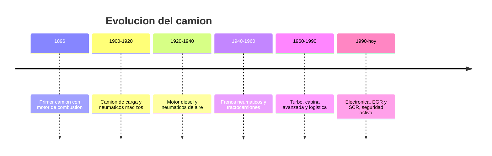

# 📜 Historia del camión

[🏠 Inicio](../../../README.md) · [🚛 Curso: Camiones](../README.md) · 📜 Historia

## Origen

El camión nace del deseo de mover carga pesada sin depender de la tracción
animal. Los primeros modelos, a finales del siglo XIX, montaron un motor de
combustión sobre un chasis reforzado. El salto decisivo llegó con el motor
diesel en las decadas de 1920 y 1930, más eficiente y con mucho par a bajas
vueltas, ideal para arrastrar grandes masas.

## Línea de tiempo

| Periodo | Hito | Importancia |
| --- | --- | --- |
| 1896 | Primer camión con motor de combustión | Prueba del concepto de carga motorizada. |
| 1900-1920 | Camión de carga y neumáticos macizos | Reemplazo del carro tirado por animales. |
| 1920-1940 | Motor diesel y neumáticos de aire | Eficiencia, par y mejor rodadura. |
| 1940-1960 | Frenos neumáticos y tractocamiones | Frenado seguro de gran masa y articulación. |
| 1960-1990 | Turbo, cabina avanzada y logística | Más potencia y confort, transporte a escala. |
| 1990-presente | Electrónica, EGR y SCR, seguridad activa | Menos emisiones y frenado asistido. |

## Evolución tecnológica

- **Propulsión**: del motor de gasolina al diesel turboalimentado de alto par.
- **Frenado**: de frenos mecánicos a neumáticos con ABS, EBS y retarder.
- **Estructura**: chasis de largueros más resistentes y cabinas seguras.
- **Transmisión**: de cajas manuales de muchas marchas a cajas automatizadas.
- **Emisiones**: recirculación de gases EGR y reducción catalítica SCR con AdBlue.
- **Seguridad**: control de estabilidad, aviso de cambio de carril, frenado de emergencia.

## Tipos representativos

| Tipo | Uso típico | Característica destacada |
| --- | --- | --- |
| Camión rígido liviano | Reparto urbano | Chasis simple, fácil de maniobrar. |
| Camión rígido pesado | Carga regional | Varios ejes, gran capacidad útil. |
| Tractocamion | Larga distancia | Arrastra semirremolque con quinta rueda. |
| Volquete / tolva | Áridos y minería | Caja basculante para descarga. |
| Cisterna | Líquidos y combustible | Estanque, centro de gravedad alto. |
| Portacontenedores | Logística intermodal | Chasis para contenedor normalizado. |

## Impacto económico y logístico

El camión es la columna vertebral del transporte de carga por tierra: mueve la
mayor parte de las mercancías que llegan a fabricas, tiendas y hogares. Su
evolución está ligada a la eficiencia de combustible, a la reducción de
emisiones y a la seguridad vial, porque su masa lo convierte en un vehículo
crítico dentro del tráfico mixto.

## Fuentes

- Registrar aquí las fuentes públicas consultadas.
- Enlazar cada fuente también en [`manuales/fuentes.md`](../../../manuales/fuentes.md).

---

[🎓 Portada del curso](../README.md) · [➡️ Siguiente: Características](../operacion/caracteristicas-camion.md)
