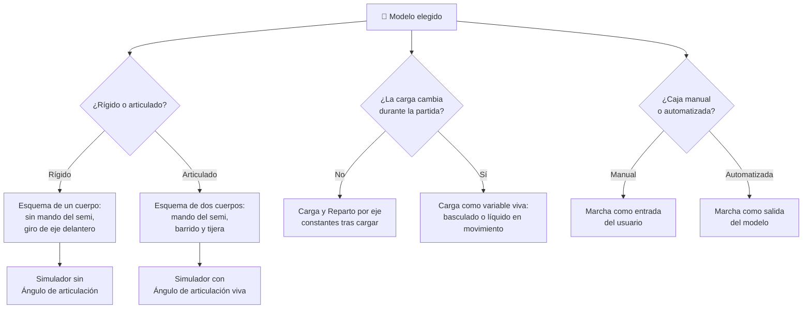

# 🧩 Modelos y variantes del camión

[🏠 Inicio](../../../README.md) · [🚛 Curso: Camiones](../README.md) · 🧩 Modelos

El [Módulo 2](../operacion/caracteristicas-camion.md) ya dijo qué tipos de camión
existen y para qué sirve cada uno. Este módulo responde a lo siguiente: **no
todos se conducen igual**, y esa diferencia no es de matiz. Cambia qué mandos
tiene la máquina y, por tanto, qué debe modelar el simulador.

> 🎯 **La idea que sostiene el módulo.** "Un camión" no es una sola máquina desde
> el punto de vista del mando. Un rígido no tiene quinta rueda ni semirremolque:
> no es que articule menos, es que **no articula**. Un simulador que presente un
> solo esquema de control está representando un camión concreto aunque diga
> representarlos todos.

---

## 🧭 Por qué el modelo decide el simulador

El [Módulo 5](../mandos/manual-mandos-camion.md) describe un puesto de mando que
incluye, en la consola, el **mando del semirremolque**: una palanca de mano que
frena solo el semi y sirve para estirar el conjunto. El
[Módulo 9](../simulacion/diseno-simulador-camion.md) expone una variable
`Ángulo de articulación` con rango `-90..90 grados`. Ambos describen un camión
**articulado**.

En un rígido esa palanca no existe: no hay semirremolque que frenar por separado.
Y la variable `Ángulo de articulación` sencillamente no tiene valores que tomar,
porque no hay perno maestro sobre el que pivotar. La diferencia no es de
parámetros: el rígido tiene un cuerpo, el articulado tiene dos unidos por una
junta. Es otra cinemática, y de ella salen el barrido trasero y el riesgo de
tijera que el [Módulo 4](../operacion/sistemas-mecanicos-camion.md) describe. Si
el simulador se construye sobre el esquema rígido y luego se le "añade" un
tractocamion, el resultado es un semirremolque que sigue al tracto como si
estuviera soldado, que no existe.

---

## 🗂️ Qué cambia en el manejo

| Modelo | Qué cambia al conducirlo |
| --- | --- |
| Rígido liviano | La referencia del curso: un solo cuerpo, ágil en ciudad, con la carga sobre su propio chasis. |
| Rígido pesado | Varios ejes y mucha masa: la inercia domina, y el reparto por eje pasa a decidir el frenado y el agarre. |
| Volquete / tolva | Se conduce cargado y se vacía en obra: el peso cae de golpe al bascular, y el vehículo cambia de comportamiento dentro de la misma jornada. |
| Tractocamion | Dos cuerpos articulados: al girar, el semi recorta la curva y la parte trasera barre. Frenar mal pliega el conjunto en tijera. |
| Cisterna | El líquido se mueve dentro del tanque y el centro de gravedad es alto: la carga empuja al frenar y el vuelco en curva llega antes. |
| Portacontenedores | Articulado con carga rígida y alta: el barrido del tracto se suma a una masa que no amortigua nada. |

---

## 🎛️ Qué cambia en el mando

| Modelo | Qué mando aparece o desaparece | Consecuencia |
| --- | --- | --- |
| Rígido liviano, Rígido pesado | **Desaparece** el mando del semirremolque de la consola. | El mapa del Módulo 5 se reduce: no hay nada que frenar por separado ni conjunto que estirar. |
| Volquete / tolva | **Aparece** el mando de la caja basculante, que el Módulo 5 no contempla. **Desaparece** el mando del semirremolque. | Se opera detenido, no en marcha: es un mando de trabajo, no de conducción. |
| Tractocamion, Portacontenedores | **Aparece** el mando del semirremolque. El volante deja de orientar solo el eje delantero y pasa a gobernar dos cuerpos. | El giro exige anticipar el barrido trasero; el freno de mano del semi entra en el repertorio. |
| Cisterna | **Aparece** el mando del semirremolque; el freno de motor y el retarder ganan peso frente al freno de servicio. | Frenar con el pedal empuja el líquido hacia delante; conviene retener sin fricción. |
| Todos con caja automatizada | **Desaparecen** el pedal de embrague y la palanca de cambio, como ya advierte el Módulo 5. | El pie izquierdo deja de tener función y la elección de marcha sale de las manos del conductor. |

---

## 🎮 Qué cambia en el simulador

Contrastado con las variables del
[Módulo 9](../simulacion/diseno-simulador-camion.md):

| Modelo | Variables que cambian | Esquema de control |
| --- | --- | --- |
| Rígido liviano | Ninguna: es el caso base. `Ángulo de articulación` queda fijo en 0. | El del Módulo 5 sin el mando del semirremolque. |
| Rígido pesado | `Carga` y `Reparto por eje` amplían rango y pesan más en el cálculo del frenado. `Ángulo de articulación` sigue fijo en 0. | El mismo. |
| Volquete / tolva | `Carga` deja de ser fija y pasa a variar durante la partida: cae a 0 al bascular. `Reparto por eje` se recalcula al vaciar. | El mismo, más una entrada de basculado disponible solo en reposo. |
| Tractocamion | `Ángulo de articulación` **se activa** y pasa a ser una variable viva. `Adherencia` se acopla a ella: el bloqueo del tracto dispara la tijera. | Con entrada de freno del semi; el giro necesita dos cuerpos. |
| Cisterna | `Ángulo de articulación` **se activa**. `Carga` deja de ser una masa quieta: se desplaza y empuja. `Adherencia` baja antes en curva por el centro de gravedad alto. | El mismo del articulado, con retarder priorizado. |
| Portacontenedores | `Ángulo de articulación` **se activa**. `Reparto por eje` depende del anclaje del contenedor, no de cómo se apile la carga. | El del articulado. |
| Todos con caja automatizada | `Marcha` deja de ser una entrada del usuario y pasa a ser una salida del modelo. `Régimen del motor` se calcula solo. | Sin entrada de embrague ni de cambio. |

---

## 🗺️ Del modelo al esquema de control

---

## ⚠️ Qué modelos no comparten simulador

Tres familias no se resuelven con un ajuste de parámetros, porque su esquema de
control es otro:

- **Los articulados** (tractocamion, cisterna, portacontenedores) frente a los
  rígidos: aparece un mando que no existía y una variable que estaba muerta pasa
  a gobernar la maniobra. El vehículo deja de ser un cuerpo y pasa a ser dos con
  una junta. Es otra cinemática, no una dificultad distinta.
- **El volquete y la cisterna** frente a los demás: obligan a que `Carga` sea una
  variable viva durante la partida, no una constante que se fija al empezar. En
  el volquete cae de golpe al bascular; en la cisterna se desplaza dentro del
  tanque y empuja al frenar.
- **La caja automatizada** frente a la manual: `Marcha` cambia de bando, deja de
  ser entrada y pasa a ser salida. Faltan dos entradas del mapa de controles.

El resto de diferencias sí caben en un mismo simulador ajustando rangos, tal como
plantean los [niveles de realismo](../../../docs/03-niveles-de-realismo.md): en
el nivel 1 casi todos se comportan igual, y las diferencias emergen a medida que
el nivel sube. No es casual que el Módulo 9 sitúe la articulación en el nivel 3:
es el punto donde el modelo deja de ser un ajuste y pasa a ser otro simulador.

> ⚖️ **El principio detrás de todo esto.** Cuánto pesa la carga y dónde va no cambia
> solo los números: cambia qué puede hacer el operador. La física común a todas las
> máquinas del catálogo —sostener, girar, equilibrar y la masa que cambia en
> marcha— está en [⚖️ carga y manejo](../../../docs/09-carga-y-manejo.md).

---

[⬅️ Anterior: Características](../operacion/caracteristicas-camion.md) · [➡️ Siguiente: Sistemas mecánicos](../operacion/sistemas-mecanicos-camion.md)
</content>
</invoke>
