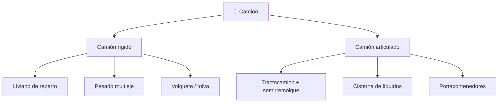

# 📋 Características funcionales del camión

[🏠 Inicio](../../../README.md) · [🚛 Curso: Camiones](../README.md) · 📋 Características

Que es un camión, que tipos existen y para que sirve cada uno. Este módulo da el
contexto antes de abrir la mecánica (Módulo 3).

---

## 🧭 Definición

Un camión es un vehículo motorizado disenado para transportar carga por
carretera. Se caracteriza por un chasis robusto, un motor de gran par (casi
siempre diesel) y una capacidad de carga que supera con creces la de un
automóvil. Puede ser rígido, con la carga sobre su propio chasis, o articulado,
cuando un tractocamion arrastra un semirremolque unido por la quinta rueda.

---

## 🧬 Características clave

| Característica | Descripción |
| --- | --- |
| Gran masa | La carga multiplica el peso; cambia la inercia y el frenado. |
| Par elevado | El motor diesel entrega fuerza a bajas vueltas para arrancar cargado. |
| Frenado neumático | Usa aire comprimido por la energía que debe disipar. |
| Peso bruto vehicular | Suma de tara y carga; define ejes y licencia requerida. |
| Reparto por eje | La carga se distribuye entre ejes para no exceder límites. |
| Articulación | El tractocamion pivota sobre la quinta rueda al girar. |

---

## 🗂️ Tipos de camión

| Tipo | Uso típico | Rasgo destacado |
| --- | --- | --- |
| Rígido liviano | Reparto urbano | Ágil, carga sobre chasis propio. |
| Rígido pesado | Carga regional | Varios ejes, alta capacidad útil. |
| Volquete / tolva | Áridos, obra y minería | Caja basculante que descarga por gravedad. |
| Tractocamion | Larga distancia | Cabeza tractora que arrastra semirremolque. |
| Cisterna | Combustible y líquidos | Centro de gravedad alto, carga que se mueve. |
| Portacontenedores | Logística intermodal | Chasis con anclajes para contenedor. |

---

## 🎯 Para qué se usa

- Transporte de carga general entre ciudades y regiones.
- Distribución urbana de mercancías a comercios.
- Movimiento de áridos, tierra y minerales en obra y minería.
- Transporte de combustible, quimicos y líquidos en cisterna.
- Logística de contenedores entre puertos y centros de distribución.

---

[⬅️ Anterior: Historia](../historia/historia-camion.md) · [➡️ Siguiente: Sistemas mecánicos](sistemas-mecanicos-camion.md)
