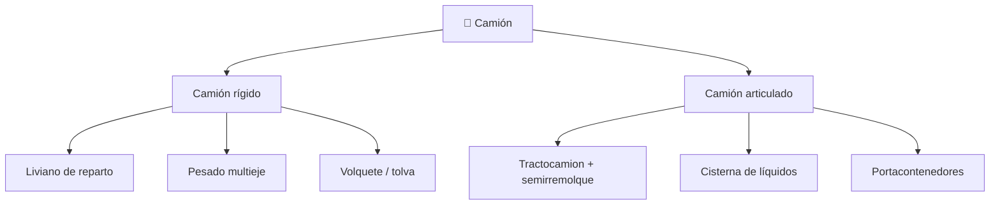

<!-- clase-meta
tipo_documento: clase
clase: 2
codigo: CAMIONES-02
curso: camiones
titulo: "Características funcionales del camión"
modalidad: "teórica aplicada"
duracion_minutos: 45
nivel: introductorio
prerrequisito: CAMIONES-01
competencia: "identificacion_funcional"
resultados_aprendizaje:
  - "Explicar definición, rasgos funcionales, tipos y usos con vocabulario propio de Camiones."
  - "Aplicar esos conceptos a una decisión segura o a un escenario de simulación de Camiones."
evidencia: "Matriz comparativa y decisión justificada."
criterio_aprobacion: "La elección considera función, límites, mando y efecto en la simulación; no se apoya solo en preferencias."
fuentes: manuales/fuentes.md
ultima_revision: 2026-09-10
-->

# 📋 Características funcionales del camión

[🏠 Inicio](../../../README.md) · [🚛 Curso: Camiones](../README.md) · 📋 Características

Que es un camión, que tipos existen y para que sirve cada uno. Esta clase da el
contexto antes de abrir la mecánica (Clase 4).

---

## 🧭 Definición

Un camión es un vehículo motorizado disenado para transportar carga por
carretera. Se caracteriza por un chasis robusto, un motor de gran par (casi
siempre diesel) y una capacidad de carga que supera con creces la de un
automóvil. Puede ser rígido, con la carga sobre su propio chasis, o articulado,
cuando un tractocamion arrastra un semirremolque unido por la quinta rueda.

---

## 🧬 Características clave

| Característica | Descripción |
| --- | --- |
| Gran masa | La carga multiplica el peso; cambia la inercia y el frenado. |
| Par elevado | El motor diesel entrega fuerza a bajas vueltas para arrancar cargado. |
| Frenado neumático | Usa aire comprimido por la energía que debe disipar. |
| Peso bruto vehicular | Suma de tara y carga; define ejes y licencia requerida. |
| Reparto por eje | La carga se distribuye entre ejes para no exceder límites. |
| Articulación | El tractocamion pivota sobre la quinta rueda al girar. |

---

## 🗂️ Tipos de camión

```mermaid
flowchart TD
    Camion[🚛 Camión] --> Rigido[Camión rígido]
    Camion --> Articulado[Camión articulado]
    Rigido --> Liviano[Liviano de reparto]
    Rigido --> Pesado[Pesado multieje]
    Rigido --> Volquete[Volquete / tolva]
    Articulado --> Tracto[Tractocamion + semirremolque]
    Articulado --> Cisterna[Cisterna de líquidos]
    Articulado --> Porta[Portacontenedores]
```

| Tipo | Uso típico | Rasgo destacado |
| --- | --- | --- |
| Rígido liviano | Reparto urbano | Ágil, carga sobre chasis propio. |
| Rígido pesado | Carga regional | Varios ejes, alta capacidad útil. |
| Volquete / tolva | Áridos, obra y minería | Caja basculante que descarga por gravedad. |
| Tractocamion | Larga distancia | Cabeza tractora que arrastra semirremolque. |
| Cisterna | Combustible y líquidos | Centro de gravedad alto, carga que se mueve. |
| Portacontenedores | Logística intermodal | Chasis con anclajes para contenedor. |

---

## 🎯 Para qué se usa

- Transporte de carga general entre ciudades y regiones.
- Distribución urbana de mercancías a comercios.
- Movimiento de áridos, tierra y minerales en obra y minería.
- Transporte de combustible, quimicos y líquidos en cisterna.
- Logística de contenedores entre puertos y centros de distribución.

## 🧭 Guía de estudio aplicada

### Pregunta guía

¿Cómo ayuda **Definición, Características clave, Tipos de camión y Para qué se usa** a **elegir una configuración adecuada para descenso de montaña con carga cercana al máximo autorizado**?

### Explicación razonada

Una característica solo es útil cuando permite anticipar comportamiento. En Camiones, la relación entre motor, caja de cambios, árbol y diferencial y ruedas motrices determina capacidad, respuesta y límites. Por eso «camión rígido frente a tractocamión articulado» no se compara por apariencia: se compara por misión, entorno, carga de trabajo y exposición al riesgo «embalamiento, fatiga de frenos o pérdida de estabilidad de la carga».

Esta clase se conecta con el resto del curso mediante **relación entre masa, pendiente, energía cinética y capacidad térmica de frenado**. El hilo de
seguridad consiste en reconocer a tiempo **embalamiento, fatiga de frenos o pérdida de estabilidad de la carga** y poder justificar la decisión
**planificar velocidad y relación de transmisión antes de entrar en la pendiente**; en clases posteriores cambiará el ángulo de análisis, no esa relación causal.
La lectura funcional común sigue **motor → caja de cambios → árbol y diferencial → ruedas motrices**, de modo que cada concepto pueda
ubicarse dentro del funcionamiento completo y no quede como un dato aislado.

**Apoyo documental:** [Ley de Tránsito 18.290](https://www.bcn.cl/leychile/navegar?idNorma=29708) aporta marco legal chileno;
[Commercial Driver's License Manual](https://www.fmcsa.dot.gov/registration/commercial-drivers-license/cdl-manual) se usa para operación de buses y camiones. Estas fuentes
se contrastan con el alcance de la clase y no sustituyen un manual de equipo concreto.

### Caso resuelto: de la observación a la decisión

1. **Definir la necesidad:** convierte «descenso de montaña con carga cercana al máximo autorizado» en requisitos de capacidad, entorno y respuesta.
2. **Comparar:** contrasta **camión rígido frente a tractocamión articulado** usando esos requisitos y la cadena **motor → caja de cambios → árbol y diferencial → ruedas motrices**.
3. **Descartar:** elimina la alternativa que deja menos margen frente a **embalamiento, fatiga de frenos o pérdida de estabilidad de la carga**.
4. **Elegir:** declara la variante escogida, la evidencia usada y una limitación que todavía debe respetarse.

### Comprueba tu comprensión

1. ¿Qué característica de **ruedas motrices** condiciona primero el caso «descenso de montaña con carga cercana al máximo autorizado»?
2. ¿Qué requisito descartaría una de las alternativas **camión rígido frente a tractocamión articulado**?
3. ¿Qué límite debe declararse junto con la variante elegida?

Orientación para revisar tus respuestas

- La primera respuesta debe relacionar el eslabón elegido con un efecto posterior, no solo nombrarlo.
- La segunda debe proponer una señal medible u observable y explicar qué tendencia sería preocupante.
- La tercera debe cambiar al menos una variable de capacidad, mando, entorno o margen de seguridad.

## 🎓 Cierre de clase

- **Actividad:** Compara variantes de Camiones mediante los ejes «definición, rasgos funcionales, tipos y usos» y elige una para un caso de uso razonado.
- **Evidencia:** Matriz comparativa y decisión justificada.
- **Criterio de aprobación:** La elección considera función, límites, mando y efecto en la simulación; no se apoya solo en preferencias.
- **Transferencia:** explica qué cambiaría al pasar a otra variante de esta máquina.

### Fuentes de esta clase

- [CL-LEY-18290](https://www.bcn.cl/leychile/navegar?idNorma=29708): Ley de Tránsito 18.290, BCN Chile. Uso: marco legal chileno.
- [US-FMCSA-CDL](https://www.fmcsa.dot.gov/registration/commercial-drivers-license/cdl-manual): Commercial Driver's License Manual, FMCSA. Uso: operación de buses y camiones.
- [US-NHTSA](https://www.nhtsa.gov/vehicle-safety): Vehicle Safety, NHTSA. Uso: seguridad de vehículos terrestres.

> Las fuentes sostienen el marco conceptual y normativo; esta clase no reemplaza el manual
> del fabricante, la formación certificada ni la habilitación exigida para operar equipos reales.

---

[⬅️ Anterior: Historia](../historia/historia-camion.md) · [➡️ Siguiente: Modelos y variantes](../modelos/modelos-camion.md)
