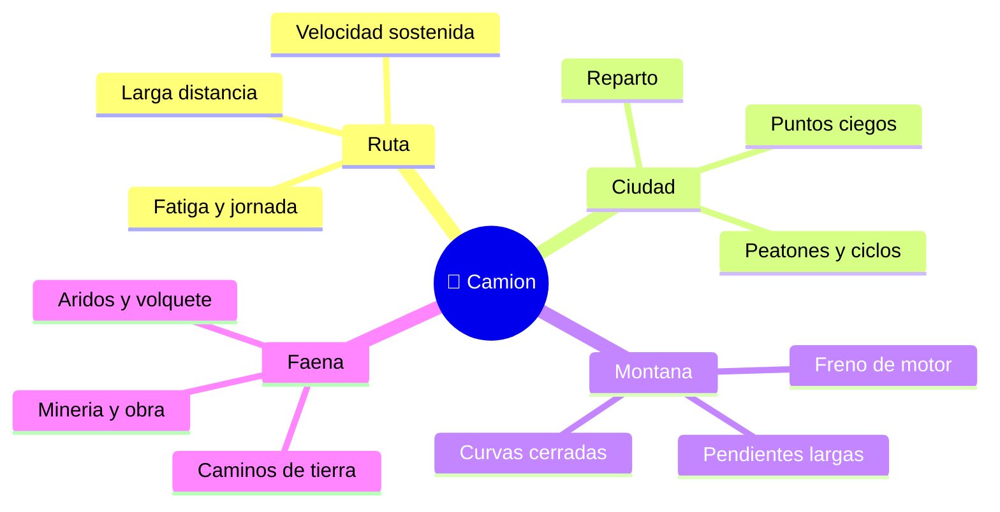

# 🌍 Entornos de trabajo del camión

[🏠 Inicio](../../../README.md) · [🚛 Curso: Camiones](../README.md) · 🌍 Entornos

Dónde opera un camión y cómo cambia la conducción según el entorno. Cada entorno
implica reglas, riesgos y ajustes distintos, y en simulación se traduce en
escenarios diferentes.

---

## 🗺️ Entornos principales

| Entorno | Características | Riesgos típicos | Ajuste de conducción |
| --- | --- | --- | --- |
| Ruta interurbana | Velocidad sostenida, largas distancias. | Fatiga, viento lateral, adelantar. | Distancia amplia, jornada controlada. |
| Ciudad | Reparto, cruces, tráfico denso. | Puntos ciegos, peatones, ciclos. | Baja velocidad, maniobras lentas. |
| Montaña | Pendientes largas y curvas. | Sobrecalentamiento de frenos. | Marcha corta, freno de motor y retarder. |
| Faena minera / obra | Caminos de tierra, áridos. | Polvo, volcamiento, otros equipos. | Velocidad baja, respeto de señalización interna. |
| Lluvia / noche | Baja visibilidad y agarre. | Aquaplaning, deslumbramiento. | Más distancia, luces, velocidad prudente. |

---

## 🌦️ Factores del entorno

- **Pendiente**: define el uso del freno de motor y del retarder, y la marcha.
- **Superficie**: asfalto, tierra, ripio o barro cambian el agarre y el frenado.
- **Clima**: lluvia, hielo o viento reducen adherencia y estabilidad.
- **Tráfico**: más vehículos y usuarios vulnerables exigen anticipar y ceder.
- **Carga**: su peso, altura y si es líquida o suelta cambian la dinámica.

---

## 🎮 Traducción a simulación

Cada entorno es un escenario con su pendiente, superficie, clima y carga. Ver
como se modela en el
[Módulo 8: Diseño de simulación](../simulacion/diseno-simulador-camion.md).

---

[⬅️ Anterior: Principios y operación](principios-camion.md) · [➡️ Siguiente: Reglamentos](../reglamentos/reglamentos-camion.md)
