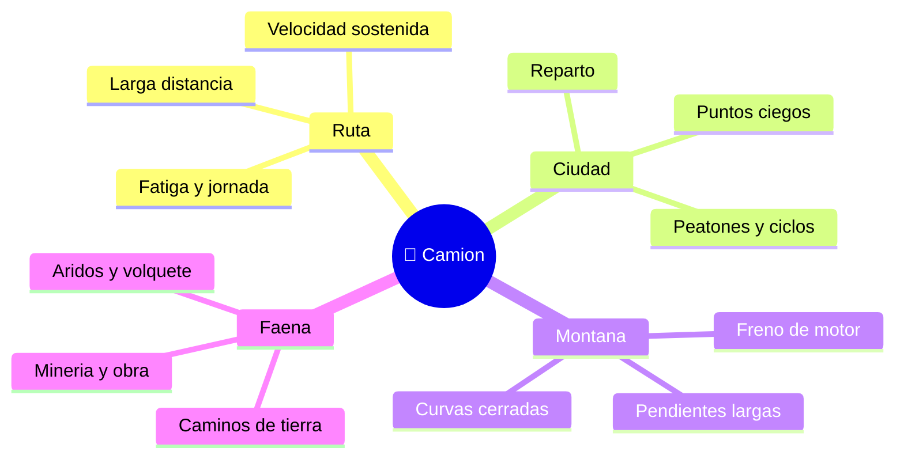

<!-- clase-meta
tipo_documento: clase
clase: 7
codigo: CAMIONES-07
curso: camiones
titulo: "Entornos de trabajo del camión"
modalidad: "análisis de escenarios"
duracion_minutos: 60
nivel: introductorio
prerrequisito: CAMIONES-06
competencia: "adaptacion_al_entorno"
resultados_aprendizaje:
  - "Explicar entornos, factores ambientales, riesgos y respuesta de simulación con vocabulario propio de Camiones."
  - "Aplicar esos conceptos a una decisión segura o a un escenario de simulación de Camiones."
evidencia: "Matriz entorno–cambio–riesgo–respuesta."
criterio_aprobacion: "Cada respuesta se adapta al entorno y distingue riesgos que no son intercambiables entre escenarios."
fuentes: manuales/fuentes.md
ultima_revision: 2026-09-10
-->

# 🌍 Entornos de trabajo del camión

[🏠 Inicio](../../../README.md) · [🚛 Curso: Camiones](../README.md) · 🌍 Entornos

Dónde opera un camión y cómo cambia la conducción según el entorno. Cada entorno
implica reglas, riesgos y ajustes distintos, y en simulación se traduce en
escenarios diferentes.

---

## 🗺️ Entornos principales

```mermaid
mindmap
  root((🚛 Camion))
    Ruta
      Larga distancia
      Velocidad sostenida
      Fatiga y jornada
    Ciudad
      Reparto
      Puntos ciegos
      Peatones y ciclos
    Montana
      Pendientes largas
      Freno de motor
      Curvas cerradas
    Faena
      Mineria y obra
      Aridos y volquete
      Caminos de tierra
```

| Entorno | Características | Riesgos típicos | Ajuste de conducción |
| --- | --- | --- | --- |
| Ruta interurbana | Velocidad sostenida, largas distancias. | Fatiga, viento lateral, adelantar. | Distancia amplia, jornada controlada. |
| Ciudad | Reparto, cruces, tráfico denso. | Puntos ciegos, peatones, ciclos. | Baja velocidad, maniobras lentas. |
| Montaña | Pendientes largas y curvas. | Sobrecalentamiento de frenos. | Marcha corta, freno de motor y retarder. |
| Faena minera / obra | Caminos de tierra, áridos. | Polvo, volcamiento, otros equipos. | Velocidad baja, respeto de señalización interna. |
| Lluvia / noche | Baja visibilidad y agarre. | Aquaplaning, deslumbramiento. | Más distancia, luces, velocidad prudente. |

---

## 🌦️ Factores del entorno

- **Pendiente**: define el uso del freno de motor y del retarder, y la marcha.
- **Superficie**: asfalto, tierra, ripio o barro cambian el agarre y el frenado.
- **Clima**: lluvia, hielo o viento reducen adherencia y estabilidad.
- **Tráfico**: más vehículos y usuarios vulnerables exigen anticipar y ceder.
- **Carga**: su peso, altura y si es líquida o suelta cambian la dinámica.

---

## 🎮 Traducción a simulación

Cada entorno es un escenario con su pendiente, superficie, clima y carga. Ver
como se modela en el
[Clase 9: Diseño de simulación](../simulacion/diseno-simulador-camion.md).

## 🧭 Guía de estudio aplicada

### Pregunta guía

¿Cómo ayuda **Entornos principales, Factores del entorno, Traducción a simulación y Guía de estudio aplicada** a **adaptar descenso de montaña con carga cercana al máximo autorizado a tres condiciones ambientales distintas**?

### Explicación razonada

El entorno no es decoración: modifica las fuerzas, la percepción y el tiempo disponible. En el caso «descenso de montaña con carga cercana al máximo autorizado», cambia el comportamiento de ruedas motrices y aumenta la probabilidad de embalamiento, fatiga de frenos o pérdida de estabilidad de la carga. La respuesta correcta empieza por reconocer qué variable cambió y después adaptar límites, ruta o misión.

Esta clase se conecta con el resto del curso mediante **relación entre masa, pendiente, energía cinética y capacidad térmica de frenado**. El hilo de
seguridad consiste en reconocer a tiempo **embalamiento, fatiga de frenos o pérdida de estabilidad de la carga** y poder justificar la decisión
**planificar velocidad y relación de transmisión antes de entrar en la pendiente**; en clases posteriores cambiará el ángulo de análisis, no esa relación causal.
La lectura funcional común sigue **motor → caja de cambios → árbol y diferencial → ruedas motrices**, de modo que cada concepto pueda
ubicarse dentro del funcionamiento completo y no quede como un dato aislado.

**Apoyo documental:** [Ley de Tránsito 18.290](https://www.bcn.cl/leychile/navegar?idNorma=29708) aporta marco legal chileno;
[Commercial Driver's License Manual](https://www.fmcsa.dot.gov/registration/commercial-drivers-license/cdl-manual) se usa para operación de buses y camiones. Estas fuentes
se contrastan con el alcance de la clase y no sustituyen un manual de equipo concreto.

### Caso resuelto: de la observación a la decisión

1. **Escenario base:** conserva la misión «descenso de montaña con carga cercana al máximo autorizado» para poder comparar.
2. **Cambiar una condición:** modifica sucesivamente superficie o medio, visibilidad y perturbación externa.
3. **Recalcular margen:** explica cómo cada cambio afecta **ruedas motrices** y acerca o aleja **embalamiento, fatiga de frenos o pérdida de estabilidad de la carga**.
4. **Adaptar:** cambia límite, ruta, configuración o incluso cancela; no mantengas la misma respuesta por hábito.

### Comprueba tu comprensión

1. ¿Cómo cambiaría **ruedas motrices** si empeora la perturbación externa?
2. ¿Qué condición ambiental acerca más el escenario a **embalamiento, fatiga de frenos o pérdida de estabilidad de la carga**?
3. ¿Cuándo adaptarías la maniobra y cuándo la cancelarías?

Orientación para revisar tus respuestas

- La primera respuesta debe relacionar el eslabón elegido con un efecto posterior, no solo nombrarlo.
- La segunda debe proponer una señal medible u observable y explicar qué tendencia sería preocupante.
- La tercera debe cambiar al menos una variable de capacidad, mando, entorno o margen de seguridad.

## 🎓 Cierre de clase

- **Actividad:** Contrasta tres entornos de Camiones a partir de entornos, factores ambientales, riesgos y respuesta de simulación y determina cómo cambian variables, percepción, riesgos y respuesta.
- **Evidencia:** Matriz entorno–cambio–riesgo–respuesta.
- **Criterio de aprobación:** Cada respuesta se adapta al entorno y distingue riesgos que no son intercambiables entre escenarios.
- **Transferencia:** explica qué cambiaría al pasar a otra variante de esta máquina.

### Fuentes de esta clase

- [CL-LEY-18290](https://www.bcn.cl/leychile/navegar?idNorma=29708): Ley de Tránsito 18.290, BCN Chile. Uso: marco legal chileno.
- [US-FMCSA-CDL](https://www.fmcsa.dot.gov/registration/commercial-drivers-license/cdl-manual): Commercial Driver's License Manual, FMCSA. Uso: operación de buses y camiones.
- [US-NHTSA](https://www.nhtsa.gov/vehicle-safety): Vehicle Safety, NHTSA. Uso: seguridad de vehículos terrestres.

> Las fuentes sostienen el marco conceptual y normativo; esta clase no reemplaza el manual
> del fabricante, la formación certificada ni la habilitación exigida para operar equipos reales.

---

[⬅️ Anterior: Principios y operación](principios-camion.md) · [➡️ Siguiente: Reglamentos](../reglamentos/reglamentos-camion.md)
