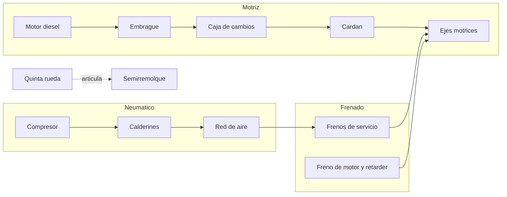
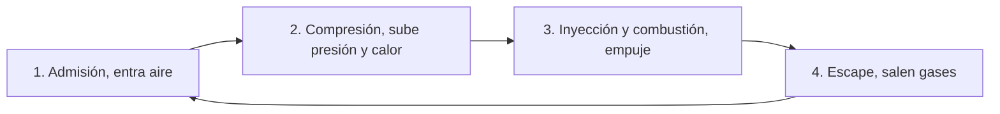
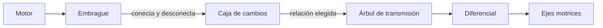
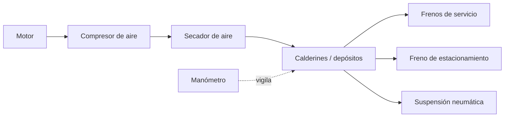
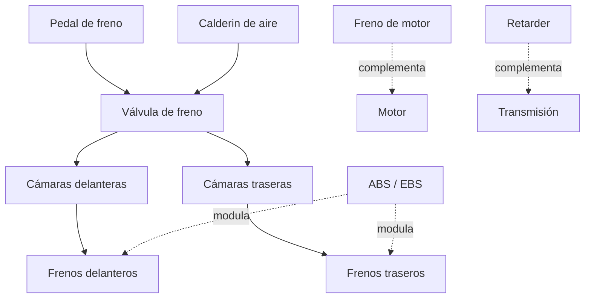
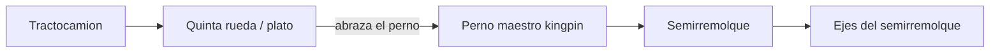

# 🔧 Sistemas mecánicos del camión

[🏠 Inicio](../../../README.md) · [🚛 Curso: Camiones](../README.md) · 🔧 Sistemas mecánicos

Este módulo abre el camión por dentro y es el corazón del curso. Explica cada
sistema, como funciona y cómo se conecta con los demás, con foco en el motor
diesel, el frenado neumático y la gestión del peso. Es la base técnica para
entender los mandos (Módulo 4) y la física de la conducción con carga (Módulo 5).

---

## 1. ⚙️ Motor diesel

El corazón del camión es el **motor diesel**, elegido por su alto par a bajas
vueltas y su eficiencia de consumo, ambos clave para arrastrar gran masa.

### Ciclo diesel

El diesel no usa bujía: comprime el aire hasta que se calienta y luego inyecta
el combustible, que se enciende por la alta temperatura (encendido por
compresión).

| Parámetro | Efecto en el camión |
| --- | --- |
| Cilindrada | Mayor cilindrada da más par para mover carga. |
| Par (torque) | Fuerza de arranque y de subida en pendiente cargado. |
| Potencia (kW/CV) | Capacidad de mantener velocidad con carga completa. |
| Régimen (rpm) | Zona económica de trabajo; el diesel gira bajo. |
| Turbo | Sobrealimenta aire y sube el par sin subir tanto el consumo. |

### Sistemas de apoyo del motor

- **Alimentación**: inyección electrónica de alta presión (common raíl).
- **Sobrealimentación**: turbocompresor movido por los gases de escape.
- **Refrigeración**: por líquido, con radiador de gran capacidad.
- **Postratamiento**: EGR recircula gases y SCR con AdBlue reduce emisiones.
- **Freno de motor**: válvula que usa la compresión para frenar sin desgaste.

---

## 2. 🔗 Caja de cambios

La transmisión adapta el par del motor a la carga y a la pendiente. Un camión
tiene muchas más relaciones que un automóvil porque debe arrancar con gran masa
y mantener el motor en su zona económica.

| Tipo de caja | Como funciona | Ventaja |
| --- | --- | --- |
| Manual multimarcha | Muchas relaciones, a veces con gama alta y baja. | Control total, económica. |
| Automatizada (AMT) | La electrónica embraga y cambia por el conductor. | Menos fatiga, cambios óptimos. |
| Automática con convertidor | Convertidor de par sin pedal de embrague. | Suave, común en obra y distribución. |

- **Embrague**: conecta y desconecta el motor de la caja para arrancar y cambiar.
- **Marchas cortas**: dan fuerza para arrancar cargado y subir pendientes.
- **Marchas largas**: dan velocidad de crucero con bajo consumo.
- **Gama alta / baja (splitter)**: duplica el número de relaciones útiles.
- **Diferencial**: reparte el giro a las ruedas del eje y permite que giren a
  distinta velocidad en las curvas.

---

## 3. 💨 Sistema neumático

El aire comprimido acciona los frenos y otros sistemas. Es tan crítico que sin
presión suficiente el camión no debe moverse.

| Componente | Función |
| --- | --- |
| Compresor | Genera aire comprimido movido por el motor. |
| Secador | Elimina humedad para evitar corrosión y hielo. |
| Calderines | Depósitos que almacenan el aire a presión. |
| Válvulas | Reparten el aire a cada circuito de freno. |
| Manómetro | Muestra la presión y avisa si es insuficiente. |

- **Presión de trabajo**: del orden de 8 a 12 bar en los calderines.
- **Presión mínima**: bajo un umbral suena alarma y no se debe circular.
- **Circuitos separados**: el frenado se divide en circuitos para que una fuga
  no deje el camión sin frenos.

---

## 4. 🛑 Frenos

Por su masa, el camión debe disipar mucha energía al frenar. Combina el freno
de servicio con frenos auxiliares que ahorran las zapatas.

| Sistema | Función | Nota |
| --- | --- | --- |
| Freno de servicio | Frenado principal por aire. | Se acciona con el pedal. |
| ABS | Evita el bloqueo de las ruedas. | Mantiene el control y la dirección. |
| EBS | Frenado electrónico repartido por eje. | Distribuye según carga real. |
| Freno de motor | Retención usando la compresión del diesel. | Ahorra frenos en descensos. |
| Retarder | Freno auxiliar hidráulico o electromagnético. | Ideal en pendientes largas. |
| Freno de estacionamiento | Bloqueo por muelle (spring brake). | Se aplica al detener y sin aire. |

Nota de seguridad: si la presión de aire cae bajo el mínimo, el **freno de
muelle** se aplica solo y detiene el camión; es un diseño a prueba de fallos.

### Por qué el freno de motor y el retarder importan tanto

En una bajada larga, usar solo el freno de servicio recalienta las zapatas y
puede provocar **fading** (pérdida de frenado por calor). El freno de motor y el
retarder frenan sin fricción, manteniendo la velocidad controlada sin desgastar
ni recalentar el freno de servicio, que queda disponible para una emergencia.

---

## 5. ⚖️ Ejes, tara y peso bruto vehicular

La capacidad de un camión no la fija solo el motor, sino cuanto peso admiten sus
ejes y la ley. Tres conceptos ordenan todo:

| Concepto | Que es | Importancia |
| --- | --- | --- |
| Tara | Peso del camión vacío. | Base para calcular la carga útil. |
| Carga útil | Peso de la mercancía transportada. | Lo que genera el trabajo del camión. |
| Peso bruto vehicular (PBV) | Tara + carga útil. | Límite legal y de diseño del vehículo. |

- **Reparto por eje**: cada eje tiene un máximo de peso permitido. Al cargar se
  distribuye la mercancía para no exceder ningún eje, aunque el total este dentro
  del límite.
- **Ejes motrices y de apoyo**: los motrices reciben la fuerza; los de apoyo (o
  ejes elevables) solo soportan carga y pueden subirse cuando el camión va vacío.
- **PBV y licencia**: el PBV determina la clase de licencia y define si el camión
  es simple o requiere configuración especial (ver Módulo 7).

---

## 6. 🔗 Quinta rueda y articulación

En un camión articulado, el **tractocamion** (cabeza tractora) se une al
**semirremolque** por la quinta rueda, un plato con un cierre que abraza el
perno maestro (kingpin) del semirremolque.

| Elemento | Función |
| --- | --- |
| Quinta rueda | Plato de acople que soporta y articula la carga. |
| Perno maestro | Punto de giro del semirremolque sobre el tracto. |
| Mangueras de aire | Llevan el aire a los frenos del semirremolque. |
| Conexión eléctrica | Alimenta luces y señales del semirremolque. |

- **Pivote**: al girar, el semirremolque pivota sobre el perno maestro; la parte
  trasera describe un arco menor que el tracto (efecto de recorte de curva).
- **Tijera (jackknife)**: si las ruedas del tracto se bloquean, el semirremolque
  puede empujar y plegar el conjunto en ángulo; el ABS ayuda a evitarlo.
- **Enganche seguro**: antes de mover se verifica el cierre del plato, las
  mangueras de aire y la conexión eléctrica.

---

## 🔁 Cómo se conecta todo

1. El **motor diesel** genera par elevado.
2. El **embrague** y la **caja multimarcha** adaptan ese par a la carga.
3. El **cardan** y el **diferencial** llevan la fuerza a los **ejes motrices**.
4. El **compresor** llena los **calderines** de aire comprimido.
5. Ese aire acciona los **frenos de servicio** de todos los ejes.
6. El **freno de motor** y el **retarder** frenan sin desgaste en pendiente.
7. En un articulado, la **quinta rueda** transmite el arrastre al semirremolque.

Con esto entendido, el [Módulo 4: Mandos](../mandos/manual-mandos-camion.md)
muestra como el conductor opera cada uno de estos sistemas.

---

[⬅️ Anterior: Características](caracteristicas-camion.md) · [➡️ Siguiente: Mandos e instrumentos](../mandos/manual-mandos-camion.md)
