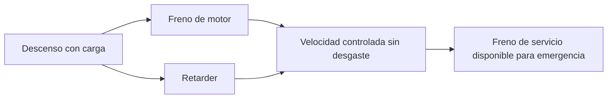

# 🧰 Recursos del camión

[🏠 Inicio](../../../README.md) · [🚛 Curso: Camiones](../README.md) · 🧰 Recursos

Glosario específico, enlaces y diagramas de apoyo del curso de camiones. Amplia
el [glosario general](../../../docs/05-glosario-general.md).

---

## 📖 Glosario específico

| Término | Definición |
| --- | --- |
| Peso bruto vehicular (PBV) | Suma de la tara y la carga útil del camión. |
| Tara | Peso del camión vacío, sin carga. |
| Reparto por eje | Distribución del peso entre los ejes, con límite legal por eje. |
| Tractocamion | Cabeza tractora que arrastra un semirremolque. |
| Semirremolque | Unidad de carga sin eje delantero, apoyada en la quinta rueda. |
| Quinta rueda | Plato de acople que une el tracto con el semirremolque. |
| Perno maestro (kingpin) | Punto de giro del semirremolque sobre el tracto. |
| Retarder | Freno auxiliar sin fricción, hidráulico o electromagnético. |
| Freno de motor | Retención que usa la compresión del diesel para frenar. |
| Fading | Pérdida de frenado por sobrecalentamiento de las zapatas. |
| Tijera (jackknife) | Plegado en ángulo del conjunto tracto y semirremolque. |

---

## 🗺️ Diagrama de frenado combinado

---

## 🔗 Enlaces y fuentes

- Marco legal: [⚖️ docs/07-marco-legal-chile.md](../../../docs/07-marco-legal-chile.md)
- Registro de fuentes: [📚 manuales/fuentes.md](../../../manuales/fuentes.md)
- Manuales oficiales del conductor (CONASET): ver el registro de fuentes.

Registrar cada recurso nuevo con su origen y licencia, siguiendo
[`recursos/README.md`](../../../recursos/README.md).

## 🎓 Cierre de clase

- **Actividad:** Selecciona términos de glosario, esquemas y trazabilidad de fuentes, explícalos en contexto de Camiones y verifica la procedencia de las fuentes utilizadas.
- **Evidencia:** Glosario aplicado y ficha breve de trazabilidad.
- **Criterio de aprobación:** Los términos permiten interpretar el curso y las fuentes se distinguen por autoridad, alcance y vigencia.
- **Transferencia:** explica qué cambiaría al pasar a otra variante de esta máquina.

### Fuentes de esta clase

- [CL-LEY-18290](https://www.bcn.cl/leychile/navegar?idNorma=29708): Ley de Tránsito 18.290, BCN Chile. Uso: marco legal chileno.
- [US-FMCSA-CDL](https://www.fmcsa.dot.gov/registration/commercial-drivers-license/cdl-manual): Commercial Driver's License Manual, FMCSA. Uso: operación de buses y camiones.
- [US-NHTSA](https://www.nhtsa.gov/vehicle-safety): Vehicle Safety, NHTSA. Uso: seguridad de vehículos terrestres.

> Las fuentes sostienen el marco conceptual y normativo; esta clase no reemplaza el manual
> del fabricante, la formación certificada ni la habilitación exigida para operar equipos reales.

---

[🎓 Portada del curso](../README.md) · [⬅️ Anterior: Diseño de simulación](../simulacion/diseno-simulador-camion.md) · [➡️ Siguiente: Ejercicios](../ejercicios/ejercicios-camion.md)
