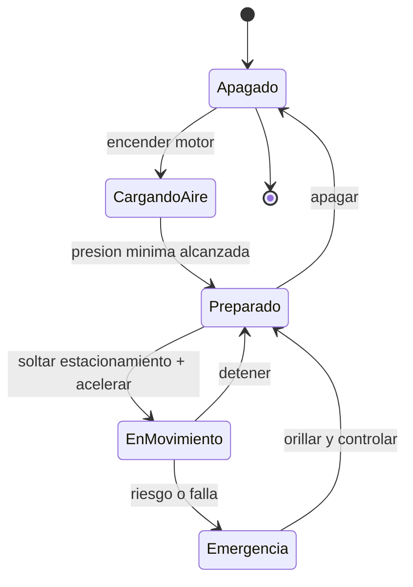
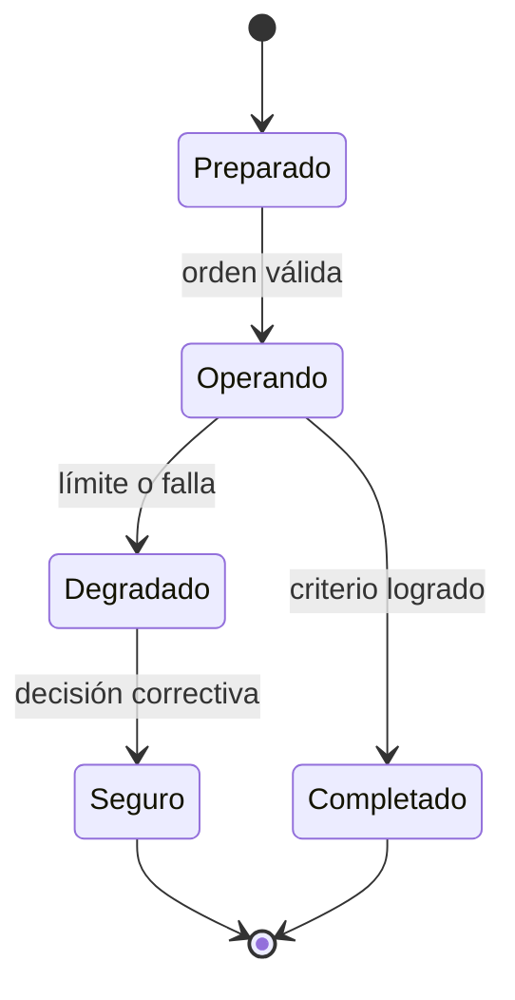

<!-- clase-meta
tipo_documento: clase
clase: 9
codigo: CAMIONES-09
curso: camiones
titulo: "Diseño de simulación del camión"
modalidad: "laboratorio de diseño"
duracion_minutos: 90
nivel: introductorio
prerrequisito: CAMIONES-08
competencia: "modelado_de_simulacion"
resultados_aprendizaje:
  - "Explicar objetivo, variables, estados, ciclo y escenarios de simulación con vocabulario propio de Camiones."
  - "Aplicar esos conceptos a una decisión segura o a un escenario de simulación de Camiones."
evidencia: "Ficha de escenario y diagrama de estados."
criterio_aprobacion: "El modelo es específico de la máquina, medible, seguro y trazable a clases anteriores."
fuentes: manuales/fuentes.md
ultima_revision: 2026-09-10
-->

# 🎮 Diseño de simulación del camión

[🏠 Inicio](../../../README.md) · [🚛 Curso: Camiones](../README.md) · 🎮 Simulación

```mermaid
stateDiagram-v2
    [*] --> Apagado
    Apagado --> CargandoAire: encender motor
    CargandoAire --> Preparado: presion minima alcanzada
    Preparado --> EnMovimiento: soltar estacionamiento + acelerar
    EnMovimiento --> Preparado: detener
    EnMovimiento --> Emergencia: riesgo o falla
    Emergencia --> Preparado: orillar y controlar
    Preparado --> Apagado: apagar
    Apagado --> [*]
```

## Objetivo de la simulación

Que el usuario aprenda a operar un camión con seguridad: cargar el aire, elegir
marchas, gestionar la inercia de la masa, frenar con freno de motor y retarder en
pendiente, repartir la carga y maniobrar un vehículo articulado respetando el
barrido trasero.

## Nivel de realismo

- Nivel elegido: se ofrece del 1 al 3 (ver `docs/03-niveles-de-realismo.md`).
- Justificación: el camión introduce la gestión de gran masa, el frenado
  neumático y la articulación, conceptos más complejos que los de la moto pero
  sin la carga de trabajo especializada de una grúa.

## Variables principales

| Variable | Tipo | Rango | Afecta a | Comentarios |
| --- | --- | --- | --- | --- |
| Velocidad | numérica | 0-100 km/h | Movimiento y frenado | Limitada por vía y carga. |
| Régimen del motor | numérica | 0-2500 rpm | Par disponible | El diesel gira bajo. |
| Marcha | discreta | N,1..16 | Fuerza y velocidad | Con gama alta/baja. |
| Carga | numérica | 0-100% del PBV | Inercia y frenado | Define distancia de frenado. |
| Reparto por eje | numérica | por eje | Agarre y legalidad | No debe exceder el límite por eje. |
| Presión de aire | numérica | 0-12 bar | Frenos | Bajo el mínimo no se circula. |
| Ángulo de articulación | numérica | -90..90 grados | Maniobra del semi | Riesgo de tijera si es extremo. |
| Adherencia | numérica | 0-1 | Freno, giro, tracción | Baja con lluvia y tierra. |

## Ciclo básico

1. Leer entrada del usuario (acelerador, frenos, retarder, marcha, dirección).
2. Actualizar estado del motor, la caja y la presión de aire.
3. Calcular fuerzas: propulsión, frenado combinado, gravedad y adherencia.
4. Aplicar restricciones del entorno (pendiente, superficie, clima, carga).
5. Actualizar velocidad, posición y ángulo de articulación.
6. Refrescar instrumentos y retroalimentación (sonido, testigos, avisos).

## Modos de juego futuros

- Tutorial guiado de mandos y carga de aire.
- Práctica de descenso de montaña con freno de motor y retarder.
- Misiones de reparto urbano con maniobras y puntos ciegos.
- Desafíos de estacionamiento y enganche del semirremolque.
- Reparto de carga por eje sin superar límites.

## Elementos fuera de alcance

- Conducción temeraria o exceso de velocidad presentados como objetivo.
- Sobrecarga deliberada como logro del juego.
- Datos que permitan alterar sistemas reales de frenado o emisiones.

## Pendientes

- [ ] Definir valores por defecto de cada variable por tipo de camión.
- [ ] Prototipar el modelo de presión de aire y frenado combinado.
- [ ] Ajustar el modelo de articulación y el efecto de tijera.
- [ ] Agregar fuentes técnicas públicas a
      [`manuales/fuentes.md`](../../../manuales/fuentes.md).

## 🧭 Guía de estudio aplicada

### Pregunta guía

¿Cómo ayuda **Objetivo de la simulación, Nivel de realismo, Variables principales y Ciclo básico** a **modelar descenso de montaña con carga cercana al máximo autorizado como estados, variables y decisiones observables**?

### Explicación razonada

Una simulación de Camiones es educativa si representa decisiones y consecuencias. Como mínimo debe modelar el estado de motor, la respuesta de caja de cambios, la transición en árbol y diferencial y el resultado en ruedas motrices. El escenario «descenso de montaña con carga cercana al máximo autorizado» es valioso porque obliga a observar, formular una hipótesis, actuar y comprobar.

```mermaid
stateDiagram-v2
    [*] --> Preparado
    Preparado --> Operando: orden válida
    Operando --> Degradado: límite o falla
    Degradado --> Seguro: decisión correctiva
    Operando --> Completado: criterio logrado
    Seguro --> [*]
    Completado --> [*]
```

Esta clase se conecta con el resto del curso mediante **relación entre masa, pendiente, energía cinética y capacidad térmica de frenado**. El hilo de
seguridad consiste en reconocer a tiempo **embalamiento, fatiga de frenos o pérdida de estabilidad de la carga** y poder justificar la decisión
**planificar velocidad y relación de transmisión antes de entrar en la pendiente**; en clases posteriores cambiará el ángulo de análisis, no esa relación causal.
La lectura funcional común sigue **motor → caja de cambios → árbol y diferencial → ruedas motrices**, de modo que cada concepto pueda
ubicarse dentro del funcionamiento completo y no quede como un dato aislado.

**Apoyo documental:** [Ley de Tránsito 18.290](https://www.bcn.cl/leychile/navegar?idNorma=29708) aporta marco legal chileno;
[Commercial Driver's License Manual](https://www.fmcsa.dot.gov/registration/commercial-drivers-license/cdl-manual) se usa para operación de buses y camiones. Estas fuentes
se contrastan con el alcance de la clase y no sustituyen un manual de equipo concreto.

### Caso resuelto: de la observación a la decisión

1. **Estado inicial:** representa descenso de montaña con carga cercana al máximo autorizado con valores observables para **motor**, **caja de cambios**, **árbol y diferencial** y **ruedas motrices**.
2. **Decisión del estudiante:** ofrece una elección que cambie el estado, no una animación automática.
3. **Consecuencia:** modela la tendencia hacia **embalamiento, fatiga de frenos o pérdida de estabilidad de la carga** y una señal previa que permita corregir.
4. **Cierre:** evalúa la explicación de la decisión, además de si el estudiante “ganó” el escenario.

### Comprueba tu comprensión

1. ¿Qué cuatro estados mínimos necesita el escenario «descenso de montaña con carga cercana al máximo autorizado»?
2. ¿Qué variable anticipa **embalamiento, fatiga de frenos o pérdida de estabilidad de la carga** antes de llegar al estado de falla?
3. ¿Cómo evaluarías la explicación del estudiante y no solo el resultado final?

Orientación para revisar tus respuestas

- La primera respuesta debe relacionar el eslabón elegido con un efecto posterior, no solo nombrarlo.
- La segunda debe proponer una señal medible u observable y explicar qué tendencia sería preocupante.
- La tercera debe cambiar al menos una variable de capacidad, mando, entorno o margen de seguridad.

## 🎓 Cierre de clase

- **Actividad:** Diseña un escenario educativo de Camiones basado en objetivo, variables, estados, ciclo y escenarios de simulación, con entradas, estados, variables y criterio de cierre.
- **Evidencia:** Ficha de escenario y diagrama de estados.
- **Criterio de aprobación:** El modelo es específico de la máquina, medible, seguro y trazable a clases anteriores.
- **Transferencia:** explica qué cambiaría al pasar a otra variante de esta máquina.

### Fuentes de esta clase

- [CL-LEY-18290](https://www.bcn.cl/leychile/navegar?idNorma=29708): Ley de Tránsito 18.290, BCN Chile. Uso: marco legal chileno.
- [US-FMCSA-CDL](https://www.fmcsa.dot.gov/registration/commercial-drivers-license/cdl-manual): Commercial Driver's License Manual, FMCSA. Uso: operación de buses y camiones.
- [US-NHTSA](https://www.nhtsa.gov/vehicle-safety): Vehicle Safety, NHTSA. Uso: seguridad de vehículos terrestres.

> Las fuentes sostienen el marco conceptual y normativo; esta clase no reemplaza el manual
> del fabricante, la formación certificada ni la habilitación exigida para operar equipos reales.

---

[⬅️ Anterior: Reglamentos](../reglamentos/reglamentos-camion.md) · [➡️ Siguiente: Recursos](../recursos/recursos-camion.md)
