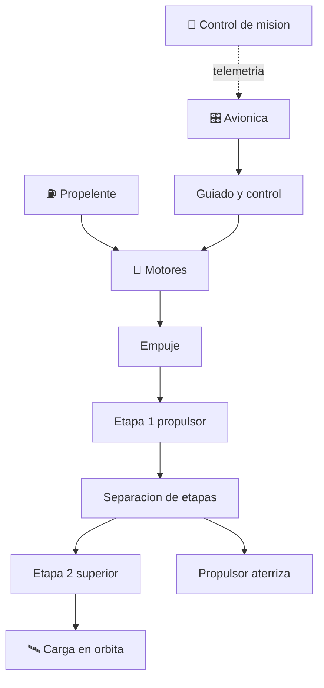

# 🚀 Curso: Cohetes

[🏠 Inicio](../../README.md) · [🚙 Catalogo de vehiculos](../README.md) · [🎓 Guia de curso](../../docs/08-guia-de-estilo-y-curso.md)

> **Curso de lanzadores actuales.** Documenta el cohete lanzador de principio a
> fin: historia, caracteristicas, sistemas (motores de combustible liquido y
> solido, etapas, estructura, avionica), control de mision, fisica del empuje y
> la ecuacion del cohete, entornos de lanzamiento, marco legal internacional y
> diseno de simulacion. Se centra en **cohetes reales de hoy**, incluida la
> recuperacion de propulsores reutilizables.

---

## 🎯 Objetivos de aprendizaje

Al terminar este curso deberias poder:

- Explicar como un cohete vence la gravedad y alcanza la velocidad orbital.
- Identificar motores de combustible liquido y solido, etapas y estructura.
- Comprender el empuje, la relacion empuje-peso y la ecuacion del cohete.
- Entender la separacion de etapas y el aterrizaje de un propulsor reutilizable.
- Reconocer el control de mision, la telemetria y la cuenta atras.
- Conocer el marco de tratados espaciales que aplica al lanzamiento.
- Traducir todo lo anterior en variables de un simulador educativo.

---

## 🗺️ Mapa del vehiculo

---

## 📚 Modulos del curso

| # | Modulo | Contenido | Enlace |
| :-: | --- | --- | --- |
| 1 | 📜 Historia | Origen y evolucion del cohete, linea de tiempo. | [Abrir](historia/historia-cohete.md) |
| 2 | 📋 Caracteristicas | Que es, tipos de cohete y para que sirve cada uno. | [Abrir](operacion/caracteristicas-cohete.md) |
| 3 | 🔧 Sistemas mecanicos | Motores, propelentes, etapas, estructura, avionica. | [Abrir](operacion/sistemas-mecanicos-cohete.md) |
| 4 | 🎛️ Mandos e instrumentos | Control de mision, telemetria y cuenta atras. | [Abrir](mandos/manual-mandos-cohete.md) |
| 5 | 🧪 Principios y operacion | Empuje, ecuacion del cohete y fases de vuelo. | [Abrir](operacion/principios-cohete.md) |
| 6 | 🌍 Entornos de trabajo | Plataforma, ascenso, orbita y retorno del propulsor. | [Abrir](operacion/entornos-cohete.md) |
| 7 | ⚖️ Reglamentos | Estado de lanzamiento y tratados espaciales. | [Abrir](reglamentos/reglamentos-cohete.md) |
| 8 | 🎮 Diseno de simulacion | Variables, ciclo y modos de juego. | [Abrir](simulacion/diseno-simulador-cohete.md) |
| 9 | 🧰 Recursos | Glosario, enlaces y diagramas. | [Abrir](recursos/recursos-cohete.md) |

---

## 🧩 Requisitos previos

Se recomienda revisar antes el curso de
[🚀 naves espaciales](../naves-espaciales/README.md), que introduce la orbita, el
delta-v y la microgravedad. El cohete profundiza en la fase mas exigente: el
lanzamiento y el ascenso hasta la orbita. Marco legal comun en
[⚖️ docs/07-marco-legal-chile.md](../../docs/07-marco-legal-chile.md).

---

[➡️ Empezar por el Modulo 1: Historia](historia/historia-cohete.md)
