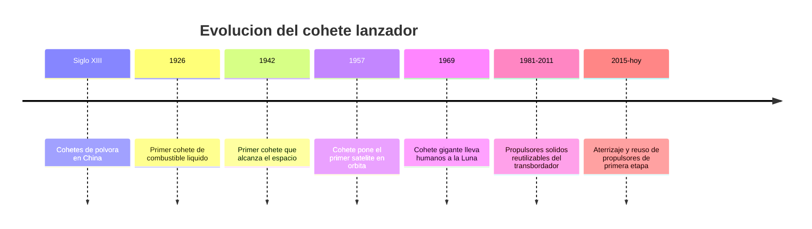

# 📜 Historia del cohete

[🏠 Inicio](../../../README.md) · [🚀 Curso: Cohetes](../README.md) · 📜 Historia

## Origen

El cohete nace como arma de pólvora en China hace siglos, pero su forma moderna
llega con la física de la propulsión por reacción. En 1926 volo el primer cohete
de combustible líquido, lo que abrió la puerta a motores controlables y potentes.
En pocas decadas el cohete paso de arma a herramienta para poner satélites,
sondas y personas en el espacio. Esta es historia de **ciencia real**.

## Línea de tiempo

| Periodo | Hito | Importancia |
| --- | --- | --- |
| Siglo XIII | Cohetes de pólvora en China | Primer uso del principio de reacción. |
| 1926 | Primer cohete de combustible líquido | Motor controlable y más potente. |
| 1942 | Primer cohete que roza el espacio | Se demuestra el vuelo a gran altura. |
| 1957 | Cohete pone un satélite en órbita | Comienza la era espacial. |
| 1969 | Cohete lunar de gran tamaño | Lanza humanos hacia la Luna. |
| 2015-presente | Propulsor que aterriza y se reutiliza | Baja el costo de acceso al espacio. |

## Evolución tecnológica

- **Propelente**: de la pólvora sólida simple a mezclas líquidas de alta energía.
- **Motores**: de cámaras rusticas a motores regulables y reencendibles.
- **Etapas**: la idea de soltar peso muerto multiplica el alcance.
- **Guiado**: de trayectorias fijas a computadores de vuelo que corrigen en tiempo real.
- **Materiales**: tanques más ligeros y resistentes a la presión y al frío.
- **Reutilización**: recuperar la primera etapa para volver a volar.

## Tipos representativos

| Tipo | Uso típico | Característica destacada |
| --- | --- | --- |
| Lanzador ligero | Satélites pequeños | Bajo costo, órbita baja. |
| Lanzador mediano | Satélites y cápsulas | Equilibrio entre carga y costo. |
| Lanzador pesado | Grandes cargas o exploración | Mucho empuje y varias etapas. |
| Propulsor reutilizable | Reducir costo por vuelo | Aterriza y vuelve a usarse. |
| Cohete sonda | Ciencia suborbital | Vuelo corto sin llegar a órbita. |

## Impacto social y económico

El cohete es la única vía actual para llegar al espacio. Gracias a el existen los
satélites de comunicación, navegación y observación de la Tierra. La reutilización
de propulsores ha reducido el costo de cada lanzamiento y ha abierto el acceso al
espacio a más países y empresas, incluida la ciencia que Chile realiza con sus
cielos y satélites.

## Fuentes

- Registrar aquí las fuentes públicas consultadas.
- Enlazar cada fuente también en [`manuales/fuentes.md`](../../../manuales/fuentes.md).

---

[🎓 Portada del curso](../README.md) · [➡️ Siguiente: Características](../operacion/caracteristicas-cohete.md)
