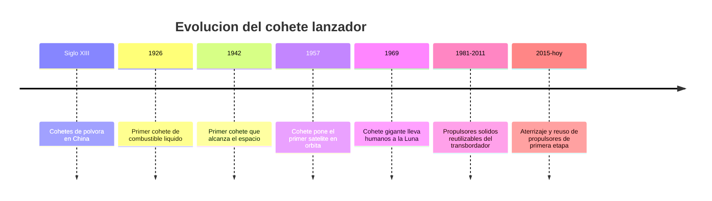

# 📜 Historia del cohete

[🏠 Inicio](../../../README.md) · [🚀 Curso: Cohetes](../README.md) · 📜 Historia

## Origen

El cohete nace como arma de polvora en China hace siglos, pero su forma moderna
llega con la fisica de la propulsion por reaccion. En 1926 volo el primer cohete
de combustible liquido, lo que abrio la puerta a motores controlables y potentes.
En pocas decadas el cohete paso de arma a herramienta para poner satelites,
sondas y personas en el espacio. Esta es historia de **ciencia real**.

## Linea de tiempo

| Periodo | Hito | Importancia |
| --- | --- | --- |
| Siglo XIII | Cohetes de polvora en China | Primer uso del principio de reaccion. |
| 1926 | Primer cohete de combustible liquido | Motor controlable y mas potente. |
| 1942 | Primer cohete que roza el espacio | Se demuestra el vuelo a gran altura. |
| 1957 | Cohete pone un satelite en orbita | Comienza la era espacial. |
| 1969 | Cohete lunar de gran tamano | Lanza humanos hacia la Luna. |
| 2015-presente | Propulsor que aterriza y se reutiliza | Baja el costo de acceso al espacio. |

## Evolucion tecnologica

- **Propelente**: de la polvora solida simple a mezclas liquidas de alta energia.
- **Motores**: de camaras rusticas a motores regulables y reencendibles.
- **Etapas**: la idea de soltar peso muerto multiplica el alcance.
- **Guiado**: de trayectorias fijas a computadores de vuelo que corrigen en tiempo real.
- **Materiales**: tanques mas ligeros y resistentes a la presion y al frio.
- **Reutilizacion**: recuperar la primera etapa para volver a volar.

## Tipos representativos

| Tipo | Uso tipico | Caracteristica destacada |
| --- | --- | --- |
| Lanzador ligero | Satelites pequenos | Bajo costo, orbita baja. |
| Lanzador mediano | Satelites y capsulas | Equilibrio entre carga y costo. |
| Lanzador pesado | Grandes cargas o exploracion | Mucho empuje y varias etapas. |
| Propulsor reutilizable | Reducir costo por vuelo | Aterriza y vuelve a usarse. |
| Cohete sonda | Ciencia suborbital | Vuelo corto sin llegar a orbita. |

## Impacto social y economico

El cohete es la unica via actual para llegar al espacio. Gracias a el existen los
satelites de comunicacion, navegacion y observacion de la Tierra. La reutilizacion
de propulsores ha reducido el costo de cada lanzamiento y ha abierto el acceso al
espacio a mas paises y empresas, incluida la ciencia que Chile realiza con sus
cielos y satelites.

## Fuentes

- Registrar aqui las fuentes publicas consultadas.
- Enlazar cada fuente tambien en [`manuales/fuentes.md`](../../../manuales/fuentes.md).

---

[🎓 Portada del curso](../README.md) · [➡️ Siguiente: Caracteristicas](../operacion/caracteristicas-cohete.md)
