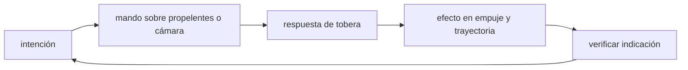

<!-- clase-meta
tipo_documento: clase
clase: 5
codigo: COHETES-05
curso: cohetes
titulo: "Mandos e instrumentos del cohete"
modalidad: "taller de simulación"
duracion_minutos: 60
nivel: introductorio
prerrequisito: COHETES-04
competencia: "lectura_y_mando"
resultados_aprendizaje:
  - "Explicar controles, instrumentos, entradas y estados del sistema con vocabulario propio de Cohetes."
  - "Aplicar esos conceptos a una decisión segura o a un escenario de simulación de Cohetes."
evidencia: "Mapa de mandos y resolución de dos estados del tablero."
criterio_aprobacion: "Reconoce los controles críticos y responde a los estados sin introducir acciones inseguras."
fuentes: manuales/fuentes.md
ultima_revision: 2026-09-10
-->

# 🎛️ Mandos e instrumentos del cohete

[🏠 Inicio](../../../README.md) · [🚀 Curso: Cohetes](../README.md) · 🎛️ Mandos

## Vista general

Un cohete moderno no se "pilota" desde una cabina como una moto: lo dirige un
**computador de vuelo** a bordo, mientras un **control de misión** en tierra lo
vigila y toma decisiones de alto nivel. El puesto de mando es, por tanto, una
sala con consolas de telemetría y una cuenta atrás coordinada. La tripulación,
cuando la hay, viaja en una cápsula sobre el cohete y supervisa el ascenso.

## Mapa de controles

| Zona | Control | Tipo | Función | Prioridad | Comentarios |
| --- | --- | --- | --- | --- | --- |
| Tierra | Cuenta atrás | Secuenciador | Coordinar el lanzamiento | Alta | Sincroniza cada sistema. |
| Tierra | Autorización de lanzamiento | Consola | Dar o negar el si final | Alta | Requiere todos los sistemas en verde. |
| Tierra | Corte de emergencia | Botón | Abortar el lanzamiento | Alta | Detiene la secuencia con seguridad. |
| Tierra | Seguimiento de trayectoria | Radar y telemetría | Vigilar el rumbo | Alta | Base de la seguridad de rango. |
| A bordo | Computador de vuelo | Automático | Guiar y controlar el empuje | Alta | Corrige el rumbo en tiempo real. |
| A bordo | Control de motores | Automático | Regular empuje y apagado | Alta | Ordena separación de etapas. |
| Cápsula | Panel de tripulación | Pantallas | Supervisar el ascenso | Media | Permite abortar si hay tripulación. |
| Cápsula | Palanca de aborto | Manual | Escapar del cohete | Alta | Solo en vuelos tripulados. |

## Instrumentos y telemetría

| Instrumento | Mide o muestra | Unidad | Importancia | Notas |
| --- | --- | --- | --- | --- |
| Altitud | Altura sobre el suelo | km | Alta | Sigue el ascenso. |
| Velocidad | Rapidez respecto al suelo | m/s | Alta | Debe llegar a velocidad orbital. |
| Empuje de motores | Fuerza entregada | kN | Alta | Comparado con el peso actual. |
| Presión de tanques | Presión del propelente | bar | Alta | Evita fallas de las bombas. |
| Nivel de propelente | Propelente restante | porcentaje | Alta | Define cuando separar etapas. |
| Aceleración | Fuerza g sobre la estructura | g | Media | Limita el esfuerzo estructural. |
| Estado de etapas | Conectada o separada | discreto | Alta | Marca cada separación. |

## Entradas de simulación

| Acción | Teclado | Controlador | Panel táctil | Comentarios |
| --- | --- | --- | --- | --- |
| Iniciar cuenta atrás | Tecla C | Botón | Botón de cuenta | Arranca la secuencia. |
| Encender motores | Tecla espacio | Gatillo | Botón de ignición | Solo con sistemas en verde. |
| Regular empuje | Shift y Ctrl | Gatillos | Barra de empuje | Ajusta la potencia. |
| Separar etapa | Tecla S | Botón | Botón de separación | Al agotar el propelente. |
| Orientar el cohete | Teclas WASD | Stick | Zona de actitud | Mueve el motor orientable. |
| Retornar propulsor | Tecla R | Botón | Modo aterrizaje | Encendidos de reentrada y aterrizaje. |
| Abortar | Tecla A | Botón rojo | Botón de aborto | Detiene o escapa con seguridad. |

## Estados del sistema

| Estado | Descripción | Indicadores | Acciones disponibles |
| --- | --- | --- | --- |
| En plataforma | Cohete cargado y listo | Checklist en verde | Cargar propelente, iniciar cuenta. |
| Cuenta atrás | Secuencia previa al despegue | Reloj y estados | Continuar o abortar. |
| Ascenso | Subiendo con motores encendidos | Empuje y velocidad activos | Guiar, regular empuje, separar etapas. |
| Separación | Se suelta una etapa | Estado de etapas | Encender etapa superior. |
| Retorno del propulsor | Primera etapa vuelve | Altitud y velocidad | Reentrada, guiado, aterrizaje. |
| Emergencia | Falla o riesgo | Alarmas activas | Abortar, cortar motores. |

## Observaciones ergonomicas

- La cuenta atrás y el estado de cada sistema deben verse de un vistazo.
- El corte de emergencia y el aborto deben ser inconfundibles y accesibles.
- La telemetría clave (altitud, velocidad, empuje) debe estar siempre visible.
- En vuelos tripulados, la palanca de aborto tiene prioridad sobre todo lo demás.
- La interfaz debe dejar claro que casi todo el guiado es automático.

## 🧭 Guía de estudio aplicada

### Pregunta guía

¿Cómo ayuda **Vista general, Mapa de controles, Instrumentos y telemetría y Entradas de simulación** a **interpretar mandos e indicaciones durante ascenso educativo con cambio de etapa y viento en altura**?

### Explicación razonada

Un mando no se aprende memorizando su nombre, sino recorriendo el ciclo intención → acción → indicación → verificación. En Cohetes, el operador actúa sobre propelentes o cámara, observa la respuesta en tobera y confirma el efecto en empuje y trayectoria. Una indicación inesperada exige detener la secuencia mental, identificar el modo activo y evitar una segunda orden que agrave el estado.

Esta clase se conecta con el resto del curso mediante **la aceleración depende de empuje menos peso y resistencia, mientras la masa disminuye**. El hilo de
seguridad consiste en reconocer a tiempo **inestabilidad, desviación o cargas excesivas durante máxima presión dinámica** y poder justificar la decisión
**evaluar trayectoria, estabilidad y condiciones de aborto antes del lanzamiento**; en clases posteriores cambiará el ángulo de análisis, no esa relación causal.
La lectura funcional común sigue **propelentes → cámara → tobera → empuje y trayectoria**, de modo que cada concepto pueda
ubicarse dentro del funcionamiento completo y no quede como un dato aislado.

**Apoyo documental:** [Rockets Educator Guide](https://www.nasa.gov/wp-content/uploads/2012/07/rockets-educator-guide-20.pdf) aporta propulsión, estabilidad y trayectoria;
[Space Law Treaties and Principles](https://www.unoosa.org/oosa/SpaceLaw/treaties.html) se usa para derecho espacial internacional. Estas fuentes
se contrastan con el alcance de la clase y no sustituyen un manual de equipo concreto.

### Caso resuelto: de la observación a la decisión

1. **Intención:** formula qué cambio se necesita durante **ascenso educativo con cambio de etapa y viento en altura**.
2. **Mando:** identifica el control que actúa sobre **propelentes** o **cámara** y el modo que debe estar activo.
3. **Lectura:** localiza la indicación que confirma la respuesta de **tobera** y el efecto en **empuje y trayectoria**.
4. **Verificación:** si la lectura no coincide, no acumules órdenes; estabiliza e investiga el estado.

### Comprueba tu comprensión

1. ¿Qué mando inicia la respuesta y qué instrumento confirma que el modo correcto está activo?
2. ¿Qué indicación temprana advertiría **inestabilidad, desviación o cargas excesivas durante máxima presión dinámica**?
3. ¿Qué secuencia usarías si la respuesta de **empuje y trayectoria** no coincide con la orden?

Orientación para revisar tus respuestas

- La primera respuesta debe relacionar el eslabón elegido con un efecto posterior, no solo nombrarlo.
- La segunda debe proponer una señal medible u observable y explicar qué tendencia sería preocupante.
- La tercera debe cambiar al menos una variable de capacidad, mando, entorno o margen de seguridad.

## 🎓 Cierre de clase

- **Actividad:** Recorre el puesto de mando simulado de Cohetes: localiza los controles de controles, instrumentos, entradas y estados del sistema y asocia cada indicación con una decisión.
- **Evidencia:** Mapa de mandos y resolución de dos estados del tablero.
- **Criterio de aprobación:** Reconoce los controles críticos y responde a los estados sin introducir acciones inseguras.
- **Transferencia:** explica qué cambiaría al pasar a otra variante de esta máquina.

### Fuentes de esta clase

- [NASA-ROCKETS](https://www.nasa.gov/wp-content/uploads/2012/07/rockets-educator-guide-20.pdf): Rockets Educator Guide, NASA. Uso: propulsión, estabilidad y trayectoria.
- [UNOOSA-TREATIES](https://www.unoosa.org/oosa/SpaceLaw/treaties.html): Space Law Treaties and Principles, UNOOSA. Uso: derecho espacial internacional.

> Las fuentes sostienen el marco conceptual y normativo; esta clase no reemplaza el manual
> del fabricante, la formación certificada ni la habilitación exigida para operar equipos reales.

---

[⬅️ Anterior: Sistemas mecánicos](../operacion/sistemas-mecanicos-cohete.md) · [➡️ Siguiente: Principios y operación](../operacion/principios-cohete.md)
