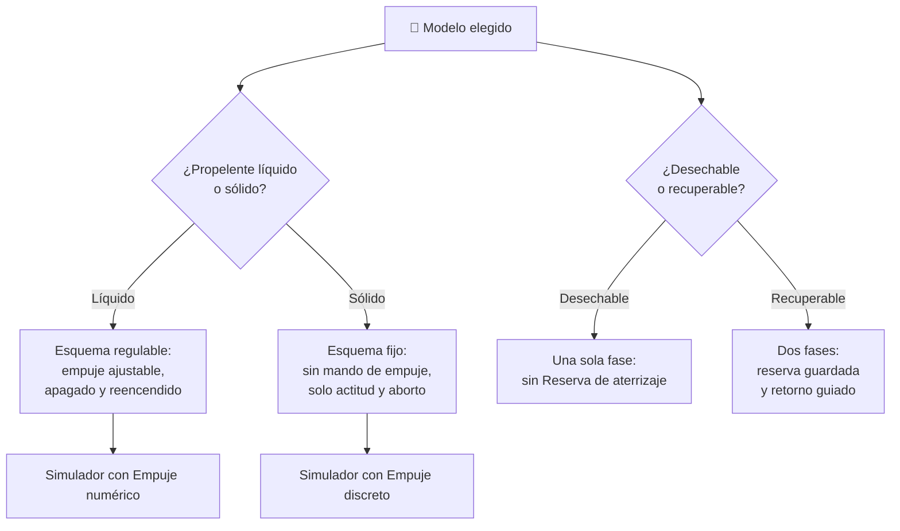

# 🧩 Modelos y variantes del cohete

[🏠 Inicio](../../../README.md) · [🚀 Curso: Cohetes](../README.md) · 🧩 Modelos

El [Módulo 2](../operacion/caracteristicas-cohete.md) ya dijo qué tipos de cohete
existen y para qué sirve cada uno. Este módulo responde a lo siguiente: **no
todos se operan igual**, y esa diferencia no es de matiz. Cambia qué mandos tiene
la máquina y, por tanto, qué debe modelar el simulador.

> 🎯 **La idea que sostiene el módulo.** "Un cohete" no es una sola máquina desde
> el punto de vista del mando. Un motor sólido no se apaga ni se regula: no es
> que sea más difícil de dosificar, es que **el mando de empuje no existe**. Un
> simulador que presente un solo esquema de control está representando un cohete
> concreto aunque diga representarlos todos.

---

## 🧭 Por qué el modelo decide el simulador

El [Módulo 5](../mandos/manual-mandos-cohete.md) describe unas entradas de
simulación con `Regular empuje` en Shift y Ctrl y `Retornar propulsor` en la
tecla R. El [Módulo 9](../simulacion/diseno-simulador-cohete.md) expone una
variable `Empuje` con rango `0-100 porciento` y una `Reserva de aterrizaje`.
Ambos describen un cohete **de motor líquido y primera etapa recuperable**.

En un cohete de motor sólido, esas teclas no tienen nada que ajustar: el
[Módulo 4](../operacion/sistemas-mecanicos-cohete.md) es explícito en que el
empuje no se regula y el motor no se apaga a voluntad una vez encendido. Y en un
lanzador desechable, la tecla R no manda sobre nada: la fase de retorno del
propulsor no ocurre. Si el simulador se construye sobre el esquema líquido y
recuperable y luego se le "añaden" las demás variantes, el resultado es un
propulsor sólido con acelerador, que no existe.

---

## 🗂️ Qué cambia en el manejo

| Modelo | Qué cambia en su operación |
| --- | --- |
| Lanzador mediano | La referencia del curso: ascenso por etapas, giro gradual e inserción orbital con margen de decisión. |
| Lanzador ligero | Menos etapas y menos margen: cada segundo de propelente cuenta y el momento de separación se estrecha. |
| Lanzador pesado | Más etapas y más masa: el empuje inicial es enorme y el esfuerzo estructural manda sobre el ritmo del ascenso. |
| De motor líquido | El empuje se dosifica durante todo el vuelo: se puede aliviar la estructura y apagar antes de agotar el tanque. |
| De motor sólido | Una vez encendido, el vuelo está comprometido: solo queda orientar y esperar a que el propelente se agote. |
| Desechable | El vuelo termina en la inserción orbital: todo el propelente se puede gastar en subir. |
| Recuperable | Aparece una fase posterior: hay que guardar propelente para el retorno y volar el ascenso pensando en el aterrizaje. |

---

## 🎛️ Qué cambia en el mando

| Modelo | Qué mando aparece o desaparece | Consecuencia |
| --- | --- | --- |
| Lanzador ligero, mediano, pesado | Ninguno: el mapa de controles del Módulo 5 aplica tal cual. | Cambian los rangos y los tiempos, no los controles. |
| De motor líquido | Ninguno: es el caso para el que está escrito el Módulo 5. | `Regular empuje` y el apagado ordenado están disponibles. |
| De motor sólido | **Desaparecen** `Regular empuje` y el apagado de motores. `Separar etapa` deja de ser una decisión y se vuelve consecuencia del agotamiento. | Del despegue solo quedan `Orientar el cohete` y `Abortar`; el corte de emergencia no puede apagar el motor, solo salvar la carga. |
| Desechable | **Desaparece** `Retornar propulsor`. | Tras la separación no hay nada que pilotar abajo: la etapa se pierde. |
| Recuperable | **Aparece** `Retornar propulsor` con los encendidos de reentrada y aterrizaje. | El mismo mando de empuje se usa dos veces en el mismo vuelo, con objetivos opuestos. |
| Tripulado (cápsula) | **Aparecen** el panel de tripulación y la palanca de aborto. | El aborto deja de ser solo una orden de tierra y pasa a tener prioridad a bordo. |

---

## 🎮 Qué cambia en el simulador

Contrastado con las variables del
[Módulo 9](../simulacion/diseno-simulador-cohete.md):

| Modelo | Variables que cambian | Esquema de control |
| --- | --- | --- |
| Lanzador mediano | Ninguna: es el caso base. | El del Módulo 5. |
| Lanzador ligero | `Propelente` y `Masa total` reducen su rango; `Altitud` y `Velocidad horizontal` se acotan a órbita baja. | El mismo, con menos tolerancia al error. |
| Lanzador pesado | `Masa total` y `Estado de etapas` amplían rango; `Ángulo de ascenso` pesa más por el esfuerzo estructural. | El mismo, con respuesta más lenta. |
| De motor líquido | Ninguna: `Empuje` es la variable regulable que el módulo asume. | El del Módulo 5. |
| De motor sólido | `Empuje` **deja de ser numérica** y pasa a discreta: encendido o agotado. `Propelente` deja de ser una entrada del usuario y solo se consume. | Sin entrada de empuje ni de apagado; solo actitud y aborto. |
| Desechable | `Reserva de aterrizaje` **se elimina**. `Estado de etapas` termina en separada, sin retorno. | Sin entrada de retorno del propulsor. |
| Recuperable | `Reserva de aterrizaje` **se activa** y compite con `Propelente` durante el ascenso. | El del Módulo 5, con una segunda fase de guiado tras la separación. |

---

## 🗺️ Del modelo al esquema de control

---

## ⚠️ Qué modelos no comparten simulador

Dos familias no se resuelven con un ajuste de parámetros, porque su esquema de
control es otro:

- **El cohete de motor sólido** frente al líquido: falta la entrada de empuje y
  la variable que la recoge cambia de tipo. Es un modo de control distinto, no
  una dificultad distinta.
- **El lanzador recuperable** frente al desechable: añade una fase completa de
  vuelo tras la separación y obliga a que la reserva de aterrizaje sea una
  decisión viva durante el ascenso, no una constante que se fija al empezar.

El resto de modelos sí caben en un mismo simulador ajustando rangos, tal como
plantean los [niveles de realismo](../../../docs/03-niveles-de-realismo.md): en
el nivel 1 casi todos se comportan igual, y las diferencias emergen a medida que
el nivel sube; el retorno del propulsor, de hecho, solo aparece en el nivel 3.

---

[⬅️ Anterior: Características](../operacion/caracteristicas-cohete.md) · [➡️ Siguiente: Sistemas mecánicos](../operacion/sistemas-mecanicos-cohete.md)
