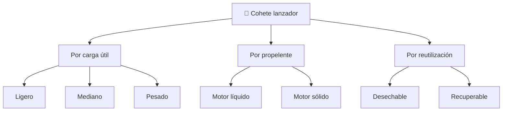

# 📋 Características funcionales del cohete

[🏠 Inicio](../../../README.md) · [🚀 Curso: Cohetes](../README.md) · 📋 Características

Que es un cohete lanzador, que tipos existen y para que sirve cada uno. Este
módulo da el contexto antes de abrir los sistemas del cohete (Módulo 4).

---

## 🧭 Definición

Un cohete lanzador es un vehículo que se impulsa expulsando gases a gran
velocidad y que lleva su propio oxidante, por lo que funciona incluso sin aire.
Su tarea es llevar una carga útil desde la superficie hasta la velocidad y la
altura necesarias para entrar en órbita, venciendo la gravedad y la atmósfera
densa de los primeros kilómetros.

---

## 🧬 Características clave

| Característica | Descripción |
| --- | --- |
| Propulsión por reacción | Avanza expulsando masa, sin apoyarse en el aire. |
| Oxidante propio | Lleva su oxígeno, por eso quema en el vacío. |
| Diseño por etapas | Suelta partes vacías para no cargar peso muerto. |
| Relación empuje-peso alta | Al despegar el empuje debe superar el peso. |
| Presupuesto de delta-v | La energía total define hasta donde puede llegar. |
| Reutilización parcial | Algunas etapas aterrizan y vuelven a volar. |

---

## 🗂️ Tipos de cohete

| Tipo | Uso típico | Rasgo destacado |
| --- | --- | --- |
| Lanzador ligero | Satélites pequeños a órbita baja | Bajo costo por vuelo. |
| Lanzador mediano | Satélites y cápsulas tripuladas | Equilibrio carga y precio. |
| Lanzador pesado | Grandes cargas o exploración lejana | Mucho empuje, varias etapas. |
| De motor líquido | Empuje regulable | Se puede apagar y reencender. |
| De motor sólido | Empuje muy alto de arranque | Simple, no se apaga a voluntad. |
| Recuperable | Bajar costo por vuelo | La primera etapa aterriza. |

---

## 🎯 Para qué se usa

- Poner satélites de comunicación, navegación y observación en órbita.
- Lanzar cápsulas y carga hacia estaciones espaciales.
- Enviar sondas a la Luna, planetas y cuerpos menores.
- Realizar vuelos suborbitales de ciencia con cohetes sonda.
- Educación y simulación de la fase de lanzamiento y ascenso.

---

[⬅️ Anterior: Historia](../historia/historia-cohete.md) · [➡️ Siguiente: Modelos y variantes](../modelos/modelos-cohete.md)
