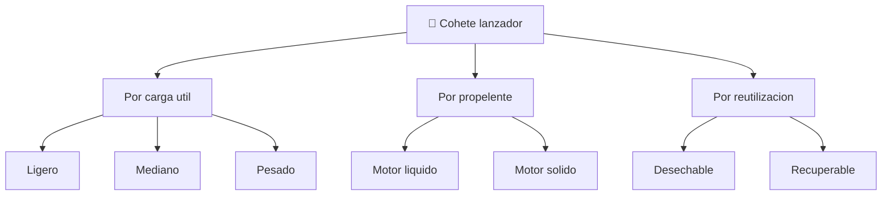

# 📋 Caracteristicas funcionales del cohete

[🏠 Inicio](../../../README.md) · [🚀 Curso: Cohetes](../README.md) · 📋 Caracteristicas

Que es un cohete lanzador, que tipos existen y para que sirve cada uno. Este
modulo da el contexto antes de abrir los sistemas del cohete (Modulo 3).

---

## 🧭 Definicion

Un cohete lanzador es un vehiculo que se impulsa expulsando gases a gran
velocidad y que lleva su propio oxidante, por lo que funciona incluso sin aire.
Su tarea es llevar una carga util desde la superficie hasta la velocidad y la
altura necesarias para entrar en orbita, venciendo la gravedad y la atmosfera
densa de los primeros kilometros.

---

## 🧬 Caracteristicas clave

| Caracteristica | Descripcion |
| --- | --- |
| Propulsion por reaccion | Avanza expulsando masa, sin apoyarse en el aire. |
| Oxidante propio | Lleva su oxigeno, por eso quema en el vacio. |
| Diseno por etapas | Suelta partes vacias para no cargar peso muerto. |
| Relacion empuje-peso alta | Al despegar el empuje debe superar el peso. |
| Presupuesto de delta-v | La energia total define hasta donde puede llegar. |
| Reutilizacion parcial | Algunas etapas aterrizan y vuelven a volar. |

---

## 🗂️ Tipos de cohete

| Tipo | Uso tipico | Rasgo destacado |
| --- | --- | --- |
| Lanzador ligero | Satelites pequenos a orbita baja | Bajo costo por vuelo. |
| Lanzador mediano | Satelites y capsulas tripuladas | Equilibrio carga y precio. |
| Lanzador pesado | Grandes cargas o exploracion lejana | Mucho empuje, varias etapas. |
| De motor liquido | Empuje regulable | Se puede apagar y reencender. |
| De motor solido | Empuje muy alto de arranque | Simple, no se apaga a voluntad. |
| Recuperable | Bajar costo por vuelo | La primera etapa aterriza. |

---

## 🎯 Para que se usa

- Poner satelites de comunicacion, navegacion y observacion en orbita.
- Lanzar capsulas y carga hacia estaciones espaciales.
- Enviar sondas a la Luna, planetas y cuerpos menores.
- Realizar vuelos suborbitales de ciencia con cohetes sonda.
- Educacion y simulacion de la fase de lanzamiento y ascenso.

---

[⬅️ Anterior: Historia](../historia/historia-cohete.md) · [➡️ Siguiente: Sistemas mecanicos](sistemas-mecanicos-cohete.md)
