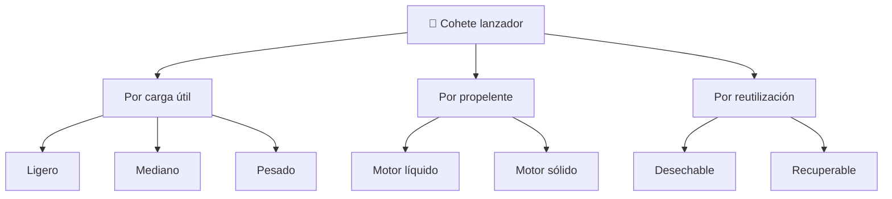

<!-- clase-meta
tipo_documento: clase
clase: 2
codigo: COHETES-02
curso: cohetes
titulo: "Características funcionales del cohete"
modalidad: "teórica aplicada"
duracion_minutos: 45
nivel: introductorio
prerrequisito: COHETES-01
competencia: "identificacion_funcional"
resultados_aprendizaje:
  - "Explicar definición, rasgos funcionales, tipos y usos con vocabulario propio de Cohetes."
  - "Aplicar esos conceptos a una decisión segura o a un escenario de simulación de Cohetes."
evidencia: "Matriz comparativa y decisión justificada."
criterio_aprobacion: "La elección considera función, límites, mando y efecto en la simulación; no se apoya solo en preferencias."
fuentes: manuales/fuentes.md
ultima_revision: 2026-09-10
-->

# 📋 Características funcionales del cohete

[🏠 Inicio](../../../README.md) · [🚀 Curso: Cohetes](../README.md) · 📋 Características

Que es un cohete lanzador, que tipos existen y para que sirve cada uno. Este
módulo da el contexto antes de abrir los sistemas del cohete (Clase 4).

---

## 🧭 Definición

Un cohete lanzador es un vehículo que se impulsa expulsando gases a gran
velocidad y que lleva su propio oxidante, por lo que funciona incluso sin aire.
Su tarea es llevar una carga útil desde la superficie hasta la velocidad y la
altura necesarias para entrar en órbita, venciendo la gravedad y la atmósfera
densa de los primeros kilómetros.

---

## 🧬 Características clave

| Característica | Descripción |
| --- | --- |
| Propulsión por reacción | Avanza expulsando masa, sin apoyarse en el aire. |
| Oxidante propio | Lleva su oxígeno, por eso quema en el vacío. |
| Diseño por etapas | Suelta partes vacías para no cargar peso muerto. |
| Relación empuje-peso alta | Al despegar el empuje debe superar el peso. |
| Presupuesto de delta-v | La energía total define hasta donde puede llegar. |
| Reutilización parcial | Algunas etapas aterrizan y vuelven a volar. |

---

## 🗂️ Tipos de cohete

```mermaid
flowchart TD
    Cohete[🚀 Cohete lanzador] --> Carga[Por carga útil]
    Cohete --> Propelente[Por propelente]
    Cohete --> Reuso[Por reutilización]
    Carga --> Ligero[Ligero]
    Carga --> Mediano[Mediano]
    Carga --> Pesado[Pesado]
    Propelente --> Liquido[Motor líquido]
    Propelente --> Solido[Motor sólido]
    Reuso --> Desechable[Desechable]
    Reuso --> Recuperable[Recuperable]
```

| Tipo | Uso típico | Rasgo destacado |
| --- | --- | --- |
| Lanzador ligero | Satélites pequeños a órbita baja | Bajo costo por vuelo. |
| Lanzador mediano | Satélites y cápsulas tripuladas | Equilibrio carga y precio. |
| Lanzador pesado | Grandes cargas o exploración lejana | Mucho empuje, varias etapas. |
| De motor líquido | Empuje regulable | Se puede apagar y reencender. |
| De motor sólido | Empuje muy alto de arranque | Simple, no se apaga a voluntad. |
| Recuperable | Bajar costo por vuelo | La primera etapa aterriza. |

---

## 🎯 Para qué se usa

- Poner satélites de comunicación, navegación y observación en órbita.
- Lanzar cápsulas y carga hacia estaciones espaciales.
- Enviar sondas a la Luna, planetas y cuerpos menores.
- Realizar vuelos suborbitales de ciencia con cohetes sonda.
- Educación y simulación de la fase de lanzamiento y ascenso.

## 🧭 Guía de estudio aplicada

### Pregunta guía

¿Cómo ayuda **Definición, Características clave, Tipos de cohete y Para qué se usa** a **elegir una configuración adecuada para ascenso educativo con cambio de etapa y viento en altura**?

### Explicación razonada

Una característica solo es útil cuando permite anticipar comportamiento. En Cohetes, la relación entre propelentes, cámara, tobera y empuje y trayectoria determina capacidad, respuesta y límites. Por eso «cohete de combustible líquido frente a sólido» no se compara por apariencia: se compara por misión, entorno, carga de trabajo y exposición al riesgo «inestabilidad, desviación o cargas excesivas durante máxima presión dinámica».

Esta clase se conecta con el resto del curso mediante **la aceleración depende de empuje menos peso y resistencia, mientras la masa disminuye**. El hilo de
seguridad consiste en reconocer a tiempo **inestabilidad, desviación o cargas excesivas durante máxima presión dinámica** y poder justificar la decisión
**evaluar trayectoria, estabilidad y condiciones de aborto antes del lanzamiento**; en clases posteriores cambiará el ángulo de análisis, no esa relación causal.
La lectura funcional común sigue **propelentes → cámara → tobera → empuje y trayectoria**, de modo que cada concepto pueda
ubicarse dentro del funcionamiento completo y no quede como un dato aislado.

**Apoyo documental:** [Rockets Educator Guide](https://www.nasa.gov/wp-content/uploads/2012/07/rockets-educator-guide-20.pdf) aporta propulsión, estabilidad y trayectoria;
[Space Law Treaties and Principles](https://www.unoosa.org/oosa/SpaceLaw/treaties.html) se usa para derecho espacial internacional. Estas fuentes
se contrastan con el alcance de la clase y no sustituyen un manual de equipo concreto.

### Caso resuelto: de la observación a la decisión

1. **Definir la necesidad:** convierte «ascenso educativo con cambio de etapa y viento en altura» en requisitos de capacidad, entorno y respuesta.
2. **Comparar:** contrasta **cohete de combustible líquido frente a sólido** usando esos requisitos y la cadena **propelentes → cámara → tobera → empuje y trayectoria**.
3. **Descartar:** elimina la alternativa que deja menos margen frente a **inestabilidad, desviación o cargas excesivas durante máxima presión dinámica**.
4. **Elegir:** declara la variante escogida, la evidencia usada y una limitación que todavía debe respetarse.

### Comprueba tu comprensión

1. ¿Qué característica de **empuje y trayectoria** condiciona primero el caso «ascenso educativo con cambio de etapa y viento en altura»?
2. ¿Qué requisito descartaría una de las alternativas **cohete de combustible líquido frente a sólido**?
3. ¿Qué límite debe declararse junto con la variante elegida?

Orientación para revisar tus respuestas

- La primera respuesta debe relacionar el eslabón elegido con un efecto posterior, no solo nombrarlo.
- La segunda debe proponer una señal medible u observable y explicar qué tendencia sería preocupante.
- La tercera debe cambiar al menos una variable de capacidad, mando, entorno o margen de seguridad.

## 🎓 Cierre de clase

- **Actividad:** Compara variantes de Cohetes mediante los ejes «definición, rasgos funcionales, tipos y usos» y elige una para un caso de uso razonado.
- **Evidencia:** Matriz comparativa y decisión justificada.
- **Criterio de aprobación:** La elección considera función, límites, mando y efecto en la simulación; no se apoya solo en preferencias.
- **Transferencia:** explica qué cambiaría al pasar a otra variante de esta máquina.

### Fuentes de esta clase

- [NASA-ROCKETS](https://www.nasa.gov/wp-content/uploads/2012/07/rockets-educator-guide-20.pdf): Rockets Educator Guide, NASA. Uso: propulsión, estabilidad y trayectoria.
- [UNOOSA-TREATIES](https://www.unoosa.org/oosa/SpaceLaw/treaties.html): Space Law Treaties and Principles, UNOOSA. Uso: derecho espacial internacional.

> Las fuentes sostienen el marco conceptual y normativo; esta clase no reemplaza el manual
> del fabricante, la formación certificada ni la habilitación exigida para operar equipos reales.

---

[⬅️ Anterior: Historia](../historia/historia-cohete.md) · [➡️ Siguiente: Modelos y variantes](../modelos/modelos-cohete.md)
