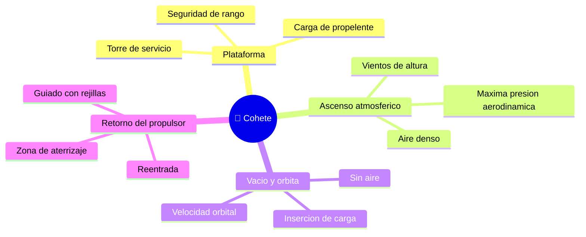

# 🌍 Entornos de trabajo del cohete

[🏠 Inicio](../../../README.md) · [🚀 Curso: Cohetes](../README.md) · 🌍 Entornos

Donde opera un cohete y como cambian las condiciones a lo largo del vuelo. Cada
fase implica un entorno distinto, con riesgos y ajustes propios, y en simulacion
se traduce en escenarios diferentes.

---

## 🗺️ Entornos principales

| Entorno | Caracteristicas | Riesgos tipicos | Ajuste de operacion |
| --- | --- | --- | --- |
| Plataforma | Cohete cargado y sujeto. | Fuga de propelente, clima adverso. | Checklist, ventanas de lanzamiento. |
| Ascenso atmosferico | Aire denso y vientos. | Maxima presion aerodinamica, viento. | Regular empuje, giro gradual. |
| Vacio y orbita | Sin aire, alta velocidad. | Error de insercion orbital. | Etapa superior precisa, apagado exacto. |
| Retorno del propulsor | Reentrada controlada. | Sobrecalentamiento, mal apuntado. | Encendidos de frenado, rejillas de guiado. |
| Zona de aterrizaje | Suelo o barcaza marina. | Viento, superficie limitada. | Encendido final suave sobre las patas. |

---

## 🌦️ Factores del entorno

- **Clima**: viento, rayos y nubes pueden retrasar o cancelar un lanzamiento.
- **Ventana de lanzamiento**: solo hay ciertos momentos para alcanzar la orbita deseada.
- **Presion aerodinamica**: hay un punto del ascenso con maximo esfuerzo del aire.
- **Seguridad de rango**: la trayectoria debe evitar zonas pobladas.

---

## 🎮 Traduccion a simulacion

Cada fase es un escenario con su densidad de aire, su gravedad efectiva y su
regimen de vuelo. Ver como se modela en el
[Modulo 8: Diseno de simulacion](../simulacion/diseno-simulador-cohete.md).

---

[⬅️ Anterior: Principios y operacion](principios-cohete.md) · [➡️ Siguiente: Reglamentos](../reglamentos/reglamentos-cohete.md)
