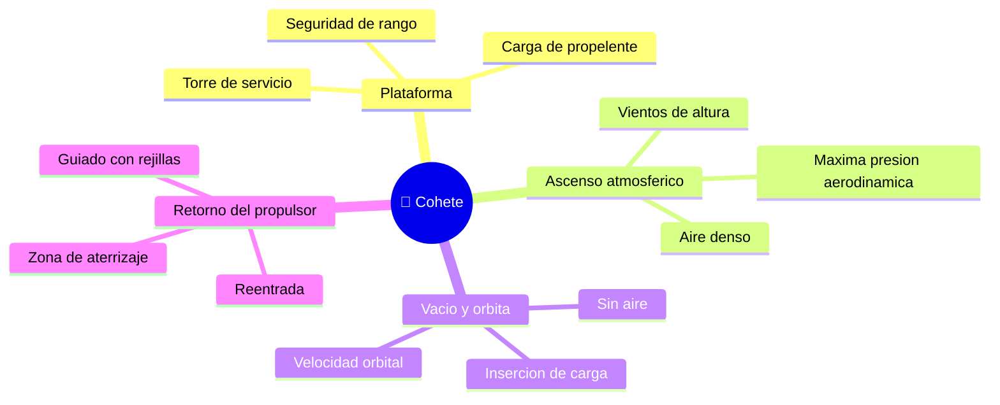

# 🌍 Entornos de trabajo del cohete

[🏠 Inicio](../../../README.md) · [🚀 Curso: Cohetes](../README.md) · 🌍 Entornos

Dónde opera un cohete y cómo cambian las condiciones a lo largo del vuelo. Cada
fase implica un entorno distinto, con riesgos y ajustes propios, y en simulación
se traduce en escenarios diferentes.

---

## 🗺️ Entornos principales

| Entorno | Características | Riesgos típicos | Ajuste de operación |
| --- | --- | --- | --- |
| Plataforma | Cohete cargado y sujeto. | Fuga de propelente, clima adverso. | Checklist, ventanas de lanzamiento. |
| Ascenso atmosférico | Aire denso y vientos. | Máxima presión aerodinámica, viento. | Regular empuje, giro gradual. |
| Vacío y órbita | Sin aire, alta velocidad. | Error de inserción orbital. | Etapa superior precisa, apagado exacto. |
| Retorno del propulsor | Reentrada controlada. | Sobrecalentamiento, mal apuntado. | Encendidos de frenado, rejillas de guiado. |
| Zona de aterrizaje | Suelo o barcaza marina. | Viento, superficie limitada. | Encendido final suave sobre las patas. |

---

## 🌦️ Factores del entorno

- **Clima**: viento, rayos y nubes pueden retrasar o cancelar un lanzamiento.
- **Ventana de lanzamiento**: solo hay ciertos momentos para alcanzar la órbita deseada.
- **Presión aerodinámica**: hay un punto del ascenso con máximo esfuerzo del aire.
- **Seguridad de rango**: la trayectoria debe evitar zonas pobladas.

---

## 🎮 Traducción a simulación

Cada fase es un escenario con su densidad de aire, su gravedad efectiva y su
régimen de vuelo. Ver cómo se modela en el
[Módulo 9: Diseño de simulación](../simulacion/diseno-simulador-cohete.md).

---

[⬅️ Anterior: Principios y operación](principios-cohete.md) · [➡️ Siguiente: Reglamentos](../reglamentos/reglamentos-cohete.md)
