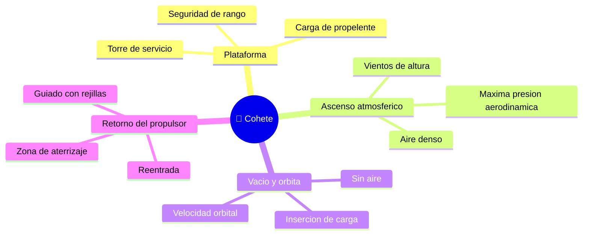

<!-- clase-meta
tipo_documento: clase
clase: 7
codigo: COHETES-07
curso: cohetes
titulo: "Entornos de trabajo del cohete"
modalidad: "análisis de escenarios"
duracion_minutos: 60
nivel: introductorio
prerrequisito: COHETES-06
competencia: "adaptacion_al_entorno"
resultados_aprendizaje:
  - "Explicar entornos, factores ambientales, riesgos y respuesta de simulación con vocabulario propio de Cohetes."
  - "Aplicar esos conceptos a una decisión segura o a un escenario de simulación de Cohetes."
evidencia: "Matriz entorno–cambio–riesgo–respuesta."
criterio_aprobacion: "Cada respuesta se adapta al entorno y distingue riesgos que no son intercambiables entre escenarios."
fuentes: manuales/fuentes.md
ultima_revision: 2026-09-10
-->

# 🌍 Entornos de trabajo del cohete

[🏠 Inicio](../../../README.md) · [🚀 Curso: Cohetes](../README.md) · 🌍 Entornos

Dónde opera un cohete y cómo cambian las condiciones a lo largo del vuelo. Cada
fase implica un entorno distinto, con riesgos y ajustes propios, y en simulación
se traduce en escenarios diferentes.

---

## 🗺️ Entornos principales

```mermaid
mindmap
  root((🚀 Cohete))
    Plataforma
      Carga de propelente
      Torre de servicio
      Seguridad de rango
    Ascenso atmosferico
      Aire denso
      Vientos de altura
      Maxima presion aerodinamica
    Vacio y orbita
      Sin aire
      Velocidad orbital
      Insercion de carga
    Retorno del propulsor
      Reentrada
      Guiado con rejillas
      Zona de aterrizaje
```

| Entorno | Características | Riesgos típicos | Ajuste de operación |
| --- | --- | --- | --- |
| Plataforma | Cohete cargado y sujeto. | Fuga de propelente, clima adverso. | Checklist, ventanas de lanzamiento. |
| Ascenso atmosférico | Aire denso y vientos. | Máxima presión aerodinámica, viento. | Regular empuje, giro gradual. |
| Vacío y órbita | Sin aire, alta velocidad. | Error de inserción orbital. | Etapa superior precisa, apagado exacto. |
| Retorno del propulsor | Reentrada controlada. | Sobrecalentamiento, mal apuntado. | Encendidos de frenado, rejillas de guiado. |
| Zona de aterrizaje | Suelo o barcaza marina. | Viento, superficie limitada. | Encendido final suave sobre las patas. |

---

## 🌦️ Factores del entorno

- **Clima**: viento, rayos y nubes pueden retrasar o cancelar un lanzamiento.
- **Ventana de lanzamiento**: solo hay ciertos momentos para alcanzar la órbita deseada.
- **Presión aerodinámica**: hay un punto del ascenso con máximo esfuerzo del aire.
- **Seguridad de rango**: la trayectoria debe evitar zonas pobladas.

---

## 🎮 Traducción a simulación

Cada fase es un escenario con su densidad de aire, su gravedad efectiva y su
régimen de vuelo. Ver cómo se modela en el
[Clase 9: Diseño de simulación](../simulacion/diseno-simulador-cohete.md).

## 🧭 Guía de estudio aplicada

### Pregunta guía

¿Cómo ayuda **Entornos principales, Factores del entorno, Traducción a simulación y Guía de estudio aplicada** a **adaptar ascenso educativo con cambio de etapa y viento en altura a tres condiciones ambientales distintas**?

### Explicación razonada

El entorno no es decoración: modifica las fuerzas, la percepción y el tiempo disponible. En el caso «ascenso educativo con cambio de etapa y viento en altura», cambia el comportamiento de empuje y trayectoria y aumenta la probabilidad de inestabilidad, desviación o cargas excesivas durante máxima presión dinámica. La respuesta correcta empieza por reconocer qué variable cambió y después adaptar límites, ruta o misión.

Esta clase se conecta con el resto del curso mediante **la aceleración depende de empuje menos peso y resistencia, mientras la masa disminuye**. El hilo de
seguridad consiste en reconocer a tiempo **inestabilidad, desviación o cargas excesivas durante máxima presión dinámica** y poder justificar la decisión
**evaluar trayectoria, estabilidad y condiciones de aborto antes del lanzamiento**; en clases posteriores cambiará el ángulo de análisis, no esa relación causal.
La lectura funcional común sigue **propelentes → cámara → tobera → empuje y trayectoria**, de modo que cada concepto pueda
ubicarse dentro del funcionamiento completo y no quede como un dato aislado.

**Apoyo documental:** [Rockets Educator Guide](https://www.nasa.gov/wp-content/uploads/2012/07/rockets-educator-guide-20.pdf) aporta propulsión, estabilidad y trayectoria;
[Space Law Treaties and Principles](https://www.unoosa.org/oosa/SpaceLaw/treaties.html) se usa para derecho espacial internacional. Estas fuentes
se contrastan con el alcance de la clase y no sustituyen un manual de equipo concreto.

### Caso resuelto: de la observación a la decisión

1. **Escenario base:** conserva la misión «ascenso educativo con cambio de etapa y viento en altura» para poder comparar.
2. **Cambiar una condición:** modifica sucesivamente superficie o medio, visibilidad y perturbación externa.
3. **Recalcular margen:** explica cómo cada cambio afecta **empuje y trayectoria** y acerca o aleja **inestabilidad, desviación o cargas excesivas durante máxima presión dinámica**.
4. **Adaptar:** cambia límite, ruta, configuración o incluso cancela; no mantengas la misma respuesta por hábito.

### Comprueba tu comprensión

1. ¿Cómo cambiaría **empuje y trayectoria** si empeora la perturbación externa?
2. ¿Qué condición ambiental acerca más el escenario a **inestabilidad, desviación o cargas excesivas durante máxima presión dinámica**?
3. ¿Cuándo adaptarías la maniobra y cuándo la cancelarías?

Orientación para revisar tus respuestas

- La primera respuesta debe relacionar el eslabón elegido con un efecto posterior, no solo nombrarlo.
- La segunda debe proponer una señal medible u observable y explicar qué tendencia sería preocupante.
- La tercera debe cambiar al menos una variable de capacidad, mando, entorno o margen de seguridad.

## 🎓 Cierre de clase

- **Actividad:** Contrasta tres entornos de Cohetes a partir de entornos, factores ambientales, riesgos y respuesta de simulación y determina cómo cambian variables, percepción, riesgos y respuesta.
- **Evidencia:** Matriz entorno–cambio–riesgo–respuesta.
- **Criterio de aprobación:** Cada respuesta se adapta al entorno y distingue riesgos que no son intercambiables entre escenarios.
- **Transferencia:** explica qué cambiaría al pasar a otra variante de esta máquina.

### Fuentes de esta clase

- [NASA-ROCKETS](https://www.nasa.gov/wp-content/uploads/2012/07/rockets-educator-guide-20.pdf): Rockets Educator Guide, NASA. Uso: propulsión, estabilidad y trayectoria.
- [UNOOSA-TREATIES](https://www.unoosa.org/oosa/SpaceLaw/treaties.html): Space Law Treaties and Principles, UNOOSA. Uso: derecho espacial internacional.

> Las fuentes sostienen el marco conceptual y normativo; esta clase no reemplaza el manual
> del fabricante, la formación certificada ni la habilitación exigida para operar equipos reales.

---

[⬅️ Anterior: Principios y operación](principios-cohete.md) · [➡️ Siguiente: Reglamentos](../reglamentos/reglamentos-cohete.md)
