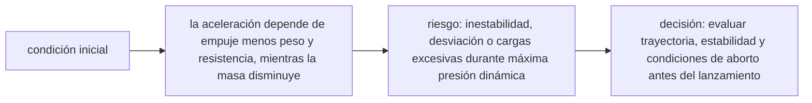

<!-- clase-meta
tipo_documento: clase
clase: 6
codigo: COHETES-06
curso: cohetes
titulo: "Principios y operación del cohete"
modalidad: "resolución de problemas"
duracion_minutos: 90
nivel: introductorio
prerrequisito: COHETES-05
competencia: "razonamiento_operacional"
resultados_aprendizaje:
  - "Explicar principios físicos, fases de operación, decisiones y errores frecuentes con vocabulario propio de Cohetes."
  - "Aplicar esos conceptos a una decisión segura o a un escenario de simulación de Cohetes."
evidencia: "Resolución argumentada de un escenario operacional."
criterio_aprobacion: "Aplica los principios correctos, anticipa consecuencias y respeta los límites del curso."
fuentes: manuales/fuentes.md
ultima_revision: 2026-09-10
-->

# 🧪 Principios y operación del cohete

[🏠 Inicio](../../../README.md) · [🚀 Curso: Cohetes](../README.md) · 🧪 Principios

Documento general y educativo. Describe cómo se opera un cohete en simulación y
que principios físicos conviene representar. Todo es **ciencia real**: la física
del empuje y de la órbita se modela con rigor.

## Principios de funcionamiento

- **Empuje por reacción**: el cohete expulsa gases hacia atrás y es empujado
  hacia adelante (tercera ley de Newton). No necesita aire.
- **Relación empuje-peso**: para despegar, el empuje debe ser mayor que el peso.
  Si la relación es 1, el cohete flota; si es menor, no despega.
- **Ecuación del cohete (Tsiolkovski)**: el cambio de velocidad que logra un
  cohete depende de la velocidad de salida de sus gases y de cuanta masa quema
  frente a su masa final. Cuanto más propelente gasta y más rápido lo expulsa,
  más delta-v obtiene.
- **Etapas**: soltar masa vacía mejora la relación entre propelente y peso, por
  eso los cohetes se dividen en etapas.
- **Velocidad orbital**: para quedar en órbita baja hace falta avanzar de lado a
  unos 7,8 km/s (aproximado), no solo subir alto.

## El empuje en una idea

Subir alto no basta: si el cohete solo ganara altura, caería de vuelta. La clave
es ganar **velocidad horizontal** suficiente para entrar en órbita.

## Fases de operación

| Fase | Que ocurre | Puntos clave |
| --- | --- | --- |
| Prelanzamiento | Carga de propelente y revisión | Checklist, presión de tanques, clima. |
| Cuenta atrás | Secuencia sincronizada final | Sistemas en verde, autorización de rango. |
| Despegue | Encendido y liberación | Empuje mayor que el peso, torre despejada. |
| Ascenso | Ganar altura y velocidad | Giro gradual hacia la horizontal. |
| Separación de etapas | Soltar la etapa agotada | Momento justo, encender la siguiente. |
| Inserción orbital | Alcanzar velocidad orbital | Velocidad de lado suficiente. |
| Retorno del propulsor | La primera etapa vuelve | Encendidos de reentrada y aterrizaje. |

## Maniobra de ascenso: idea general

1. Despegar vertical para salir del aire más denso.
2. Inclinar poco a poco hacia la horizontal (giro gravitatorio).
3. Regular el empuje para no exceder el esfuerzo estructural.
4. Separar la etapa inferior al agotarse.
5. Con la etapa superior, ganar la velocidad orbital final.

## Errores comunes que la simulación puede enseñar a evitar

- Creer que basta con subir alto sin ganar velocidad horizontal.
- Despegar con relación empuje-peso menor que 1.
- Separar la etapa demasiado pronto o demasiado tarde.
- Gastar todo el propelente sin reserva para el aterrizaje del propulsor.
- Inclinar el cohete demasiado rápido y sobrecargar la estructura.

## Relación con los niveles de realismo

- **Nivel 1 (educativo)**: despegar, ascender y llegar a órbita de forma guiada.
- **Nivel 2 (simplificado)**: agregar relación empuje-peso, etapas y velocidad orbital.
- **Nivel 3 (técnico)**: sumar ecuación del cohete, giro gravitatorio y retorno del propulsor.

Ver [`docs/03-niveles-de-realismo.md`](../../../docs/03-niveles-de-realismo.md) para el detalle de cada nivel.

## 🧭 Guía de estudio aplicada

### Pregunta guía

¿Cómo ayuda **Principios de funcionamiento, El empuje en una idea, Fases de operación y Maniobra de ascenso: idea general** a **resolver ascenso educativo con cambio de etapa y viento en altura sin agotar el margen operacional**?

### Explicación razonada

El principio rector puede resumirse así: la aceleración depende de empuje menos peso y resistencia, mientras la masa disminuye. Esto explica por qué una misma orden produce resultados distintos cuando cambian velocidad, carga, configuración o entorno. Operar bien consiste en leer la tendencia antes de agotar el margen y tomar esta decisión: evaluar trayectoria, estabilidad y condiciones de aborto antes del lanzamiento.

Esta clase se conecta con el resto del curso mediante **la aceleración depende de empuje menos peso y resistencia, mientras la masa disminuye**. El hilo de
seguridad consiste en reconocer a tiempo **inestabilidad, desviación o cargas excesivas durante máxima presión dinámica** y poder justificar la decisión
**evaluar trayectoria, estabilidad y condiciones de aborto antes del lanzamiento**; en clases posteriores cambiará el ángulo de análisis, no esa relación causal.
La lectura funcional común sigue **propelentes → cámara → tobera → empuje y trayectoria**, de modo que cada concepto pueda
ubicarse dentro del funcionamiento completo y no quede como un dato aislado.

**Apoyo documental:** [Rockets Educator Guide](https://www.nasa.gov/wp-content/uploads/2012/07/rockets-educator-guide-20.pdf) aporta propulsión, estabilidad y trayectoria;
[Space Law Treaties and Principles](https://www.unoosa.org/oosa/SpaceLaw/treaties.html) se usa para derecho espacial internacional. Estas fuentes
se contrastan con el alcance de la clase y no sustituyen un manual de equipo concreto.

### Caso resuelto: de la observación a la decisión

1. **Datos:** reconoce condiciones, configuración y margen disponibles en **ascenso educativo con cambio de etapa y viento en altura**.
2. **Modelo:** aplica **la aceleración depende de empuje menos peso y resistencia, mientras la masa disminuye** para predecir una tendencia antes de actuar.
3. **Riesgo:** explica mediante qué cadena de causas podría ocurrir **inestabilidad, desviación o cargas excesivas durante máxima presión dinámica**.
4. **Decisión:** ejecuta mentalmente **evaluar trayectoria, estabilidad y condiciones de aborto antes del lanzamiento** y define qué observación confirmaría que funcionó.

### Comprueba tu comprensión

1. ¿Qué variable del principio «la aceleración depende de empuje menos peso y resistencia, mientras la masa disminuye» cambia primero en el caso?
2. ¿Cómo se propaga ese cambio hasta **empuje y trayectoria**?
3. ¿Qué evidencia confirmaría que **evaluar trayectoria, estabilidad y condiciones de aborto antes del lanzamiento** conservó margen operacional?

Orientación para revisar tus respuestas

- La primera respuesta debe relacionar el eslabón elegido con un efecto posterior, no solo nombrarlo.
- La segunda debe proponer una señal medible u observable y explicar qué tendencia sería preocupante.
- La tercera debe cambiar al menos una variable de capacidad, mando, entorno o margen de seguridad.

## 🎓 Cierre de clase

- **Actividad:** Resuelve un escenario de Cohetes explicando, paso a paso, cómo intervienen principios físicos, fases de operación, decisiones y errores frecuentes.
- **Evidencia:** Resolución argumentada de un escenario operacional.
- **Criterio de aprobación:** Aplica los principios correctos, anticipa consecuencias y respeta los límites del curso.
- **Transferencia:** explica qué cambiaría al pasar a otra variante de esta máquina.

### Fuentes de esta clase

- [NASA-ROCKETS](https://www.nasa.gov/wp-content/uploads/2012/07/rockets-educator-guide-20.pdf): Rockets Educator Guide, NASA. Uso: propulsión, estabilidad y trayectoria.
- [UNOOSA-TREATIES](https://www.unoosa.org/oosa/SpaceLaw/treaties.html): Space Law Treaties and Principles, UNOOSA. Uso: derecho espacial internacional.

> Las fuentes sostienen el marco conceptual y normativo; esta clase no reemplaza el manual
> del fabricante, la formación certificada ni la habilitación exigida para operar equipos reales.

---

[⬅️ Anterior: Mandos](../mandos/manual-mandos-cohete.md) · [➡️ Siguiente: Entornos de trabajo](entornos-cohete.md)
