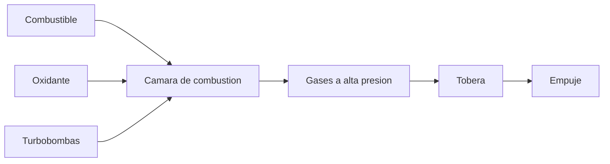
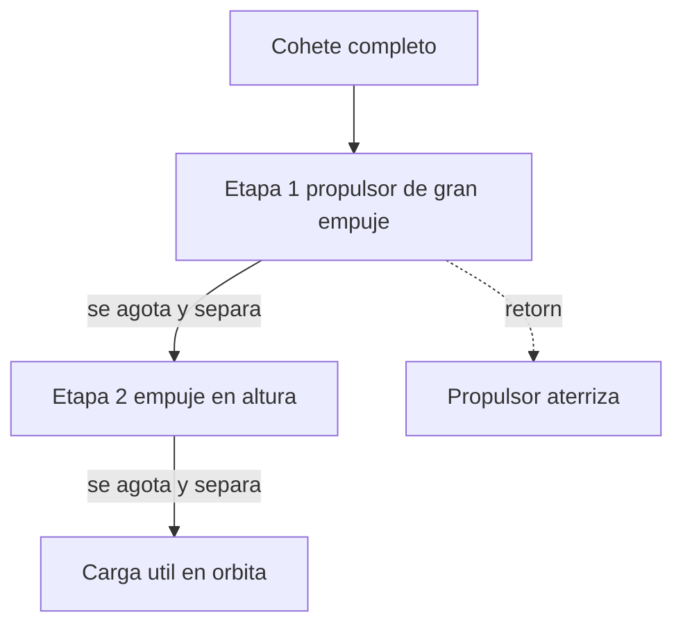
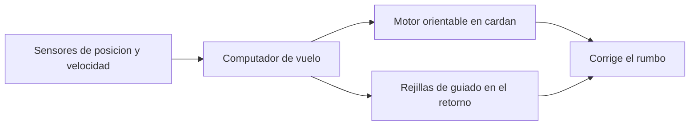

# 🔧 Sistemas mecanicos del cohete

[🏠 Inicio](../../../README.md) · [🚀 Curso: Cohetes](../README.md) · 🔧 Sistemas mecanicos

Este modulo abre el cohete por dentro. Explica cada sistema, como funciona y como
se conecta con los demas. Es la base tecnica para entender el control de mision
(Modulo 4) y la fisica del empuje (Modulo 5). Todo es **ciencia real**.

---

## 1. 🔥 Motores y propulsion

El motor cohete quema combustible con un oxidante y expulsa los gases por la
tobera. La tercera ley de Newton hace el resto: al lanzar masa hacia atras, el
cohete es empujado hacia adelante.

| Componente | Funcion |
| --- | --- |
| Combustible | Materia que se quema, por ejemplo queroseno, hidrogeno o metano. |
| Oxidante | Aporta el oxigeno para quemar sin aire, suele ser oxigeno liquido. |
| Turbobombas | Empujan propelente a la camara a muy alta presion. |
| Camara de combustion | Donde se quema la mezcla y sube la presion. |
| Tobera | Acelera los gases y convierte presion en empuje. |
| Sistema de refrigeracion | Circula propelente frio por las paredes de la tobera. |

### Motor de combustible liquido

Usa combustible y oxidante liquidos en tanques separados. Su gran ventaja es que
el empuje se **regula**, se puede apagar y a veces reencender. Es el motor tipico
de las etapas que necesitan control fino, como el aterrizaje del propulsor.

### Motor de combustible solido

El propelente es una mezcla solida ya cargada en el cuerpo del motor. Da un empuje
muy alto de arranque y es mecanicamente simple, pero **no** se apaga a voluntad
una vez encendido. Se usa como refuerzo en el despegue.

| Aspecto | Motor liquido | Motor solido |
| --- | --- | --- |
| Regulacion de empuje | Si, ajustable | No, casi fijo |
| Apagado y reencendido | Posible | No una vez encendido |
| Complejidad | Alta, con bombas y valvulas | Baja, sin partes moviles |
| Uso tipico | Etapas principales y aterrizaje | Refuerzo de despegue |

---

## 2. 🪜 Etapas y separacion

El cohete se divide en etapas para soltar la masa vacia y no arrastrar peso
muerto. Cada etapa se separa al agotar su propelente.

| Elemento | Funcion |
| --- | --- |
| Etapa inferior o propulsor | Vence la gravedad y el aire denso del despegue. |
| Etapa superior | Da la velocidad final para entrar en orbita. |
| Sistema de separacion | Suelta la etapa vacia con resortes o pernos explosivos. |
| Cofia protectora | Cubre la carga en la atmosfera y luego se suelta. |
| Interfaz de carga | Sujeta el satelite o capsula y lo libera en orbita. |

---

## 3. 🛢️ Propelentes y tanques

Los tanques guardan combustible y oxidante, muchas veces a temperaturas muy bajas
(propelentes criogenicos). La estructura debe ser ligera pero soportar presion.

- **Propelente criogenico**: oxigeno o hidrogeno liquidos, muy frios y energeticos.
- **Presurizacion**: un gas mantiene la presion para que las bombas no fallen.
- **Aislamiento**: capas que evitan que el propelente frio se caliente.
- **Estructura**: los tanques suelen ser parte del cuerpo que da rigidez al cohete.

---

## 4. 🎯 Guiado y control de vuelo

El cohete corrige su rumbo constantemente porque es inestable por naturaleza.

| Sistema | Funcion |
| --- | --- |
| Computador de vuelo | Calcula la trayectoria y ordena correcciones. |
| Motor orientable | Gira la tobera para apuntar el empuje y girar el cohete. |
| Rejillas de guiado | Superficies que dirigen el propulsor al volver a la atmosfera. |
| Sensores de navegacion | Miden posicion, velocidad y orientacion. |
| Patas de aterrizaje | Se despliegan para posar el propulsor reutilizable. |

---

## 5. ♻️ Recuperacion del propulsor

En un cohete reutilizable, la primera etapa regresa de forma controlada.

1. Tras separarse, el propulsor se orienta para frenar.
2. Enciende sus motores en un **encendido de reentrada** para bajar la velocidad.
3. Usa rejillas de guiado para dirigirse a la zona de aterrizaje.
4. Un **encendido de aterrizaje** final lo posa suave sobre sus patas.
5. Se revisa y se prepara para volar de nuevo.

---

## 🔁 Como se conecta todo

1. Los **motores** generan el empuje quemando propelente con oxidante.
2. Las **etapas** sueltan peso muerto para ganar eficiencia.
3. Los **tanques** alimentan los motores a la presion correcta.
4. El **guiado** corrige el rumbo todo el tiempo.
5. La **recuperacion** trae de vuelta el propulsor para reutilizarlo.

Con esto entendido, el [Modulo 4: Mandos](../mandos/manual-mandos-cohete.md)
muestra como el control de mision opera y vigila estos sistemas.

---

[⬅️ Anterior: Caracteristicas](caracteristicas-cohete.md) · [➡️ Siguiente: Mandos e instrumentos](../mandos/manual-mandos-cohete.md)
