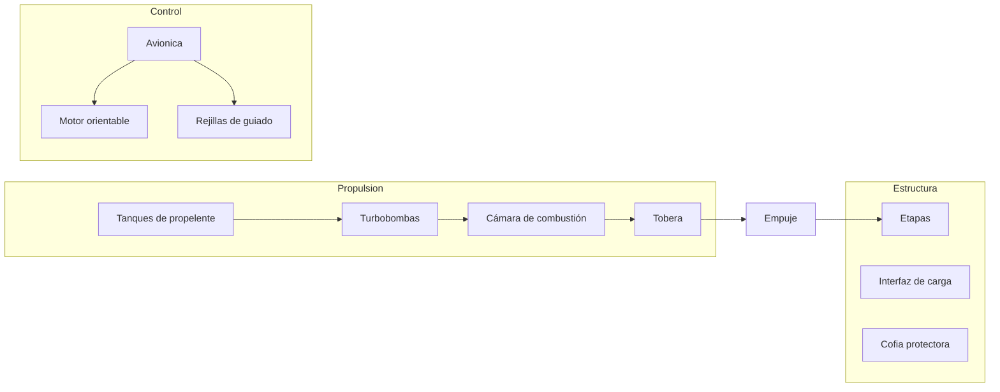
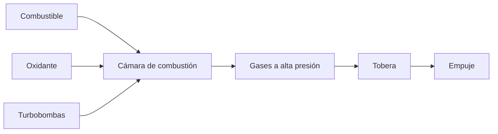
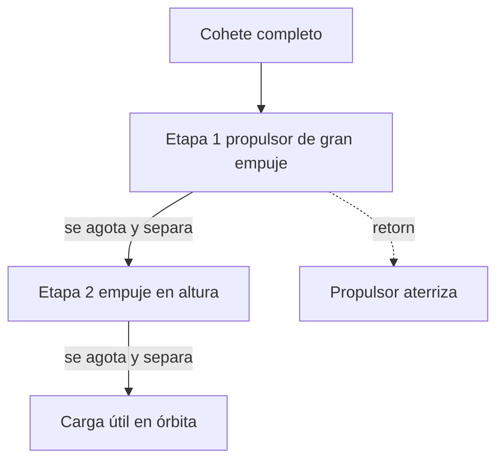
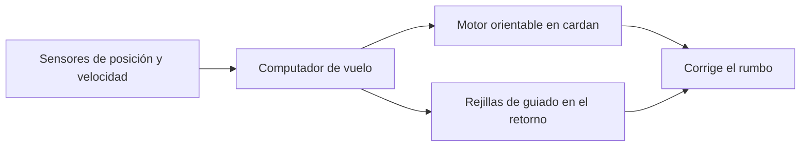
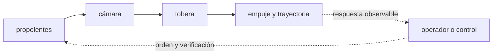

<!-- clase-meta
tipo_documento: clase
clase: 4
codigo: COHETES-04
curso: cohetes
titulo: "Sistemas mecánicos del cohete"
modalidad: "teórica aplicada"
duracion_minutos: 90
nivel: introductorio
prerrequisito: COHETES-03
competencia: "comprension_de_sistemas"
resultados_aprendizaje:
  - "Explicar Motores y propulsión, Etapas y separación, Propelentes y tanques y Guiado y control de vuelo con vocabulario propio de Cohetes."
  - "Aplicar esos conceptos a una decisión segura o a un escenario de simulación de Cohetes."
evidencia: "Esquema con flujos de energía, materia o información anotados."
criterio_aprobacion: "Las conexiones esenciales son correctas y la consecuencia de la falla se propaga de manera coherente."
fuentes: manuales/fuentes.md
ultima_revision: 2026-09-10
-->

# 🔧 Sistemas mecánicos del cohete

[🏠 Inicio](../../../README.md) · [🚀 Curso: Cohetes](../README.md) · 🔧 Sistemas mecánicos

Esta clase abre el cohete por dentro. Explica cada sistema, como funciona y como
se conecta con los demás. Es la base técnica para entender el control de misión
(Clase 5) y la física del empuje (Clase 6). Todo es **ciencia real**.

```mermaid
flowchart LR
    subgraph Propulsion
        Tanque[Tanques de propelente] --> Turbo[Turbobombas]
        Turbo --> Camara[Cámara de combustión]
        Camara --> Tobera[Tobera]
    end
    subgraph Estructura
        Etapas[Etapas]
        Interfaz[Interfaz de carga]
        Cofia[Cofia protectora]
    end
    subgraph Control
        Avionica[Avionica]
        Cardan[Motor orientable]
        Rejillas[Rejillas de guiado]
    end
    Tobera --> Empuje[Empuje]
    Empuje --> Etapas
    Avionica --> Cardan
    Avionica --> Rejillas
```

---

## 1. 🔥 Motores y propulsión

El motor cohete quema combustible con un oxidante y expulsa los gases por la
tobera. La tercera ley de Newton hace el resto: al lanzar masa hacia atrás, el
cohete es empujado hacia adelante.

```mermaid
flowchart LR
    Comb[Combustible] --> Camara[Cámara de combustión]
    Oxid[Oxidante] --> Camara
    Bomba[Turbobombas] --> Camara
    Camara --> Gases[Gases a alta presión]
    Gases --> Tobera[Tobera]
    Tobera --> Empuje[Empuje]
```

| Componente | Función |
| --- | --- |
| Combustible | Materia que se quema, por ejemplo queroseno, hidrógeno o metano. |
| Oxidante | Aporta el oxígeno para quemar sin aire, suele ser oxígeno líquido. |
| Turbobombas | Empujan propelente a la cámara a muy alta presión. |
| Cámara de combustión | Dónde se quema la mezcla y sube la presión. |
| Tobera | Acelera los gases y convierte presión en empuje. |
| Sistema de refrigeración | Circula propelente frío por las paredes de la tobera. |

### Motor de combustible líquido

Usa combustible y oxidante líquidos en tanques separados. Su gran ventaja es que
el empuje se **regula**, se puede apagar y a veces reencender. Es el motor típico
de las etapas que necesitan control fino, como el aterrizaje del propulsor.

### Motor de combustible sólido

El propelente es una mezcla sólida ya cargada en el cuerpo del motor. Da un empuje
muy alto de arranque y es mecánicamente simple, pero **no** se apaga a voluntad
una vez encendido. Se usa como refuerzo en el despegue.

| Aspecto | Motor líquido | Motor sólido |
| --- | --- | --- |
| Regulación de empuje | Si, ajustable | No, casi fijo |
| Apagado y reencendido | Posible | No una vez encendido |
| Complejidad | Alta, con bombas y válvulas | Baja, sin partes móviles |
| Uso típico | Etapas principales y aterrizaje | Refuerzo de despegue |

---

## 2. 🪜 Etapas y separación

El cohete se divide en etapas para soltar la masa vacía y no arrastrar peso
muerto. Cada etapa se separa al agotar su propelente.

```mermaid
flowchart TD
    Total[Cohete completo] --> E1[Etapa 1 propulsor de gran empuje]
    E1 -->|se agota y separa| E2[Etapa 2 empuje en altura]
    E2 -->|se agota y separa| Carga[Carga útil en órbita]
    E1 -.retorno.-> Aterriza[Propulsor aterriza]
```

| Elemento | Función |
| --- | --- |
| Etapa inferior o propulsor | Vence la gravedad y el aire denso del despegue. |
| Etapa superior | Da la velocidad final para entrar en órbita. |
| Sistema de separación | Suelta la etapa vacía con resortes o pernos explosivos. |
| Cofia protectora | Cubre la carga en la atmósfera y luego se suelta. |
| Interfaz de carga | Sujeta el satélite o cápsula y lo libera en órbita. |

---

## 3. 🛢️ Propelentes y tanques

Los tanques guardan combustible y oxidante, muchas veces a temperaturas muy bajas
(propelentes criogenicos). La estructura debe ser ligera pero soportar presión.

- **Propelente criogenico**: oxígeno o hidrógeno líquidos, muy fríos y energéticos.
- **Presurización**: un gas mantiene la presión para que las bombas no fallen.
- **Aislamiento**: capas que evitan que el propelente frío se caliente.
- **Estructura**: los tanques suelen ser parte del cuerpo que da rigidez al cohete.

---

## 4. 🎯 Guiado y control de vuelo

El cohete corrige su rumbo constantemente porque es inestable por naturaleza.

```mermaid
flowchart LR
    Sensor[Sensores de posición y velocidad] --> Avionica[Computador de vuelo]
    Avionica --> Cardan[Motor orientable en cardan]
    Avionica --> Rejillas[Rejillas de guiado en el retorno]
    Cardan --> Rumbo[Corrige el rumbo]
    Rejillas --> Rumbo
```

| Sistema | Función |
| --- | --- |
| Computador de vuelo | Calcula la trayectoria y ordena correcciones. |
| Motor orientable | Gira la tobera para apuntar el empuje y girar el cohete. |
| Rejillas de guiado | Superficies que dirigen el propulsor al volver a la atmósfera. |
| Sensores de navegación | Miden posición, velocidad y orientación. |
| Patas de aterrizaje | Se despliegan para posar el propulsor reutilizable. |

---

## 5. ♻️ Recuperación del propulsor

En un cohete reutilizable, la primera etapa regresa de forma controlada.

1. Tras separarse, el propulsor se orienta para frenar.
2. Enciende sus motores en un **encendido de reentrada** para bajar la velocidad.
3. Usa rejillas de guiado para dirigirse a la zona de aterrizaje.
4. Un **encendido de aterrizaje** final lo posa suave sobre sus patas.
5. Se revisa y se prepara para volar de nuevo.

---

## 🔁 Cómo se conecta todo

1. Los **motores** generan el empuje quemando propelente con oxidante.
2. Las **etapas** sueltan peso muerto para ganar eficiencia.
3. Los **tanques** alimentan los motores a la presión correcta.
4. El **guiado** corrige el rumbo todo el tiempo.
5. La **recuperación** trae de vuelta el propulsor para reutilizarlo.

Con esto entendido, el [Clase 5: Mandos](../mandos/manual-mandos-cohete.md)
muestra como el control de misión opera y vigila estos sistemas.

## 🧭 Guía de estudio aplicada

### Pregunta guía

¿Cómo ayuda **Motores y propulsión, Etapas y separación, Propelentes y tanques y Guiado y control de vuelo** a **seguir una alteración desde propelentes hasta empuje y trayectoria durante ascenso educativo con cambio de etapa y viento en altura**?

### Explicación razonada

El funcionamiento puede leerse como una cadena causal: propelentes entrega o transforma energía; cámara la adapta; tobera la transmite o gobierna; y empuje y trayectoria produce el efecto observable. La cadena no es lineal en sentido estricto: sensores, estructura y operador cierran el lazo. Si un eslabón se degrada, la señal importante es cómo cambia el estado de empuje y trayectoria y qué margen queda.

```mermaid
flowchart LR
    A["propelentes"] --> B["cámara"] --> C["tobera"] --> D["empuje y trayectoria"]
    D -. respuesta observable .-> O["operador o control"]
    O -. orden y verificación .-> A
```

Esta clase se conecta con el resto del curso mediante **la aceleración depende de empuje menos peso y resistencia, mientras la masa disminuye**. El hilo de
seguridad consiste en reconocer a tiempo **inestabilidad, desviación o cargas excesivas durante máxima presión dinámica** y poder justificar la decisión
**evaluar trayectoria, estabilidad y condiciones de aborto antes del lanzamiento**; en clases posteriores cambiará el ángulo de análisis, no esa relación causal.
La lectura funcional común sigue **propelentes → cámara → tobera → empuje y trayectoria**, de modo que cada concepto pueda
ubicarse dentro del funcionamiento completo y no quede como un dato aislado.

**Apoyo documental:** [Rockets Educator Guide](https://www.nasa.gov/wp-content/uploads/2012/07/rockets-educator-guide-20.pdf) aporta propulsión, estabilidad y trayectoria;
[Space Law Treaties and Principles](https://www.unoosa.org/oosa/SpaceLaw/treaties.html) se usa para derecho espacial internacional. Estas fuentes
se contrastan con el alcance de la clase y no sustituyen un manual de equipo concreto.

### Caso resuelto: de la observación a la decisión

1. **Entrada:** identifica el estado inicial de **propelentes** durante **ascenso educativo con cambio de etapa y viento en altura**.
2. **Transformación:** explica qué hacen **cámara** y **tobera**, y qué magnitud cambia en cada paso.
3. **Salida:** comprueba el efecto esperado en **empuje y trayectoria** y busca una desviación temprana.
4. **Falla razonada:** si aparece **inestabilidad, desviación o cargas excesivas durante máxima presión dinámica**, retrocede por la cadena antes de ordenar otra acción.

### Comprueba tu comprensión

1. Si se degrada **cámara**, ¿qué efecto esperarías primero en **tobera** y después en **empuje y trayectoria**?
2. ¿Qué observación ayudaría a diferenciar una falla de **propelentes** de una falla de **tobera**?
3. ¿Por qué una segunda orden podría agravar **inestabilidad, desviación o cargas excesivas durante máxima presión dinámica**?

Orientación para revisar tus respuestas

- La primera respuesta debe relacionar el eslabón elegido con un efecto posterior, no solo nombrarlo.
- La segunda debe proponer una señal medible u observable y explicar qué tendencia sería preocupante.
- La tercera debe cambiar al menos una variable de capacidad, mando, entorno o margen de seguridad.

## 🎓 Cierre de clase

- **Actividad:** Dibuja un esquema funcional de Cohetes que conecte Motores y propulsión, Etapas y separación, Propelentes y tanques y Guiado y control de vuelo; después predice el efecto de una falla simulada.
- **Evidencia:** Esquema con flujos de energía, materia o información anotados.
- **Criterio de aprobación:** Las conexiones esenciales son correctas y la consecuencia de la falla se propaga de manera coherente.
- **Transferencia:** explica qué cambiaría al pasar a otra variante de esta máquina.

### Fuentes de esta clase

- [NASA-ROCKETS](https://www.nasa.gov/wp-content/uploads/2012/07/rockets-educator-guide-20.pdf): Rockets Educator Guide, NASA. Uso: propulsión, estabilidad y trayectoria.
- [UNOOSA-TREATIES](https://www.unoosa.org/oosa/SpaceLaw/treaties.html): Space Law Treaties and Principles, UNOOSA. Uso: derecho espacial internacional.

> Las fuentes sostienen el marco conceptual y normativo; esta clase no reemplaza el manual
> del fabricante, la formación certificada ni la habilitación exigida para operar equipos reales.

---

[⬅️ Anterior: Modelos y variantes](../modelos/modelos-cohete.md) · [➡️ Siguiente: Mandos e instrumentos](../mandos/manual-mandos-cohete.md)
