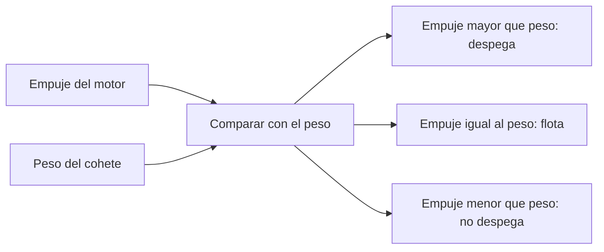

# 🧰 Recursos del cohete

[🏠 Inicio](../../../README.md) · [🚀 Curso: Cohetes](../README.md) · 🧰 Recursos

Glosario específico, enlaces y diagramas de apoyo del curso de cohetes. Amplia el
[glosario general](../../../docs/05-glosario-general.md).

---

## 📖 Glosario específico

| Término | Definición |
| --- | --- |
| Empuje | Fuerza que impulsa el cohete al expulsar gases hacia atrás. |
| Relación empuje-peso | Cociente entre empuje y peso; debe superar 1 para despegar. |
| Ecuación del cohete | Relación que liga el delta-v con la velocidad de los gases y la masa gastada. |
| Delta-v | Cambio total de velocidad que el cohete puede lograr. |
| Etapa | Sección del cohete con sus propios motores y propelente que se separa al agotarse. |
| Propelente | Combustible más oxidante que el motor quema y expulsa. |
| Oxidante | Sustancia que aporta oxígeno para quemar sin aire externo. |
| Criogenico | Propelente muy frío y licuado, como el oxígeno o el hidrógeno líquidos. |
| Giro gravitatorio | Maniobra de inclinar el cohete poco a poco hacia la horizontal. |
| Rejillas de guiado | Superficies que dirigen el propulsor en su retorno a la atmósfera. |

---

## 🗺️ Diagrama de la relación empuje-peso

---

## 🔗 Enlaces y fuentes

- Marco legal: [⚖️ docs/07-marco-legal-chile.md](../../../docs/07-marco-legal-chile.md)
- Seguridad y límites: [🦺 docs/04-seguridad-y-limites.md](../../../docs/04-seguridad-y-limites.md)
- Registro de fuentes: [📚 manuales/fuentes.md](../../../manuales/fuentes.md)

Registrar cada recurso nuevo con su origen y licencia, siguiendo
[`recursos/README.md`](../../../recursos/README.md).

---

[🎓 Portada del curso](../README.md) · [⬅️ Anterior: Diseño de simulación](../simulacion/diseno-simulador-cohete.md)
