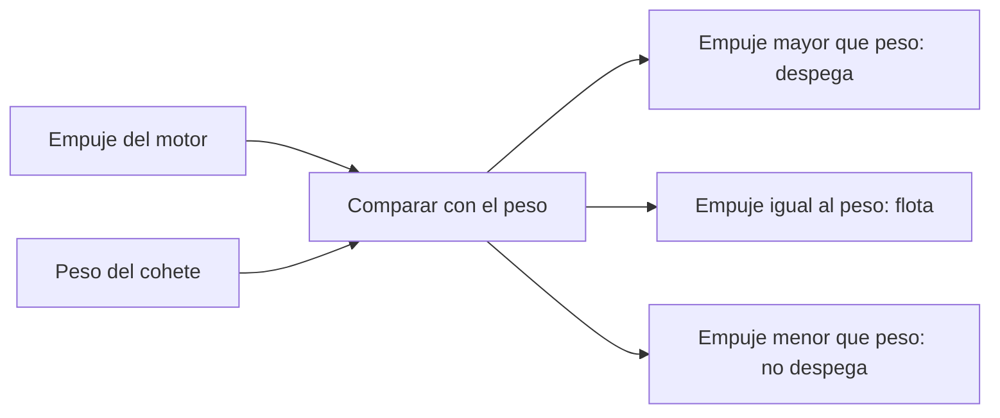

<!-- clase-meta
tipo_documento: clase
clase: 10
codigo: COHETES-10
curso: cohetes
titulo: "Recursos del cohete"
modalidad: "taller documental"
duracion_minutos: 45
nivel: introductorio
prerrequisito: COHETES-09
competencia: "alfabetizacion_tecnica"
resultados_aprendizaje:
  - "Explicar glosario, esquemas y trazabilidad de fuentes con vocabulario propio de Cohetes."
  - "Aplicar esos conceptos a una decisión segura o a un escenario de simulación de Cohetes."
evidencia: "Glosario aplicado y ficha breve de trazabilidad."
criterio_aprobacion: "Los términos permiten interpretar el curso y las fuentes se distinguen por autoridad, alcance y vigencia."
fuentes: manuales/fuentes.md
ultima_revision: 2026-09-10
-->

# 🧰 Recursos del cohete

[🏠 Inicio](../../../README.md) · [🚀 Curso: Cohetes](../README.md) · 🧰 Recursos

Glosario específico, enlaces y diagramas de apoyo del curso de cohetes. Amplia el
[glosario general](../../../docs/05-glosario-general.md).

---

## 📖 Glosario específico

| Término | Definición |
| --- | --- |
| Empuje | Fuerza que impulsa el cohete al expulsar gases hacia atrás. |
| Relación empuje-peso | Cociente entre empuje y peso; debe superar 1 para despegar. |
| Ecuación del cohete | Relación que liga el delta-v con la velocidad de los gases y la masa gastada. |
| Delta-v | Cambio total de velocidad que el cohete puede lograr. |
| Etapa | Sección del cohete con sus propios motores y propelente que se separa al agotarse. |
| Propelente | Combustible más oxidante que el motor quema y expulsa. |
| Oxidante | Sustancia que aporta oxígeno para quemar sin aire externo. |
| Criogenico | Propelente muy frío y licuado, como el oxígeno o el hidrógeno líquidos. |
| Giro gravitatorio | Maniobra de inclinar el cohete poco a poco hacia la horizontal. |
| Rejillas de guiado | Superficies que dirigen el propulsor en su retorno a la atmósfera. |

---

## 🗺️ Diagrama de la relación empuje-peso

```mermaid
flowchart LR
    Empuje[Empuje del motor] --> Compara[Comparar con el peso]
    Peso[Peso del cohete] --> Compara
    Compara --> Mayor[Empuje mayor que peso: despega]
    Compara --> Igual[Empuje igual al peso: flota]
    Compara --> Menor[Empuje menor que peso: no despega]
```

---

## 🔗 Enlaces y fuentes

- Marco legal: [⚖️ docs/07-marco-legal-chile.md](../../../docs/07-marco-legal-chile.md)
- Seguridad y límites: [🦺 docs/04-seguridad-y-limites.md](../../../docs/04-seguridad-y-limites.md)
- Registro de fuentes: [📚 manuales/fuentes.md](../../../manuales/fuentes.md)

Registrar cada recurso nuevo con su origen y licencia, siguiendo
[`recursos/README.md`](../../../recursos/README.md).

## 🧭 Guía de estudio aplicada

### Pregunta guía

¿Cómo ayuda **Glosario específico, Diagrama de la relación empuje-peso, Enlaces y fuentes y Guía de estudio aplicada** a **explicar con fuentes los términos propelentes, cámara, tobera y empuje y trayectoria**?

### Explicación razonada

El vocabulario técnico organiza relaciones: propelentes, cámara, tobera y empuje y trayectoria nombran partes distintas de una misma cadena funcional. Una fuente se usa para sostener una afirmación concreta —principio, límite, procedimiento o contexto— y debe distinguirse del manual particular de un fabricante o de una regla narrativa.

Esta clase se conecta con el resto del curso mediante **la aceleración depende de empuje menos peso y resistencia, mientras la masa disminuye**. El hilo de
seguridad consiste en reconocer a tiempo **inestabilidad, desviación o cargas excesivas durante máxima presión dinámica** y poder justificar la decisión
**evaluar trayectoria, estabilidad y condiciones de aborto antes del lanzamiento**; en clases posteriores cambiará el ángulo de análisis, no esa relación causal.
La lectura funcional común sigue **propelentes → cámara → tobera → empuje y trayectoria**, de modo que cada concepto pueda
ubicarse dentro del funcionamiento completo y no quede como un dato aislado.

**Apoyo documental:** [Rockets Educator Guide](https://www.nasa.gov/wp-content/uploads/2012/07/rockets-educator-guide-20.pdf) aporta propulsión, estabilidad y trayectoria;
[Space Law Treaties and Principles](https://www.unoosa.org/oosa/SpaceLaw/treaties.html) se usa para derecho espacial internacional. Estas fuentes
se contrastan con el alcance de la clase y no sustituyen un manual de equipo concreto.

### Caso resuelto: de la observación a la decisión

1. **Definir en contexto:** explica **propelentes**, **cámara**, **tobera** y **empuje y trayectoria** por su función y relación.
2. **Respaldar:** enlaza cada afirmación importante con una fuente identificable y declara su alcance.
3. **Contrastar:** separa principios generales, requisitos locales, manual de fabricante y —si aplica— canon ficticio.
4. **Reformular:** convierte una definición copiada en una explicación propia con un ejemplo de **Cohetes**.

### Comprueba tu comprensión

1. Explica la diferencia funcional entre **cámara** y **tobera** sin copiar una definición.
2. ¿Qué fuente respalda el principio «la aceleración depende de empuje menos peso y resistencia, mientras la masa disminuye» y cuál es su alcance?
3. ¿Qué dato exigiría un manual de fabricante en vez de una fuente general?

Orientación para revisar tus respuestas

- La primera respuesta debe relacionar el eslabón elegido con un efecto posterior, no solo nombrarlo.
- La segunda debe proponer una señal medible u observable y explicar qué tendencia sería preocupante.
- La tercera debe cambiar al menos una variable de capacidad, mando, entorno o margen de seguridad.

## 🎓 Cierre de clase

- **Actividad:** Selecciona términos de glosario, esquemas y trazabilidad de fuentes, explícalos en contexto de Cohetes y verifica la procedencia de las fuentes utilizadas.
- **Evidencia:** Glosario aplicado y ficha breve de trazabilidad.
- **Criterio de aprobación:** Los términos permiten interpretar el curso y las fuentes se distinguen por autoridad, alcance y vigencia.
- **Transferencia:** explica qué cambiaría al pasar a otra variante de esta máquina.

### Fuentes de esta clase

- [NASA-ROCKETS](https://www.nasa.gov/wp-content/uploads/2012/07/rockets-educator-guide-20.pdf): Rockets Educator Guide, NASA. Uso: propulsión, estabilidad y trayectoria.
- [UNOOSA-TREATIES](https://www.unoosa.org/oosa/SpaceLaw/treaties.html): Space Law Treaties and Principles, UNOOSA. Uso: derecho espacial internacional.

> Las fuentes sostienen el marco conceptual y normativo; esta clase no reemplaza el manual
> del fabricante, la formación certificada ni la habilitación exigida para operar equipos reales.

---

[🎓 Portada del curso](../README.md) · [⬅️ Anterior: Diseño de simulación](../simulacion/diseno-simulador-cohete.md) · [➡️ Siguiente: Ejercicios](../ejercicios/ejercicios-cohete.md)
