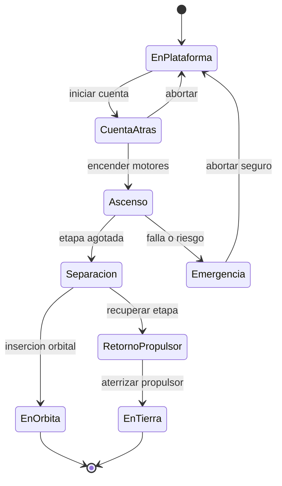

# 🎮 Diseño de simulación del cohete

[🏠 Inicio](../../../README.md) · [🚀 Curso: Cohetes](../README.md) · 🎮 Simulación

Simulación educativa del lanzamiento y ascenso de un cohete. Modela con rigor la
física del empuje, las etapas y la órbita, y añade el reto de recuperar el
propulsor reutilizable.

## Objetivo de la simulación

Que el usuario aprenda a preparar una cuenta atrás, despegar con la relación
empuje-peso correcta, ascender con un giro gradual, separar etapas en el momento
justo, alcanzar una órbita estable y, si el cohete lo permite, aterrizar el
propulsor para reutilizarlo.

## Nivel de realismo

- Nivel elegido: se ofrece del 1 al 3 (ver `docs/03-niveles-de-realismo.md`).
- Justificación: el lanzamiento es la fase más exigente del vuelo espacial, por lo
  que se recomienda como vehículo avanzado.

## Variables principales

| Variable | Tipo | Rango | Afecta a | Comentarios |
| --- | --- | --- | --- | --- |
| Empuje | numérica | 0-100 porciento | Aceleración | Regulable en motor líquido. |
| Masa total | numérica | baja al quemar | Relación empuje-peso | Cae según se gasta propelente. |
| Propelente | numérica | 0-100 porciento | Delta-v y empuje | Limita el alcance. |
| Altitud | numérica | 0-2000 km | Fase de vuelo | Sube durante el ascenso. |
| Velocidad horizontal | numérica | 0-8 km/s | Inserción orbital | Clave para quedar en órbita. |
| Ángulo de ascenso | numérica | 0-90 grados | Trayectoria | Giro gradual a la horizontal. |
| Estado de etapas | discreta | unida o separada | Estructura y masa | Marca cada separación. |
| Reserva de aterrizaje | numérica | 0-100 porciento | Retorno del propulsor | Propelente guardado para posar. |

## Ciclo básico

1. Leer entrada del usuario (empuje, ángulo, separación, retorno).
2. Actualizar masa, propelente y estado de etapas.
3. Calcular fuerzas: empuje, gravedad y resistencia del aire.
4. Aplicar el entorno (densidad del aire según altitud, viento).
5. Actualizar altitud, velocidad y órbita.
6. Refrescar telemetría y alarmas (empuje, presión, propelente).

## Modos de juego futuros

- Tutorial de cuenta atrás y despegue.
- Práctica de ascenso y giro gravitatorio.
- Desafíos de separación de etapas en el momento justo.
- Misiones de inserción orbital con precisión.
- Reto de aterrizaje del propulsor reutilizable.

## Elementos fuera de alcance

- Datos técnicos sensibles de sistemas de lanzamiento reales o militares.
- Detalles que permitan replicar armamento o propulsión clasificada.
- Reproducción de operaciones peligrosas como si fueran seguras.

## Pendientes

- [ ] Definir valores por defecto de empuje y masa por tipo de cohete.
- [ ] Prototipar el modelo de ascenso con giro gravitatorio.
- [ ] Ajustar el modelo de aterrizaje del propulsor.
- [ ] Agregar fuentes técnicas públicas a [`manuales/fuentes.md`](../../../manuales/fuentes.md).

---

[⬅️ Anterior: Reglamentos](../reglamentos/reglamentos-cohete.md) · [➡️ Siguiente: Recursos](../recursos/recursos-cohete.md)
