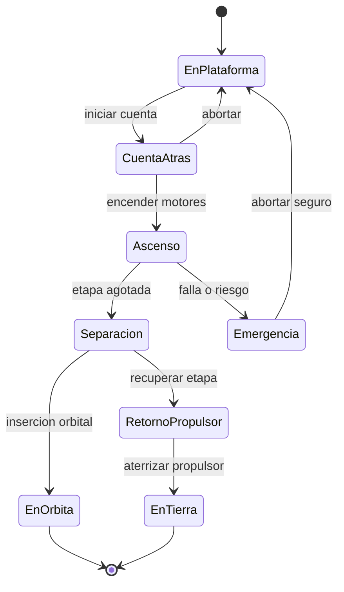
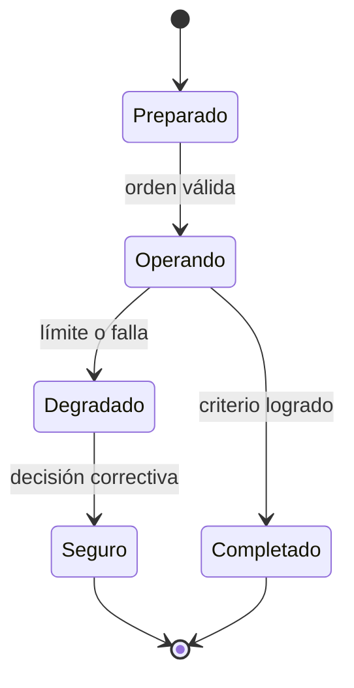

<!-- clase-meta
tipo_documento: clase
clase: 9
codigo: COHETES-09
curso: cohetes
titulo: "Diseño de simulación del cohete"
modalidad: "laboratorio de diseño"
duracion_minutos: 90
nivel: introductorio
prerrequisito: COHETES-08
competencia: "modelado_de_simulacion"
resultados_aprendizaje:
  - "Explicar objetivo, variables, estados, ciclo y escenarios de simulación con vocabulario propio de Cohetes."
  - "Aplicar esos conceptos a una decisión segura o a un escenario de simulación de Cohetes."
evidencia: "Ficha de escenario y diagrama de estados."
criterio_aprobacion: "El modelo es específico de la máquina, medible, seguro y trazable a clases anteriores."
fuentes: manuales/fuentes.md
ultima_revision: 2026-09-10
-->

# 🎮 Diseño de simulación del cohete

[🏠 Inicio](../../../README.md) · [🚀 Curso: Cohetes](../README.md) · 🎮 Simulación

Simulación educativa del lanzamiento y ascenso de un cohete. Modela con rigor la
física del empuje, las etapas y la órbita, y añade el reto de recuperar el
propulsor reutilizable.

```mermaid
stateDiagram-v2
    [*] --> EnPlataforma
    EnPlataforma --> CuentaAtras: iniciar cuenta
    CuentaAtras --> Ascenso: encender motores
    CuentaAtras --> EnPlataforma: abortar
    Ascenso --> Separacion: etapa agotada
    Separacion --> EnOrbita: insercion orbital
    Separacion --> RetornoPropulsor: recuperar etapa
    RetornoPropulsor --> EnTierra: aterrizar propulsor
    Ascenso --> Emergencia: falla o riesgo
    Emergencia --> EnPlataforma: abortar seguro
    EnOrbita --> [*]
    EnTierra --> [*]
```

## Objetivo de la simulación

Que el usuario aprenda a preparar una cuenta atrás, despegar con la relación
empuje-peso correcta, ascender con un giro gradual, separar etapas en el momento
justo, alcanzar una órbita estable y, si el cohete lo permite, aterrizar el
propulsor para reutilizarlo.

## Nivel de realismo

- Nivel elegido: se ofrece del 1 al 3 (ver `docs/03-niveles-de-realismo.md`).
- Justificación: el lanzamiento es la fase más exigente del vuelo espacial, por lo
  que se recomienda como vehículo avanzado.

## Variables principales

| Variable | Tipo | Rango | Afecta a | Comentarios |
| --- | --- | --- | --- | --- |
| Empuje | numérica | 0-100 porciento | Aceleración | Regulable en motor líquido. |
| Masa total | numérica | baja al quemar | Relación empuje-peso | Cae según se gasta propelente. |
| Propelente | numérica | 0-100 porciento | Delta-v y empuje | Limita el alcance. |
| Altitud | numérica | 0-2000 km | Fase de vuelo | Sube durante el ascenso. |
| Velocidad horizontal | numérica | 0-8 km/s | Inserción orbital | Clave para quedar en órbita. |
| Ángulo de ascenso | numérica | 0-90 grados | Trayectoria | Giro gradual a la horizontal. |
| Estado de etapas | discreta | unida o separada | Estructura y masa | Marca cada separación. |
| Reserva de aterrizaje | numérica | 0-100 porciento | Retorno del propulsor | Propelente guardado para posar. |

## Ciclo básico

1. Leer entrada del usuario (empuje, ángulo, separación, retorno).
2. Actualizar masa, propelente y estado de etapas.
3. Calcular fuerzas: empuje, gravedad y resistencia del aire.
4. Aplicar el entorno (densidad del aire según altitud, viento).
5. Actualizar altitud, velocidad y órbita.
6. Refrescar telemetría y alarmas (empuje, presión, propelente).

## Modos de juego futuros

- Tutorial de cuenta atrás y despegue.
- Práctica de ascenso y giro gravitatorio.
- Desafíos de separación de etapas en el momento justo.
- Misiones de inserción orbital con precisión.
- Reto de aterrizaje del propulsor reutilizable.

## Elementos fuera de alcance

- Datos técnicos sensibles de sistemas de lanzamiento reales o militares.
- Detalles que permitan replicar armamento o propulsión clasificada.
- Reproducción de operaciones peligrosas como si fueran seguras.

## Pendientes

- [ ] Definir valores por defecto de empuje y masa por tipo de cohete.
- [ ] Prototipar el modelo de ascenso con giro gravitatorio.
- [ ] Ajustar el modelo de aterrizaje del propulsor.
- [ ] Agregar fuentes técnicas públicas a [`manuales/fuentes.md`](../../../manuales/fuentes.md).

## 🧭 Guía de estudio aplicada

### Pregunta guía

¿Cómo ayuda **Objetivo de la simulación, Nivel de realismo, Variables principales y Ciclo básico** a **modelar ascenso educativo con cambio de etapa y viento en altura como estados, variables y decisiones observables**?

### Explicación razonada

Una simulación de Cohetes es educativa si representa decisiones y consecuencias. Como mínimo debe modelar el estado de propelentes, la respuesta de cámara, la transición en tobera y el resultado en empuje y trayectoria. El escenario «ascenso educativo con cambio de etapa y viento en altura» es valioso porque obliga a observar, formular una hipótesis, actuar y comprobar.

```mermaid
stateDiagram-v2
    [*] --> Preparado
    Preparado --> Operando: orden válida
    Operando --> Degradado: límite o falla
    Degradado --> Seguro: decisión correctiva
    Operando --> Completado: criterio logrado
    Seguro --> [*]
    Completado --> [*]
```

Esta clase se conecta con el resto del curso mediante **la aceleración depende de empuje menos peso y resistencia, mientras la masa disminuye**. El hilo de
seguridad consiste en reconocer a tiempo **inestabilidad, desviación o cargas excesivas durante máxima presión dinámica** y poder justificar la decisión
**evaluar trayectoria, estabilidad y condiciones de aborto antes del lanzamiento**; en clases posteriores cambiará el ángulo de análisis, no esa relación causal.
La lectura funcional común sigue **propelentes → cámara → tobera → empuje y trayectoria**, de modo que cada concepto pueda
ubicarse dentro del funcionamiento completo y no quede como un dato aislado.

**Apoyo documental:** [Rockets Educator Guide](https://www.nasa.gov/wp-content/uploads/2012/07/rockets-educator-guide-20.pdf) aporta propulsión, estabilidad y trayectoria;
[Space Law Treaties and Principles](https://www.unoosa.org/oosa/SpaceLaw/treaties.html) se usa para derecho espacial internacional. Estas fuentes
se contrastan con el alcance de la clase y no sustituyen un manual de equipo concreto.

### Caso resuelto: de la observación a la decisión

1. **Estado inicial:** representa ascenso educativo con cambio de etapa y viento en altura con valores observables para **propelentes**, **cámara**, **tobera** y **empuje y trayectoria**.
2. **Decisión del estudiante:** ofrece una elección que cambie el estado, no una animación automática.
3. **Consecuencia:** modela la tendencia hacia **inestabilidad, desviación o cargas excesivas durante máxima presión dinámica** y una señal previa que permita corregir.
4. **Cierre:** evalúa la explicación de la decisión, además de si el estudiante “ganó” el escenario.

### Comprueba tu comprensión

1. ¿Qué cuatro estados mínimos necesita el escenario «ascenso educativo con cambio de etapa y viento en altura»?
2. ¿Qué variable anticipa **inestabilidad, desviación o cargas excesivas durante máxima presión dinámica** antes de llegar al estado de falla?
3. ¿Cómo evaluarías la explicación del estudiante y no solo el resultado final?

Orientación para revisar tus respuestas

- La primera respuesta debe relacionar el eslabón elegido con un efecto posterior, no solo nombrarlo.
- La segunda debe proponer una señal medible u observable y explicar qué tendencia sería preocupante.
- La tercera debe cambiar al menos una variable de capacidad, mando, entorno o margen de seguridad.

## 🎓 Cierre de clase

- **Actividad:** Diseña un escenario educativo de Cohetes basado en objetivo, variables, estados, ciclo y escenarios de simulación, con entradas, estados, variables y criterio de cierre.
- **Evidencia:** Ficha de escenario y diagrama de estados.
- **Criterio de aprobación:** El modelo es específico de la máquina, medible, seguro y trazable a clases anteriores.
- **Transferencia:** explica qué cambiaría al pasar a otra variante de esta máquina.

### Fuentes de esta clase

- [NASA-ROCKETS](https://www.nasa.gov/wp-content/uploads/2012/07/rockets-educator-guide-20.pdf): Rockets Educator Guide, NASA. Uso: propulsión, estabilidad y trayectoria.
- [UNOOSA-TREATIES](https://www.unoosa.org/oosa/SpaceLaw/treaties.html): Space Law Treaties and Principles, UNOOSA. Uso: derecho espacial internacional.

> Las fuentes sostienen el marco conceptual y normativo; esta clase no reemplaza el manual
> del fabricante, la formación certificada ni la habilitación exigida para operar equipos reales.

---

[⬅️ Anterior: Reglamentos](../reglamentos/reglamentos-cohete.md) · [➡️ Siguiente: Recursos](../recursos/recursos-cohete.md)
