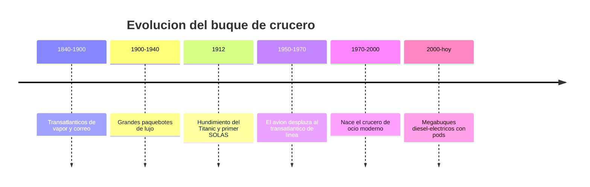

# 📜 Historia del crucero

[🏠 Inicio](../../../README.md) · [⛴️ Curso: Cruceros](../README.md) · 📜 Historia

## Origen

El crucero desciende del transatlántico de pasaje del siglo XIX, cuando el vapor
y el casco de hierro permitieron cruzar el océano con horario fijo. Aquellos
buques transportaban correo, emigrantes y viajeros de lujo entre Europa y
América. El viaje era un medio de transporte, no un fin en si mismo.

## Línea de tiempo

| Periodo | Hito | Importancia |
| --- | --- | --- |
| 1840-1900 | Transatlánticos de vapor | Transporte oceánico regular de pasaje. |
| 1900-1940 | Grandes paquebotes de lujo | El confort y el prestigio como servicio. |
| 1912 | Titanic y primer convenio SOLAS | La seguridad de la vida en el mar se vuelve norma. |
| 1950-1970 | Auge del avión de línea | El transatlántico pierde su rol de transporte. |
| 1970-2000 | Crucero de ocio moderno | El viaje pasa a ser el destino turístico. |
| 2000-presente | Megabuques diesel-electricos | Pods, gran capacidad y servicios de hotel a gran escala. |

## Evolución tecnológica

- **Casco**: del hierro remachado al acero soldado con compartimentado estanco.
- **Propulsión**: de la máquina de vapor y ejes fijos a la planta diesel-electrica con pods azimutales.
- **Seguridad**: de los botes insuficientes del Titanic a los sistemas SOLAS de evacuación para todos a bordo.
- **Estabilidad**: aparición de aletas estabilizadoras activas para el confort del pasaje.
- **Servicios**: de los camarotes básicos a ciudades flotantes con hoteleria, ocio y depuración de aguas.
- **Navegación**: del sextante y la carta de papel al GPS, el ECDIS y el posicionamiento dinámico.

## Tipos representativos

| Tipo | Uso típico | Característica destacada |
| --- | --- | --- |
| Transatlántico clásico | Travesía oceánica de línea | Casco robusto para mar gruesa. |
| Ferry de pasaje y carga rodada | Rutas cortas costeras | Rampas Ro-Ro y alta rotación. |
| Crucero de ocio | Turismo por escalas | Servicios de hotel y entretenimiento. |
| Megacrucero | Turismo masivo | Miles de pasajeros y pods de propulsión. |
| Crucero de expedición | Zonas remotas y polares | Casco reforzado y menor capacidad. |

## Impacto social y económico

El crucero convirtió el viaje por mar en una industria turística global que mueve
puertos, empleo y cadenas de suministro. A la vez, concentra a miles de personas
en un mismo casco, por lo que la seguridad, la evacuación y la gestión ambiental
son hoy el centro de su diseño y de su regulación internacional.

## Fuentes

- Registrar aquí las fuentes públicas consultadas.
- Enlazar cada fuente también en [`manuales/fuentes.md`](../../../manuales/fuentes.md).

---

[🎓 Portada del curso](../README.md) · [➡️ Siguiente: Características](../operacion/caracteristicas-crucero.md)
