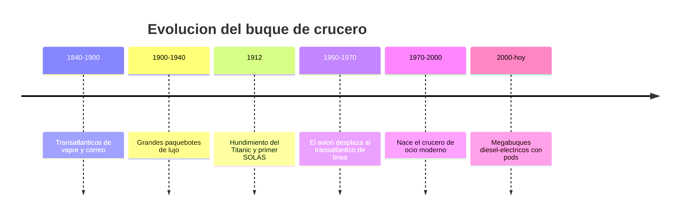

<!-- clase-meta
tipo_documento: clase
clase: 1
codigo: CRUCEROS-01
curso: cruceros
titulo: "Historia del crucero"
modalidad: "teórica dialogada"
duracion_minutos: 45
nivel: introductorio
prerrequisito: ninguno
competencia: "contexto_historico"
resultados_aprendizaje:
  - "Explicar origen, evolución tecnológica, variantes representativas e impacto con vocabulario propio de Cruceros."
  - "Aplicar esos conceptos a una decisión segura o a un escenario de simulación de Cruceros."
evidencia: "Línea de tiempo comentada con cuatro hitos o más."
criterio_aprobacion: "Los hitos están ordenados, son pertinentes y dos relaciones de causa y efecto quedan justificadas."
fuentes: manuales/fuentes.md
ultima_revision: 2026-09-10
-->

# 📜 Historia del crucero

[🏠 Inicio](../../../README.md) · [⛴️ Curso: Cruceros](../README.md) · 📜 Historia

```mermaid
timeline
    title Evolucion del buque de crucero
    1840-1900 : Transatlanticos de vapor y correo
    1900-1940 : Grandes paquebotes de lujo
    1912 : Hundimiento del Titanic y primer SOLAS
    1950-1970 : El avion desplaza al transatlantico de linea
    1970-2000 : Nace el crucero de ocio moderno
    2000-hoy : Megabuques diesel-electricos con pods
```

## Origen

El crucero desciende del transatlántico de pasaje del siglo XIX, cuando el vapor
y el casco de hierro permitieron cruzar el océano con horario fijo. Aquellos
buques transportaban correo, emigrantes y viajeros de lujo entre Europa y
América. El viaje era un medio de transporte, no un fin en si mismo.

## Línea de tiempo

| Periodo | Hito | Importancia |
| --- | --- | --- |
| 1840-1900 | Transatlánticos de vapor | Transporte oceánico regular de pasaje. |
| 1900-1940 | Grandes paquebotes de lujo | El confort y el prestigio como servicio. |
| 1912 | Titanic y primer convenio SOLAS | La seguridad de la vida en el mar se vuelve norma. |
| 1950-1970 | Auge del avión de línea | El transatlántico pierde su rol de transporte. |
| 1970-2000 | Crucero de ocio moderno | El viaje pasa a ser el destino turístico. |
| 2000-presente | Megabuques diesel-eléctricos | Pods, gran capacidad y servicios de hotel a gran escala. |

## Evolución tecnológica

- **Casco**: del hierro remachado al acero soldado con compartimentado estanco.
- **Propulsión**: de la máquina de vapor y ejes fijos a la planta diesel-eléctrica con pods azimutales.
- **Seguridad**: de los botes insuficientes del Titanic a los sistemas SOLAS de evacuación para todos a bordo.
- **Estabilidad**: aparición de aletas estabilizadoras activas para el confort del pasaje.
- **Servicios**: de los camarotes básicos a ciudades flotantes con hoteleria, ocio y depuración de aguas.
- **Navegación**: del sextante y la carta de papel al GPS, el ECDIS y el posicionamiento dinámico.

## Tipos representativos

| Tipo | Uso típico | Característica destacada |
| --- | --- | --- |
| Transatlántico clásico | Travesía oceánica de línea | Casco robusto para mar gruesa. |
| Ferry de pasaje y carga rodada | Rutas cortas costeras | Rampas Ro-Ro y alta rotación. |
| Crucero de ocio | Turismo por escalas | Servicios de hotel y entretenimiento. |
| Megacrucero | Turismo masivo | Miles de pasajeros y pods de propulsión. |
| Crucero de expedición | Zonas remotas y polares | Casco reforzado y menor capacidad. |

## Impacto social y económico

El crucero convirtió el viaje por mar en una industria turística global que mueve
puertos, empleo y cadenas de suministro. A la vez, concentra a miles de personas
en un mismo casco, por lo que la seguridad, la evacuación y la gestión ambiental
son hoy el centro de su diseño y de su regulación internacional.

## 🧭 Guía de estudio aplicada

### Pregunta guía

¿Cómo ayuda **Origen, Línea de tiempo, Evolución tecnológica y Tipos representativos** a **explicar cómo la evolución hizo posibles alternativas como crucero convencional frente a buque con propulsión azimutal**?

### Explicación razonada

La evolución de Cruceros se comprende mejor como una sucesión de respuestas a problemas, no como una lista de fechas. Los cambios en generación eléctrica, propulsión, hélices o pods y casco y gobierno alteraron qué podía hacer la máquina, quién podía usarla y qué riesgos debían controlarse. El contraste «crucero convencional frente a buque con propulsión azimutal» permite observar qué decisiones de diseño permanecieron y cuáles cambiaron con la tecnología y el propósito.

Esta clase se conecta con el resto del curso mediante **maniobrabilidad de gran masa combinada con viento lateral y efecto de aguas restringidas**. El hilo de
seguridad consiste en reconocer a tiempo **contacto con muelle o pérdida de separación por subestimar abatimiento** y poder justificar la decisión
**coordinar propulsión, remolcadores y límites de viento antes de aproximar**; en clases posteriores cambiará el ángulo de análisis, no esa relación causal.
La lectura funcional común sigue **generación eléctrica → propulsión → hélices o pods → casco y gobierno**, de modo que cada concepto pueda
ubicarse dentro del funcionamiento completo y no quede como un dato aislado.

**Apoyo documental:** [Safety of Navigation](https://www.imo.org/en/ourwork/safety/pages/navigationdefault.aspx) aporta navegación, SOLAS, COLREG y STCW;
[Collision Regulations](https://www.imo.org/en/about/conventions/pages/colreg.aspx) se usa para prevención de abordajes. Estas fuentes
se contrastan con el alcance de la clase y no sustituyen un manual de equipo concreto.

### Caso resuelto: de la observación a la decisión

1. **Situar:** ordena los hitos que explican cómo se llegó a **crucero convencional frente a buque con propulsión azimutal** y describe la necesidad que impulsó cada cambio.
2. **Relacionar:** explica qué se modificó en **generación eléctrica**, **propulsión**, **hélices o pods** o **casco y gobierno**; una fecha sin mecanismo no basta.
3. **Interpretar:** vincula el cambio con una capacidad nueva y también con el riesgo **contacto con muelle o pérdida de separación por subestimar abatimiento**.
4. **Transferir:** usa la evolución para justificar por qué hoy conviene **coordinar propulsión, remolcadores y límites de viento antes de aproximar**.

### Comprueba tu comprensión

1. ¿Qué necesidad histórica impulsó un cambio en **generación eléctrica** o **propulsión**?
2. ¿Qué hito modificó la relación entre capacidad y **contacto con muelle o pérdida de separación por subestimar abatimiento**?
3. ¿Por qué **crucero convencional frente a buque con propulsión azimutal** no puede explicarse como una simple diferencia estética?

Orientación para revisar tus respuestas

- La primera respuesta debe relacionar el eslabón elegido con un efecto posterior, no solo nombrarlo.
- La segunda debe proponer una señal medible u observable y explicar qué tendencia sería preocupante.
- La tercera debe cambiar al menos una variable de capacidad, mando, entorno o margen de seguridad.

## 🎓 Cierre de clase

- **Actividad:** Construye una línea de tiempo de Cruceros y explica cómo dos cambios históricos transformaron su función o su puesto de mando.
- **Evidencia:** Línea de tiempo comentada con cuatro hitos o más.
- **Criterio de aprobación:** Los hitos están ordenados, son pertinentes y dos relaciones de causa y efecto quedan justificadas.
- **Transferencia:** explica qué cambiaría al pasar a otra variante de esta máquina.

### Fuentes de esta clase

- [IMO-NAV](https://www.imo.org/en/ourwork/safety/pages/navigationdefault.aspx): Safety of Navigation, International Maritime Organization. Uso: navegación, SOLAS, COLREG y STCW.
- [IMO-COLREG](https://www.imo.org/en/about/conventions/pages/colreg.aspx): Collision Regulations, International Maritime Organization. Uso: prevención de abordajes.
- [CL-DIRECTEMAR](https://www.directemar.cl/directemar/marco-normativo): Marco normativo, DIRECTEMAR. Uso: marco marítimo chileno.

> Las fuentes sostienen el marco conceptual y normativo; esta clase no reemplaza el manual
> del fabricante, la formación certificada ni la habilitación exigida para operar equipos reales.

---

[🎓 Portada del curso](../README.md) · [➡️ Siguiente: Características](../operacion/caracteristicas-crucero.md)
