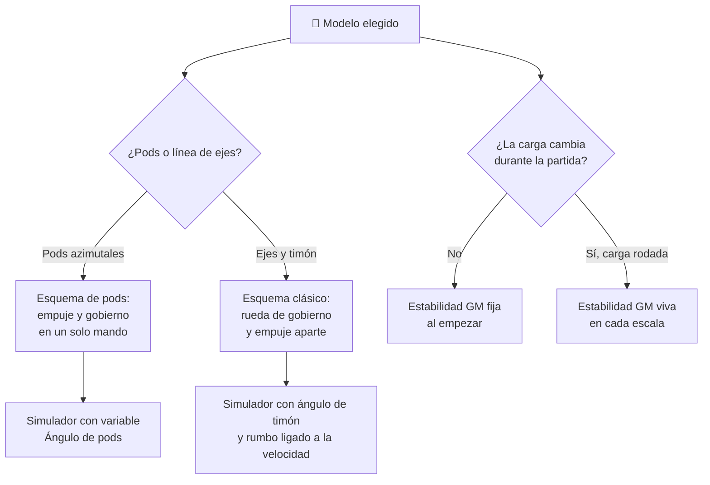

# 🧩 Modelos y variantes del crucero

[🏠 Inicio](../../../README.md) · [⛴️ Curso: Cruceros](../README.md) · 🧩 Modelos

El [Módulo 2](../operacion/caracteristicas-crucero.md) ya dijo qué tipos de buque
de pasaje existen y para qué sirve cada uno. Este módulo responde a lo siguiente:
**no todos se gobiernan igual**, y esa diferencia no es de matiz. Cambia qué
mandos tiene el puente y, por tanto, qué debe modelar el simulador.

> 🎯 **La idea que sostiene el módulo.** "Un crucero" no es una sola máquina desde
> el punto de vista del mando. En un buque con pods azimutales el gobierno **es**
> la orientación del empuje: no hay una rueda de timón que mandar aparte. En un
> buque con línea de ejes y timón clásico, el empuje y el gobierno son dos mandos
> distintos. Un simulador que presente un solo esquema de control está
> representando un buque concreto aunque diga representarlos todos.

---

## 🧭 Por qué el modelo decide el simulador

El [Módulo 5](../mandos/manual-mandos-crucero.md) ya lo confiesa sin decirlo: en
su tabla de entradas de simulación, la acción **Orientar pods** lleva la nota
"solo con propulsión por pods", y el **Timón / rueda de gobierno** aparece con el
comentario "en buques con timones clásicos". Son dos puestos de mando descritos
como si fueran uno.

El [Módulo 9](../simulacion/diseno-simulador-crucero.md) toma partido: expone
`Empuje de pods` y `Ángulo de pods` como variables principales, y no hay ninguna
variable de timón. Eso describe un buque **con propulsión por pods**, tal como el
megacrucero del Módulo 2.

En un transatlántico de línea con hélice y timón, `Ángulo de pods` sencillamente
no tiene valores que tomar, y falta el ángulo de pala que sí gobierna el buque.
Si el simulador se construye sobre el esquema de pods y luego se le "añade" un
buque de ejes, el resultado es un transatlántico que gira sobre sí mismo en el
muelle, que no es lo que hace.

---

## 🗂️ Qué cambia en el manejo

| Modelo | Qué cambia al gobernarlo |
| --- | --- |
| Crucero clásico | La referencia del curso: equilibrio entre confort y tamaño, escalas frecuentes, maniobra de puerto asistida. |
| Megacrucero | Propulsión por pods y obra muerta enorme: gobierna con autoridad a baja velocidad, pero el viento lo empuja como una vela. |
| Transatlántico de línea | Casco robusto y línea de ejes: el gobierno pierde autoridad al reducir velocidad, y la mar gruesa manda sobre el confort. |
| Ferry Ro-Ro | Rutas cortas y alta rotación: la maniobra de puerto deja de ser excepcional y pasa a ser casi toda la operación. |
| Crucero de expedición | Zonas remotas y poca gente a bordo: menos margen de asistencia externa y más peso de la autonomía. |
| Crucero fluvial | Calado bajo y eslora limitada: la profundidad bajo la quilla y la corriente del río condicionan cada tramo. |

---

## 🎛️ Qué cambia en el mando

| Modelo | Qué mando aparece o desaparece | Consecuencia |
| --- | --- | --- |
| Crucero clásico, Megacrucero | Ninguno: el mapa de controles del Módulo 5 aplica tal cual, con pods y joystick de maniobra. | Cambian los rangos, no los controles. |
| Transatlántico de línea | **Desaparecen** las palancas de pod y el joystick de maniobra integrado. **Aparece** la rueda de gobierno junto a un mando de empuje separado. | El empuje y el rumbo dejan de ser el mismo gesto: son dos órdenes que hay que coordinar. |
| Ferry Ro-Ro | **Aparece** el control de rampas de carga rodada como paso obligado antes de zarpar. **Se repiten** más los mandos de las alas del puente. | No es un mando de navegación, pero condiciona cuándo el buque puede moverse. |
| Crucero de expedición | Ninguno se añade; la **ecosonda** sube de instrumento de vigilancia a referencia constante del gobierno. | El calado deja de ser un dato de puerto y pasa a mandar la derrota. |
| Crucero fluvial | El **joystick de maniobra** pierde sentido fuera del atraque; el mando de gobierno trabaja contra la corriente de forma permanente. | El rumbo nunca se "mantiene": se corrige de continuo. |

---

## 🎮 Qué cambia en el simulador

Contrastado con las variables del
[Módulo 9](../simulacion/diseno-simulador-crucero.md):

| Modelo | Variables que cambian | Esquema de control |
| --- | --- | --- |
| Crucero clásico | Ninguna: es el caso base. | El del Módulo 5. |
| Megacrucero | `Viento y corriente` gana peso sobre la deriva por la obra muerta. `Pasajeros a bordo` amplía rango y alarga el muster. | El mismo: pods, thruster y joystick. |
| Transatlántico de línea | `Ángulo de pods` **se elimina** y se sustituye por un ángulo de timón. `Empuje de pods` deja de aportar gobierno. `Rumbo` pasa a depender de la `Velocidad`: sin agua sobre la pala no hay giro. | Sin entrada de orientación de empuje; gobierno y propulsión separados. |
| Ferry Ro-Ro | `Estabilidad (GM)` deja de ser un valor fijo de partida y varía en cada escala con la carga rodada. `Pasajeros a bordo` rota por completo varias veces. | El mismo, con maniobra de puerto continua. |
| Crucero de expedición | `Pasajeros a bordo` **reduce** su rango. `Combustible` deja de reponerse en cada escala y pasa a ser una restricción viva de la derrota. | El mismo. |
| Crucero fluvial | `Viento y corriente` deja de ser una perturbación variable y pasa a ser una corriente permanente y direccional. La profundidad bajo la quilla entra en el cálculo de gobierno. | El mismo, con corrección de rumbo constante. |

---

## 🗺️ Del modelo al esquema de control

---

## ⚠️ Qué modelos no comparten simulador

Dos familias no se resuelven con un ajuste de parámetros, porque su esquema de
control es otro:

- **El transatlántico de línea con hélice y timón** frente al resto: una entrada
  desaparece, otra ocupa su lugar y el rumbo pasa a depender de la velocidad. Es
  un modo de control distinto, no una dificultad distinta.
- **El ferry Ro-Ro con carga rodada** frente a los demás: obliga a que la
  estabilidad sea una variable viva durante la partida, no una constante que se
  fija al zarpar.

El resto de modelos sí caben en un mismo simulador ajustando rangos, tal como
plantean los [niveles de realismo](../../../docs/03-niveles-de-realismo.md): en
el nivel 1 casi todos se comportan igual, y las diferencias emergen a medida que
el nivel sube.

---

[⬅️ Anterior: Características](../operacion/caracteristicas-crucero.md) · [➡️ Siguiente: Sistemas mecánicos](../operacion/sistemas-mecanicos-crucero.md)
