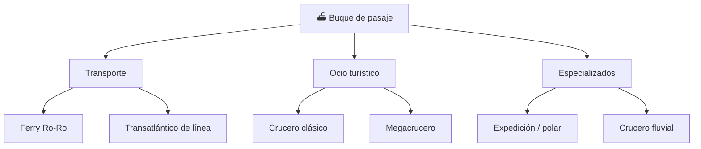

# 📋 Características funcionales del crucero

[🏠 Inicio](../../../README.md) · [⛴️ Curso: Cruceros](../README.md) · 📋 Características

Que es un crucero, que tipos existen y para que sirve cada uno. Este módulo da el
contexto antes de abrir la mecánica naval (Módulo 4).

---

## 🧭 Definición

Un crucero es un buque de pasaje destinado al transporte y alojamiento de
personas por vía marítima, casi siempre con fines turísticos. Flota por el
principio de Arquímedes, avanza por el empuje de su propulsión y gobierna
mediante el timón o los pods. A diferencia de un carguero, su carga son personas:
la seguridad, el confort y la evacuación condicionan todo su diseño.

---

## 🧬 Características clave

| Característica | Descripción |
| --- | --- |
| Carga humana | Transporta miles de pasajeros y tripulación; la seguridad de la vida es prioritaria. |
| Gran volumen | Obra muerta muy alta con muchas cubiertas, sensible al viento. |
| Servicios de hotel | Agua, energía, climatización y ocio para una población flotante. |
| Compartimentado | Mamparos estancos que permiten flotar aun con averías. |
| Estabilidad y confort | Aletas estabilizadoras reducen el balance para el pasaje. |
| Autonomía | Recorre largas rutas con múltiples escalas sin repostar. |

---

## 🗂️ Tipos de crucero

| Tipo | Uso típico | Rasgo destacado |
| --- | --- | --- |
| Ferry Ro-Ro | Rutas cortas costeras | Rampas de carga rodada y alta rotación. |
| Transatlántico de línea | Travesías oceánicas | Casco robusto para mar gruesa. |
| Crucero clásico | Turismo por escalas | Equilibrio entre confort y tamaño. |
| Megacrucero | Turismo masivo | Miles de pasajeros y propulsión por pods. |
| Crucero de expedición | Zonas remotas y polares | Casco reforzado, capacidad reducida. |
| Crucero fluvial | Rios navegables | Calado bajo y eslora limitada. |

---

## 🎯 Para qué se usa

- Turismo marítimo con escalas en varios puertos.
- Transporte de pasajeros y vehículos en rutas costeras (ferry).
- Viajes de expedición a zonas remotas y polares.
- Eventos, hoteleria y ocio como ciudad flotante.
- Conexión de islas y zonas sin acceso terrestre.

---

[⬅️ Anterior: Historia](../historia/historia-crucero.md) · [➡️ Siguiente: Modelos y variantes](../modelos/modelos-crucero.md)
