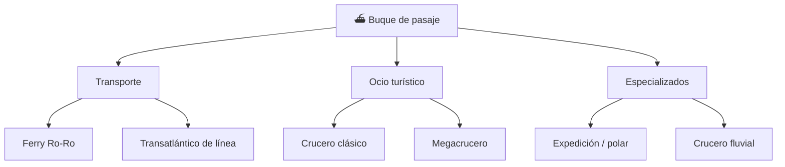

<!-- clase-meta
tipo_documento: clase
clase: 2
codigo: CRUCEROS-02
curso: cruceros
titulo: "Características funcionales del crucero"
modalidad: "teórica aplicada"
duracion_minutos: 45
nivel: introductorio
prerrequisito: CRUCEROS-01
competencia: "identificacion_funcional"
resultados_aprendizaje:
  - "Explicar definición, rasgos funcionales, tipos y usos con vocabulario propio de Cruceros."
  - "Aplicar esos conceptos a una decisión segura o a un escenario de simulación de Cruceros."
evidencia: "Matriz comparativa y decisión justificada."
criterio_aprobacion: "La elección considera función, límites, mando y efecto en la simulación; no se apoya solo en preferencias."
fuentes: manuales/fuentes.md
ultima_revision: 2026-09-10
-->

# 📋 Características funcionales del crucero

[🏠 Inicio](../../../README.md) · [⛴️ Curso: Cruceros](../README.md) · 📋 Características

Que es un crucero, que tipos existen y para que sirve cada uno. Esta clase da el
contexto antes de abrir la mecánica naval (Clase 4).

---

## 🧭 Definición

Un crucero es un buque de pasaje destinado al transporte y alojamiento de
personas por vía marítima, casi siempre con fines turísticos. Flota por el
principio de Arquímedes, avanza por el empuje de su propulsión y gobierna
mediante el timón o los pods. A diferencia de un carguero, su carga son personas:
la seguridad, el confort y la evacuación condicionan todo su diseño.

---

## 🧬 Características clave

| Característica | Descripción |
| --- | --- |
| Carga humana | Transporta miles de pasajeros y tripulación; la seguridad de la vida es prioritaria. |
| Gran volumen | Obra muerta muy alta con muchas cubiertas, sensible al viento. |
| Servicios de hotel | Agua, energía, climatización y ocio para una población flotante. |
| Compartimentado | Mamparos estancos que permiten flotar aun con averías. |
| Estabilidad y confort | Aletas estabilizadoras reducen el balance para el pasaje. |
| Autonomía | Recorre largas rutas con múltiples escalas sin repostar. |

---

## 🗂️ Tipos de crucero

```mermaid
flowchart TD
    Crucero[⛴️ Buque de pasaje] --> Transporte[Transporte]
    Crucero --> Ocio[Ocio turístico]
    Crucero --> Especial[Especializados]
    Transporte --> Ferry[Ferry Ro-Ro]
    Transporte --> Transatlantico[Transatlántico de línea]
    Ocio --> Clasico[Crucero clásico]
    Ocio --> Mega[Megacrucero]
    Especial --> Expedicion[Expedición / polar]
    Especial --> Fluvial[Crucero fluvial]
```

| Tipo | Uso típico | Rasgo destacado |
| --- | --- | --- |
| Ferry Ro-Ro | Rutas cortas costeras | Rampas de carga rodada y alta rotación. |
| Transatlántico de línea | Travesías oceánicas | Casco robusto para mar gruesa. |
| Crucero clásico | Turismo por escalas | Equilibrio entre confort y tamaño. |
| Megacrucero | Turismo masivo | Miles de pasajeros y propulsión por pods. |
| Crucero de expedición | Zonas remotas y polares | Casco reforzado, capacidad reducida. |
| Crucero fluvial | Rios navegables | Calado bajo y eslora limitada. |

---

## 🎯 Para qué se usa

- Turismo marítimo con escalas en varios puertos.
- Transporte de pasajeros y vehículos en rutas costeras (ferry).
- Viajes de expedición a zonas remotas y polares.
- Eventos, hoteleria y ocio como ciudad flotante.
- Conexión de islas y zonas sin acceso terrestre.

## 🧭 Guía de estudio aplicada

### Pregunta guía

¿Cómo ayuda **Definición, Características clave, Tipos de crucero y Para qué se usa** a **elegir una configuración adecuada para atraque con viento sobre una superestructura de gran superficie**?

### Explicación razonada

Una característica solo es útil cuando permite anticipar comportamiento. En Cruceros, la relación entre generación eléctrica, propulsión, hélices o pods y casco y gobierno determina capacidad, respuesta y límites. Por eso «crucero convencional frente a buque con propulsión azimutal» no se compara por apariencia: se compara por misión, entorno, carga de trabajo y exposición al riesgo «contacto con muelle o pérdida de separación por subestimar abatimiento».

Esta clase se conecta con el resto del curso mediante **maniobrabilidad de gran masa combinada con viento lateral y efecto de aguas restringidas**. El hilo de
seguridad consiste en reconocer a tiempo **contacto con muelle o pérdida de separación por subestimar abatimiento** y poder justificar la decisión
**coordinar propulsión, remolcadores y límites de viento antes de aproximar**; en clases posteriores cambiará el ángulo de análisis, no esa relación causal.
La lectura funcional común sigue **generación eléctrica → propulsión → hélices o pods → casco y gobierno**, de modo que cada concepto pueda
ubicarse dentro del funcionamiento completo y no quede como un dato aislado.

**Apoyo documental:** [Safety of Navigation](https://www.imo.org/en/ourwork/safety/pages/navigationdefault.aspx) aporta navegación, SOLAS, COLREG y STCW;
[Collision Regulations](https://www.imo.org/en/about/conventions/pages/colreg.aspx) se usa para prevención de abordajes. Estas fuentes
se contrastan con el alcance de la clase y no sustituyen un manual de equipo concreto.

### Caso resuelto: de la observación a la decisión

1. **Definir la necesidad:** convierte «atraque con viento sobre una superestructura de gran superficie» en requisitos de capacidad, entorno y respuesta.
2. **Comparar:** contrasta **crucero convencional frente a buque con propulsión azimutal** usando esos requisitos y la cadena **generación eléctrica → propulsión → hélices o pods → casco y gobierno**.
3. **Descartar:** elimina la alternativa que deja menos margen frente a **contacto con muelle o pérdida de separación por subestimar abatimiento**.
4. **Elegir:** declara la variante escogida, la evidencia usada y una limitación que todavía debe respetarse.

### Comprueba tu comprensión

1. ¿Qué característica de **casco y gobierno** condiciona primero el caso «atraque con viento sobre una superestructura de gran superficie»?
2. ¿Qué requisito descartaría una de las alternativas **crucero convencional frente a buque con propulsión azimutal**?
3. ¿Qué límite debe declararse junto con la variante elegida?

Orientación para revisar tus respuestas

- La primera respuesta debe relacionar el eslabón elegido con un efecto posterior, no solo nombrarlo.
- La segunda debe proponer una señal medible u observable y explicar qué tendencia sería preocupante.
- La tercera debe cambiar al menos una variable de capacidad, mando, entorno o margen de seguridad.

## 🎓 Cierre de clase

- **Actividad:** Compara variantes de Cruceros mediante los ejes «definición, rasgos funcionales, tipos y usos» y elige una para un caso de uso razonado.
- **Evidencia:** Matriz comparativa y decisión justificada.
- **Criterio de aprobación:** La elección considera función, límites, mando y efecto en la simulación; no se apoya solo en preferencias.
- **Transferencia:** explica qué cambiaría al pasar a otra variante de esta máquina.

### Fuentes de esta clase

- [IMO-NAV](https://www.imo.org/en/ourwork/safety/pages/navigationdefault.aspx): Safety of Navigation, International Maritime Organization. Uso: navegación, SOLAS, COLREG y STCW.
- [IMO-COLREG](https://www.imo.org/en/about/conventions/pages/colreg.aspx): Collision Regulations, International Maritime Organization. Uso: prevención de abordajes.
- [CL-DIRECTEMAR](https://www.directemar.cl/directemar/marco-normativo): Marco normativo, DIRECTEMAR. Uso: marco marítimo chileno.

> Las fuentes sostienen el marco conceptual y normativo; esta clase no reemplaza el manual
> del fabricante, la formación certificada ni la habilitación exigida para operar equipos reales.

---

[⬅️ Anterior: Historia](../historia/historia-crucero.md) · [➡️ Siguiente: Modelos y variantes](../modelos/modelos-crucero.md)
