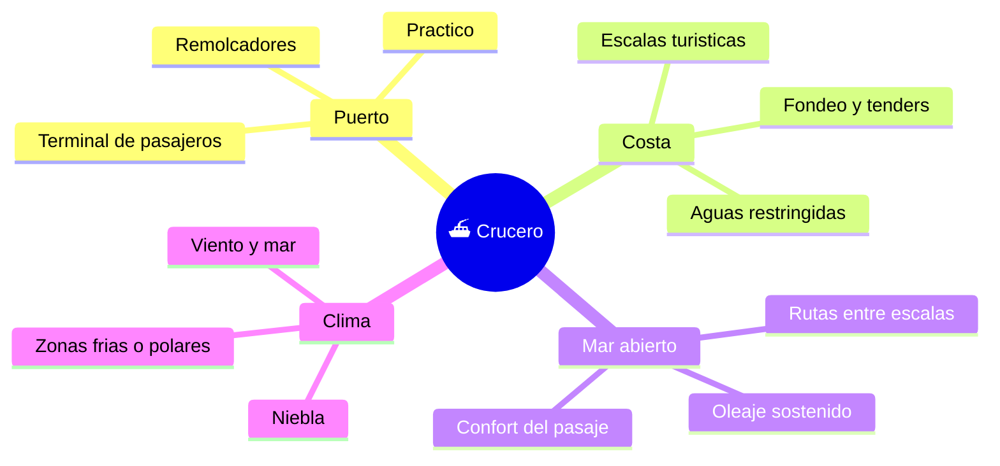

# 🌍 Entornos de trabajo del crucero

[🏠 Inicio](../../../README.md) · [⛴️ Curso: Cruceros](../README.md) · 🌍 Entornos

Dónde opera un crucero y cómo cambia la navegación según el entorno. Cada entorno
implica reglas, riesgos y ajustes distintos, y en simulación se traduce en
escenarios diferentes.

---

## 🗺️ Entornos principales

| Entorno | Características | Riesgos típicos | Ajuste de navegación |
| --- | --- | --- | --- |
| Puerto | Terminal de pasaje, muelles. | Colisión, mala maniobra. | Baja velocidad, pods, thruster, práctico. |
| Fondeo frente a escala | Sin muelle disponible. | Garreo, riesgo en tenders. | Vigilar ancla, embarcar pasaje con cuidado. |
| Costa | Aguas restringidas, tráfico. | Varada, abordaje. | Vigilancia, ecosonda, COLREG. |
| Mar abierto | Rutas largas, oleaje. | Temporales, mareo del pasaje. | Rumbo, guardias, estabilizadores. |
| Niebla / noche | Baja visibilidad. | No ser visto, abordaje. | Radar, luces, señales acústicas. |
| Zonas frías o polares | Hielo, apoyo escaso. | Avería lejos de puerto. | Casco reforzado, rutas planificadas. |

---

## 🌦️ Factores del entorno

- **Viento y mar**: el oleaje y el viento afectan rumbo, escora y el confort del
  pasaje; la alta obra muerta hace al crucero muy sensible al viento.
- **Corrientes y mareas**: modifican la trayectoria real y el calado disponible.
- **Profundidad**: los bajos limitan las rutas según el calado del buque.
- **Tráfico**: más buques implica más decisiones y aplicación del COLREG.
- **Visibilidad**: niebla y noche exigen radar, luces y señales.

---

## 🎮 Traducción a simulación

Cada entorno es un escenario con su profundidad, clima, corriente y tráfico. Ver
como se modela en el
[Módulo 8: Diseño de simulación](../simulacion/diseno-simulador-crucero.md).

---

[⬅️ Anterior: Principios y operación](principios-crucero.md) · [➡️ Siguiente: Reglamentos](../reglamentos/reglamentos-crucero.md)
